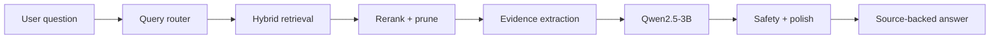

# R3MES v1 🚀

**R3MES is an AI knowledge platform that turns private or public documents into source-backed conversations.**

Instead of trying to force a small model to memorize everything, R3MES gives the model the right knowledge at the right moment. The system combines **RAG**, **hybrid search**, **Qwen2.5-3B**, and optional **behavior LoRA** adapters to create a practical, local-first AI assistant pipeline.

## The Idea ✨

Most small AI models fail when they are asked to do everything alone.

R3MES takes a different path:

- 🧠 The base model writes and reasons in natural language.
- 📚 RAG provides factual knowledge from uploaded sources.
- 🔎 Hybrid retrieval finds the most relevant evidence.
- ✂️ Reranking and pruning keep only the useful context.
- 🎭 LoRA changes behavior, tone, or role, but does not carry facts.
- 🔐 Private knowledge stays private; public knowledge can be shared intentionally.
- 🧾 Every grounded answer can show where its information came from.

The goal is not to build a huge model. The goal is to build a smarter pipeline around a smaller model.

## What R3MES Does 🧩

R3MES lets users create knowledge collections, upload documents, and chat with those documents through a controlled retrieval pipeline.

At a high level:

1. A user uploads knowledge.
2. R3MES parses, chunks, embeds, and indexes it.
3. The user asks a question.
4. The system routes the query, searches relevant sources, reranks evidence, and builds a compact context.
5. Qwen2.5-3B generates an answer using only the selected evidence.
6. The UI shows the answer with citations and source metadata.

## Why It Exists 🌱

R3MES is built around a simple belief:

**Small models can become much more useful when the surrounding system is engineered well.**

That means:

- no pretending LoRA is a database,
- no dumping huge raw context into the prompt,
- no trusting the model to magically pick the right source,
- no mixing private and public knowledge carelessly,
- no forcing one model call to handle routing, retrieval, reasoning, safety, and style all at once.

R3MES separates those jobs into a pipeline that is easier to improve, test, and trust.

## Core Features 🔥

- 📚 **Knowledge-first workflow**  
  Upload documents into collections and use them as the factual memory layer.

- 🔐 **Private / public visibility**  
  Knowledge starts private. Publishing is explicit.

- 🔎 **Hybrid retrieval**  
  Combines vector search with lexical/database-backed candidates.

- 🧠 **Qwen2.5-3B base model**  
  The MVP stays on a small local model and improves quality through pipeline design.

- 🎭 **Optional behavior LoRA**  
  LoRA is used for tone, role, or response style, not for factual knowledge.

- 🧾 **Source-backed answers**  
  Chat responses can include citations, chunks, and source metadata.

- 🛡️ **Safety and quality gates**  
  The backend applies routing, pruning, grounding, and post-generation checks.

- 🧪 **Evaluation-ready structure**  
  The repo includes local eval flows for grounded RAG and adaptive routing.

## Product Philosophy 🧭

R3MES is not trying to be another generic chatbot wrapper.

It is designed as a modular AI assembly line:



Each part has one clear job. That makes the system easier to debug, safer to extend, and more realistic for small local models.

## Current MVP Stack 🛠️

| Area | Technology |
| --- | --- |
| Base model | Qwen2.5-3B GGUF |
| AI serving | llama.cpp / llama-server |
| AI proxy | FastAPI |
| Backend | Fastify + Prisma |
| Frontend | Next.js |
| Relational DB | PostgreSQL + pgvector |
| Vector memory | Qdrant |
| Queue/cache | Redis |
| Storage | IPFS-compatible local storage |
| Smart contracts | Sui Move |

## Active Direction 🧬

The active R3MES path is:

```text
Qwen2.5-3B + RAG + hybrid retrieval + optional behavior LoRA
```

The project is intentionally moving away from:

- training domain knowledge directly into LoRA,
- adapter-first chat flows,
- BitNet/QVAC as the main product path,
- benchmark-only quality claims,
- hardcoded answers for specific demo questions.

The target is an adaptive system that improves as new knowledge is added.

## Repository Map 🗺️

| Folder | What it contains |
| --- | --- |
| `apps/backend-api` | API, chat orchestration, RAG, safety, Prisma |
| `apps/ai-engine` | AI proxy, inference bridge, embeddings/rerank endpoints |
| `apps/dApp` | Web app, Studio, chat UI, wallet flows |
| `packages/shared-types` | Shared contracts and types |
| `packages/sui-contracts` | Sui Move contracts |
| `infrastructure` | Docker, runtime docs, evals, scripts, training notes |
| `docs` | Local dev, architecture, API, and operational docs |

## Local Development ⚙️

R3MES is a local-first MVP. The full dev stack includes backend, frontend, AI proxy, database, vector memory, Redis, IPFS, and a local Qwen model.

Start here if you want to run it:

- [Local development guide](./docs/LOCAL_DEV.md)
- [Golden path startup](./docs/GOLDEN_PATH_STARTUP.md)
- [Active runtime inventory](./infrastructure/ACTIVE_RUNTIME.md)

Common commands:

```powershell
pnpm install
pnpm bootstrap
pnpm dev
```

Or:

```powershell
pnpm local:start
pnpm local:status
pnpm local:stop
```

## Public Repo Notes 🔒

This public repository does **not** include local secrets, raw private datasets, model binaries, checkpoints, training outputs, logs, or runtime caches.

Tracked files are intended to describe and run the source code. Heavy local assets such as GGUF models, LoRA outputs, and parquet datasets stay outside Git.

## Status 🚧

R3MES v1 is an active MVP.

The system already has the core pieces for source-backed chat, private/public knowledge, hybrid retrieval, optional LoRA, and local evaluation. The next focus is improving adaptive routing, retrieval quality, UI clarity, and production-grade reliability.

## Vision 🌍

R3MES is a step toward affordable, controllable, source-aware AI systems that can run with smaller models and still behave intelligently.

The long-term goal is simple:

**Give people AI that can use their knowledge safely, explain where answers came from, and adapt without retraining a giant model every time.**
