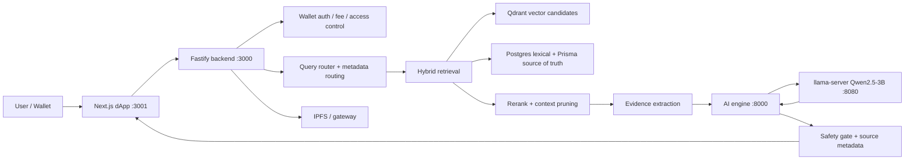

# R3MES v1

R3MES is a local-first AI application platform for retrieval-backed chat, knowledge management, and optional behavior LoRA adapters. The current MVP path uses **Qwen2.5-3B**, **RAG**, **hybrid retrieval**, a Fastify backend, a FastAPI AI proxy, and a Next.js dApp.

The project is intentionally pivoted away from "train knowledge into LoRA". Knowledge lives in the retrieval layer; LoRA is only an optional behavior, tone, role, or persona layer.

## Current Product Path

| Layer | Active choice |
| --- | --- |
| Base model | Qwen2.5-3B GGUF |
| Inference | `llama-server` on `8080` |
| AI proxy | `apps/ai-engine` on `8000` |
| Backend | `apps/backend-api` on `3000` |
| Frontend | `apps/dApp` on `3001` |
| Relational store | PostgreSQL + pgvector |
| Vector memory | Qdrant |
| Queue/cache | Redis |
| Artifact storage | IPFS / local gateway |
| Knowledge | RAG collections with `PRIVATE` / `PUBLIC` visibility |
| LoRA | Optional behavior/style/persona adapter |

See the canonical runtime inventory: [infrastructure/ACTIVE_RUNTIME.md](./infrastructure/ACTIVE_RUNTIME.md).

## Architecture



## What Works Today

- Knowledge upload and storage through backend-owned collections.
- `PRIVATE` and `PUBLIC` knowledge visibility boundaries.
- Retrieval-backed chat with source citations.
- Domain / metadata-aware routing that can adapt to newly indexed knowledge.
- Hybrid candidate retrieval through Qdrant and Prisma/Postgres.
- Rerank/pruning before the 3B model sees context.
- Optional behavior LoRA flow without making LoRA the knowledge source.
- Local evaluation commands for adaptive RAG and grounded-answer checks.

## Monorepo Layout

| Path | Purpose |
| --- | --- |
| [apps/backend-api](./apps/backend-api) | Fastify API, Prisma, RAG orchestration, chat proxy, safety gates |
| [apps/ai-engine](./apps/ai-engine) | FastAPI proxy around llama-compatible inference, embeddings, rerank routes |
| [apps/dApp](./apps/dApp) | Next.js product UI for Studio, chat, wallet flows |
| [packages/shared-types](./packages/shared-types) | Shared API contracts and runtime types |
| [packages/sui-contracts](./packages/sui-contracts) | Sui Move contracts |
| [packages/sui-indexer](./packages/sui-indexer) | Sui event indexing |
| [packages/qa-sandbox](./packages/qa-sandbox) | Optional QA / evaluation sandbox |
| [infrastructure](./infrastructure) | Docker, runtime docs, evals, local scripts, training notes |
| [docs](./docs) | Local dev, API, architecture, and operational docs |

## Requirements

- Node.js `>=20.10`
- `pnpm` `9.15`
- Python `3.11+`
- Docker Desktop, for PostgreSQL, Redis, Qdrant, and IPFS
- A local Qwen2.5-3B GGUF file for full inference

Large local assets such as model files, datasets, checkpoints, logs, caches, and runtime binaries are intentionally not tracked in Git.

## Quick Start

Install workspace dependencies:

```powershell
pnpm install
```

Start the local infrastructure, wait for health checks, and apply migrations:

```powershell
pnpm bootstrap
```

Start the application processes:

```powershell
pnpm dev
```

Or use the local system helper:

```powershell
pnpm local:start
pnpm local:status
pnpm local:stop
```

Open the dApp:

```text
http://localhost:3001
```

The backend health endpoint should be available at:

```text
http://127.0.0.1:3000/health
```

For the full golden path, ports, Windows notes, and troubleshooting, start here:

- [docs/LOCAL_DEV.md](./docs/LOCAL_DEV.md)
- [docs/GOLDEN_PATH_STARTUP.md](./docs/GOLDEN_PATH_STARTUP.md)
- [docs/SINGLE_TEST_RUNTIME.md](./docs/SINGLE_TEST_RUNTIME.md)

## Model and LoRA Notes

R3MES v1 targets **Qwen2.5-3B**, not Qwen 0.5B. The current quality strategy is to keep the base model small and make the surrounding pipeline stronger:

- route the query before retrieval,
- retrieve broadly,
- rerank and prune aggressively,
- send only compact usable facts to the model,
- keep LoRA optional and behavior-only,
- apply deterministic safety and source checks after generation.

LoRA adapters should not be treated as factual memory. If an answer needs domain knowledge, that knowledge should come from RAG sources.

## Evaluation

Common local quality gates:

```powershell
pnpm --filter @r3mes/backend-api exec tsc -p tsconfig.json --noEmit
pnpm --filter @r3mes/backend-api run eval:adaptive-rag
```

Broader repo checks:

```powershell
pnpm run smoke:ts
pnpm run release:check
```

Useful demo seeds:

```powershell
pnpm --filter @r3mes/backend-api seed:multi-domain-demo
pnpm --filter @r3mes/backend-api seed:legal-basic-demo
pnpm --filter @r3mes/backend-api seed:legal-divorce-demo
pnpm --filter @r3mes/backend-api seed:education-basic-demo
```

## Public Repository Hygiene

This repository is prepared for public GitHub use. The following are excluded by design:

- `.env` and local secret files,
- raw training datasets such as `.parquet` and local `.jsonl`,
- model weights such as `.gguf`, `.safetensors`, `.pt`, `.bin`, `.onnx`,
- checkpoints, training outputs, and LoRA run artifacts,
- logs, process IDs, local caches, virtual environments, and `node_modules`,
- generated runtime folders such as local llama binaries and Docker model caches.

Template environment files such as `.env.example` are tracked so new developers can configure the stack without exposing secrets.

## Legacy / R&D Boundary

BitNet/QVAC materials and older knowledge-heavy LoRA experiments remain only as legacy or R&D references. They do not define the active MVP path.

Legacy index:

- [infrastructure/LEGACY_RND.md](./infrastructure/LEGACY_RND.md)

Active path:

- Qwen2.5-3B base model
- RAG as the knowledge layer
- optional behavior LoRA
- hybrid retrieval and source-backed answers

## Status

R3MES v1 is an active MVP codebase, not a polished hosted product. The current focus is reliability of the RAG pipeline, adaptive routing for newly uploaded knowledge, source-grounded answers, and clean local development workflows.

## License

License information will be finalized with the public release policy. Until then, treat this repository as project-owned source code, not as an unrestricted model or dataset distribution.
