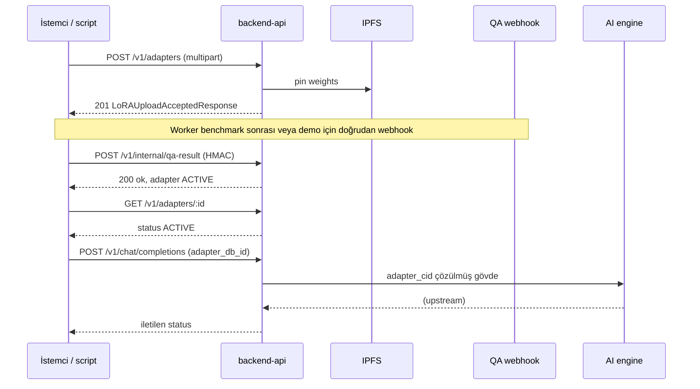

# Upload → QA → ACTIVE → Chat (Faz 7 — backend yaşam döngüsü)

**Amaç:** Aynı backend üzerinde, tekrarlanabilir şekilde tam zinciri kanıtlamak (yalnızca unit test geçti varsayımı yeterli değildir).

**Kanon:** [INTEGRATION_CONTRACT.md](../../../docs/api/INTEGRATION_CONTRACT.md) §3.1–3.5.

## Önkoşullar (çalışan süreçler)

| Bileşen | Not |
|--------|-----|
| API | `pnpm dev` veya `node dist/index.js` — `DATABASE_URL`, `REDIS_URL` |
| IPFS (Kubo) | `IPFS_API_URL` — LoRA pin |
| QA HMAC | Sunucuda `R3MES_QA_WEBHOOK_SECRET` — script ile **aynı** değer |
| Geliştirme kolaylığı | `R3MES_SKIP_WALLET_AUTH=1`, `R3MES_DEV_WALLET`, `R3MES_SKIP_CHAT_FEE=1`, `R3MES_DISABLE_RATE_LIMIT=1` |
| Chat (son adım) | `R3MES_AI_ENGINE_URL` ayakta veya yanıt hata da olsa `ADAPTER_RESOLUTION_FAILED` **olmamalı** |

## Akış (özet)



## Log işaretleri (demo / debug)

Sunucu loglarında (JSON `msg` veya structured fields) şu anahtarlar aranır:

| `e2eLifecycle` | Anlam |
|----------------|--------|
| `upload_accepted` | LoRA kabul, `adapterDbId`, `weightsCid`, `benchmarkJobId` |
| `qa_webhook_applied` | QA tamam, `newStatus` (ör. `ACTIVE`) |
| `chat_proxy_resolved` | `adapter_cid` çözümü yapıldı (`hasAdapterCid: true`) |

## Otomatik smoke

Repo kökünden veya `apps/backend-api` içinden:

```bash
set R3MES_QA_WEBHOOK_SECRET=your-secret
set R3MES_E2E_BASE_URL=http://127.0.0.1:3000
node scripts/e2e-lifecycle-smoke.mjs
```

Çıkış kodu `0`: health → upload → QA webhook → GET ACTIVE → chat çözümü (AI yanıtı opsiyonel). `0` dışı: önce IPFS / DB / env mesajına bakın.

## Manuel doğrulama

1. `GET /health` → 200.
2. `POST /v1/adapters` — en az bir `weights` alanı (içerik: llama.cpp LoRA GGUF; dosya adı öneri `.gguf`, bkz. `docs/api/INTEGRATION_CONTRACT.md` §3.3.1).
3. Dönen `weightsCid` ve `benchmarkJobId` ile `POST /v1/internal/qa-result` — gövde JSON, `X-QA-HMAC: hex(HMAC-SHA256(secret, rawBody))`.
4. `GET /v1/adapters/{adapterId}` — `status: ACTIVE`, `benchmarkScore` dolu.
5. `POST /v1/chat/completions` — gövdeye `adapter_db_id` veya `adapter_cid`; logda `chat_proxy_resolved`.

## Başarı kriteri (Faz 7)

Aynı ortamda script **ardışık iki kez** çalıştırıldığında (farklı upload veya idempotent QA duplicate kurallarına göre) zincir tutarlı kalır; “sadece testler yeşil” ile sınırlı kanıt kabul edilmez.
