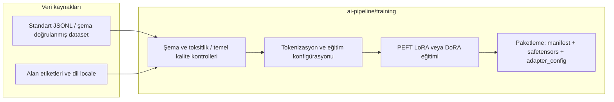
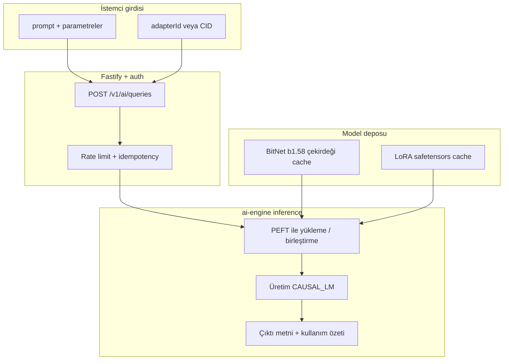
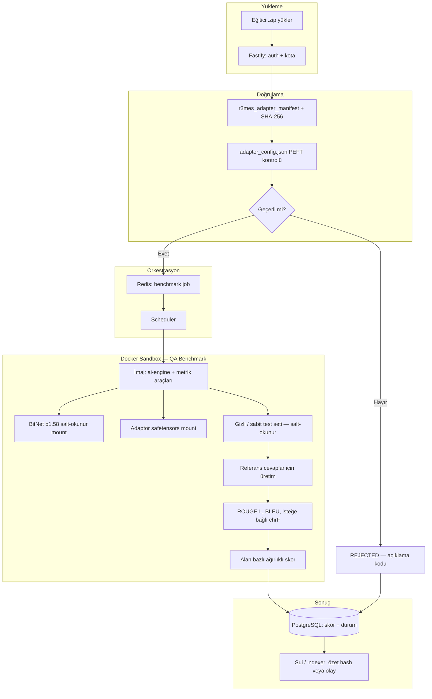
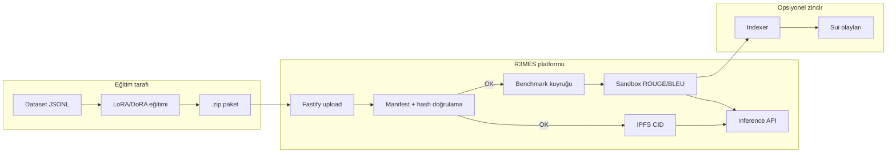

# R3MES Yapay Zeka Mimarisi — legacy BitNet/LoRA tasarım notu

> **Durum:** Bu belge tarihî BitNet/LoRA-first tasarım notudur. **Aktif MVP yolu değildir.**
>
> **Aktif ürün yönü:** `Qwen2.5-3B + RAG-first + optional behavior LoRA`
>
> **Tek resmi başlangıç belgeleri:**
> - [LOCAL_DEV.md](./LOCAL_DEV.md)
> - [GOLDEN_PATH_STARTUP.md](./GOLDEN_PATH_STARTUP.md)
> - [INTEGRATION_CONTRACT.md](./api/INTEGRATION_CONTRACT.md)

Bu belge **Faz 0** kapsamında AGENT-AI sorumluluğundaki erken dönem makine öğrenimi girdi/çıktı süreçlerini, donmuş çekirdek (o dönemde BitNet b1.58 varsayımı) ile dışarıdan gelen LoRA/DoRA adaptör paketlerinin **format standardını** ve **Otonom QA & Benchmark (Sandbox Docker)** akışını tanımlar. Uygulama kodu sonraki fazlarda `apps/ai-engine` ve `packages/qa-sandbox` altında yer almıştır.

> **Kanon uyarısı — iki dünya:** **Üretim runtime / QA / chat** (tek dosya LoRA **GGUF**, IPFS CID, `llama-server`) için **tek kaynak** [INTEGRATION_CONTRACT §3.3.1–§3.3.2](./api/INTEGRATION_CONTRACT.md). Bu dosyadaki **zip + safetensors** anlatımı **eğitim ve paketleme taslağıdır**; Fastify multipart üretim yolu ile otomatik aynı değildir. Faz 0 metnini kanon ile **karıştırmayın**.

**İlgili şemalar:** `docs/schemas/r3mes_adapter_manifest.schema.json`, `docs/schemas/peft_adapter_config.schema.json`

**BitNet runtime / OS spike (ürün omurgasından bağımsız karar notu):** [ADR-003-bitnet-runtime-compatibility-spike.md](./adr/ADR-003-bitnet-runtime-compatibility-spike.md) — **BitNet zorunlu değildir**; çekirdek GGUF dağıtım seçimi §3.3.2.

---

## 1. Tasarım İlkeleri


| İlke                 | Uygulama                                                                                                                        |
| -------------------- | ------------------------------------------------------------------------------------------------------------------------------- |
| Donmuş çekirdek      | **Legacy varsayım:** tek bir BitNet b1.58 ağırlık seti (IPFS + kayıtlı hash); eğiticiler bunu değiştiremez. Güncel MVP bu varsayımı kullanmaz. |
| İzole değerlendirme  | Benchmark ve otomatik QA, ağ erişimi kısıtlı **sandbox Docker** içinde çalışır; eğitim verisi ve gizli test seti dışarı sızmaz. |
| Kanıtlanabilir paket | `.zip` içinde manifest + SHA-256 listesi; sunucu dosyaları birebir doğrular.                                                    |
| Ağırlık biçimi (üretim çıkarım / QA) | **llama.cpp uyumlu LoRA GGUF** (tek dosya CID’si) — kanon: [INTEGRATION_CONTRACT.md §3.3.1](./api/INTEGRATION_CONTRACT.md). Sunucuda safetensors→GGUF dönüşümü yok. Eğitim/paketleme zip’inde safetensors kullanımı **çevrimdışı** GGUF üretimine bağlanır. |


---

## 2. Donmuş Model ve Adaptör Rolü

- **BitNet b1.58:** Bu belge yazıldığında tüm çıkarım ve benchmark işleri bu çekirdeği yükler varsayımı vardı; güncel MVP’de ana model **Qwen2.5-3B** ve bilgi katmanı **RAG**’dir.
- **LoRA / DoRA:** Bu belge LoRA/DoRA’yı ana uyarlama katmanı olarak anlatır; güncel MVP’de LoRA yalnızca **davranış / üslup / persona** katmanıdır.

---

## 3. Eğitim Girdileri (Training Input Pipeline — eğitim dünyası)

**Not:** Aşağıdaki diyagram **PEFT/safetensors eğitim çıktısı** içindir; üretimde IPFS’e giden primer artefakt **GGUF**’dur ([§3.3.1](./api/INTEGRATION_CONTRACT.md)).




**Çıktı:** Eğitici, aşağıdaki Bölüm 4 ile uyumlu bir `.zip` üretir. Bu dosya Fastify üzerinden veya önce nesne depolamaya (ör. presigned upload) yüklenir.

---

## 4. LoRA ZIP Paket Düzeni ve Doğrulama (eğitim / sandbox — Faz 0 taslak)

**Üretim upload:** Kanonik yol `POST /v1/adapters` ile **tek GGUF** dosyasıdır (§3.3.1); bu bölümdeki `.zip` düzeni **eğitim pipeline / sandbox doğrulama** ile uyumludur, runtime **lora-adapters** tek dosya bekler.

### 4.1 Zorunlu dosya yapısı (önerilen düzen)

Aşağıdaki yapı, doğrulayıcı ve (taslakta) çıkarım motorunun tek tip çalışması için **önerilen** standarttır. Kök dizinde ek dosyalar (ör. `README.md`) bulunabilir; **manifestte listelenmeyen** `.safetensors` dosyaları Faz 0 politikasında **reddedilir**.

```text
adapter-package.zip
├── r3mes_adapter_manifest.json    # JSON Schema: docs/schemas/r3mes_adapter_manifest.schema.json
├── adapter_config.json             # PEFT; JSON Schema: docs/schemas/peft_adapter_config.schema.json
├── adapter_model.safetensors       # veya weights/ altında; manifest.weight_files ile listelenir
└── (opsiyonel) tokenizer/          # tokenizer_bundle_path ile belirtilirse
```

### 4.2 Sunucu tarafı doğrulama adımları (özet)

1. **Arşiv:** Yalnızca `.zip`; zip bombası ve aşırı iç içe yol derinliği için sınır (ör. max dosya sayısı, max sıkıştırılmış boyut — değerler infra politikasında).
2. **Manifest:** `r3mes_adapter_manifest.json` JSON Schema ile doğrulanır; `package_format === "r3mes-lora-zip"`, `base_model.variant === "b1.58"`.
3. **Bütünlük:** `adapter.weight_files[]` içindeki her `path` için SHA-256, diskteki dosya ile eşleşmelidir.
4. **PEFT:** `adapter.peft_config_path` okunur; `peft_type` manifest `adapter.kind` ile aynı, `task_type === "CAUSAL_LM"`.
5. **Safetensors:** Uzantı ve boyut kontrolü; isteğe bağlı olarak başlık/magic doğrulaması (uygulama katmanında).
6. **Çekirdek hash:** `base_model.frozen_core_sha256`, ortamda tanımlı BitNet çekirdeği ile uyumlu olmalıdır.

Bu adımların hiçbiri geçmezse paket **REJECTED** durumuna alınır; benchmark kuyruğuna alınmaz.

---

## 5. API ve Depolama I/O (Fastify → Kuyruk → Worker) — taslak akış

**Güncel üretim:** [INTEGRATION_CONTRACT §3](./api/INTEGRATION_CONTRACT.md) — multipart GGUF; aşağıdaki madde sırası **Faz 0 zip yükleme** taslağıdır.

Eğitici `.zip` dosyasını yüklediğinde:

1. **Fastify** kimlik doğrulama, boyut kotası ve içerik tipi kontrolü yapar.
2. Geçici depoda saklanan arşiv **doğrulama worker**’ına devredilir (senkron veya asenkron).
3. Başarılı doğrulama sonrası paket (veya yalnızca ağırlıklar) **IPFS**’e yazılır; **CID** ve özetler PostgreSQL `Adapter` kaydına işlenir (`backend_architecture.md` ile uyumlu).
4. **Benchmark işi** Redis kuyruğuna eklenir; izole **QA Sandbox** konteyneri işi tüketir.

---

## 6. Çıkarım (Inference) I/O Pipeline




**Girdi:** JSON gövdesinde `adapterId`, `prompt`, isteğe bağlı sıcaklık, üst token sınırı, `idempotencyKey`.

**Çıktı:** Asenkron modda `jobId` ve durum uçları; tamamlandığında üretilen metin özeti ve hata kodu (varsa). Mikro-ödeme ve zincir etkileşimi backend mimarisinde tanımlıdır.

---

## 7. Otonom QA ve Benchmark Sistemi (Sandbox Docker)

Amaç: Model kalitesini **izole** ortamda ölçmek; ROUGE / BLEU (ve ileride genişletilebilir ek metrikler) ile skor üretmek; eşik altı sonuçları yayına kapalı tutmak veya slash politikasına beslemek.

### 7.1 Akış diyagramı




### 7.2 Sandbox kısıtları (tasarım gereksinimleri)


| Özellik                             | Gerekçe                                      |
| ----------------------------------- | -------------------------------------------- |
| Ağ çıkışı kapalı veya allowlist     | Test seti ve model sızıntısını önler         |
| Salt-okunur çekirdek ve test verisi | Manipülasyon ve yanlışlıkla yazmayı engeller |
| CPU/GPU zaman ve bellek sınırı      | Kaynak tüketim saldırılarını sınırlar        |
| Tek iş / tek adaptör                | Ölçüm tekrarlanabilirliği                    |


### 7.3 Skorlama (Faz 0 tanımı)

- **BLEU:** Referans cevaplara karşı n-gram örtüşmesi (özellikle kısa ve şablon benzeri çıktılar için).
- **ROUGE-L:** en uzun ortak alt dizi; özetleme ve serbest metin benzerliği için.
- **Birleşik skor:** Alan etiketlerine göre ağırlıklar (`domains`); platform eşiği `min_benchmark_score` altında ise adaptör **onaylanmaz** (ürün politikası `R3MES.md` ile uyumlu).

İleride **LLM-as-a-judge** ayrı bir opsiyonel aşama olarak eklenebilir; Faz 0’da zorunlu değildir.

---

## 8. Tam Uçtan Uca ML Veri Akışı (Özet)




---

## 9. Hata Kodları ve Durumlar (öneri)

Doğrulama veya benchmark başarısız olduğunda istemciye güvenli bir **kod** dönülür (iç yapı sızdırılmaz):


| Kod                         | Anlam                              |
| --------------------------- | ---------------------------------- |
| `MANIFEST_INVALID`          | JSON Schema ihlali                 |
| `HASH_MISMATCH`             | SHA-256 uyuşmazlığı                |
| `PEFT_MISMATCH`             | peft_type / task_type uyumsuzluğu  |
| `BASE_MODEL_MISMATCH`       | frozen_core_sha256 yanlış          |
| `BENCHMARK_FAILED`          | Sandbox içi çökme veya zaman aşımı |
| `BENCHMARK_BELOW_THRESHOLD` | Skor eşiğin altında                |


---

## 10. Sürüm ve Uyumluluk


| Bileşen                              | Sürüm notu             |
| ------------------------------------ | ---------------------- |
| `r3mes_adapter_manifest.schema.json` | `schema_version` 1.0.x |
| Bu belge                             | Faz 0 — 2026-04-08     |


Sonraki fazlarda şema yinelemeleri için **geri uyumluluk** veya **migration** politikası ayrı ADR ile sabitlenmelidir.
