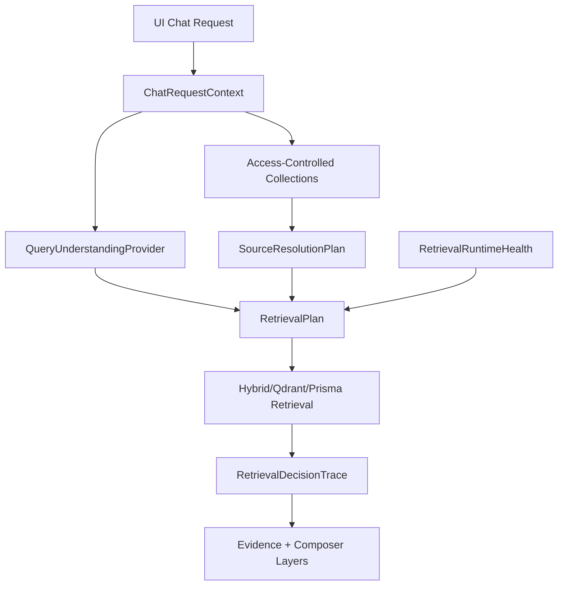

# R3MES Section 02 - Solution Research and Remediation Design

Date: 2026-05-15

Related audit: `docs/architecture-audits/section-02-source-query-retrieval-audit.md`

Scope: solutions for Section 02 findings: UI/eval parity, source resolution, query understanding, retrieval runtime, hardcoded retrieval behavior, and eval reality.

Non-scope: implementing answer planning/composer changes. Those belong to the next architecture layer.

## Research Basis

The solution design below uses repo observations plus these external technical references:

- [Qdrant Hybrid Queries](https://qdrant.tech/documentation/search/hybrid-queries/): dense + sparse retrieval can be fused, including RRF-style fusion.
- [Qdrant Hybrid Search with Reranking](https://qdrant.tech/documentation/search-precision/reranking-hybrid-search/): hybrid retrieval improves recall, but fusion alone is not enough; reranking is needed for precision.
- [Qdrant Filtering](https://qdrant.tech/documentation/search/filtering/): payload filters should enforce constraints that embeddings cannot represent, including business/access constraints.
- [BGE-M3 paper](https://arxiv.org/abs/2402.03216): BGE-M3 supports multilingual, multi-function retrieval: dense, sparse, and multi-vector modes.
- [Docling](https://www.docling.ai/): document conversion can preserve structure such as reading order, bounding boxes, and table rows/columns/headers.
- [Zemberek NLP](https://github.com/ahmetaa/zemberek-nlp): Turkish morphology, tokenization, noisy text normalization, NER, and classification are available as separate modules.
- [RAGAS metrics](https://docs.ragas.io/en/stable/concepts/metrics/): RAG quality needs retrieval and response metrics such as context precision, context recall, response relevancy, and faithfulness.
- [ARES paper](https://arxiv.org/abs/2311.09476): RAG evaluation should evaluate context relevance, answer faithfulness, and answer relevance, with small human-annotated sets to control judge error.

Research interpretation:

1. Hybrid retrieval is useful, but only if the runtime actually uses dense/sparse retrieval and has clear fallback visibility.
2. Reranking should be treated as a precision layer after broad candidate generation, not as an optional invisible enhancement.
3. Filters and source-scoping are product correctness mechanisms, not just performance optimizations.
4. For table/numeric enterprise data, preserving document structure is more reliable than reconstructing table semantics from flattened text.
5. Turkish query understanding can stay deterministic at first, but hardcoded product-domain rules should move behind provider/config boundaries.
6. Eval must test the real UI request state and the individual RAG components, not only final answer shape.

## Target Remediation Principle

Do not rewrite the RAG backbone.

Add explicit contracts around the current system:



The current code already has most of the raw pieces. The product gap is that they are implicit, scattered, and sometimes env-dependent.

## Shared Types To Introduce

These are the recommended contracts for implementation. They should be added before changing retrieval behavior heavily.

```ts
export type ChatSourceMode =
  | "explicit_selected"
  | "ui_auto_single"
  | "backend_auto_private"
  | "include_public"
  | "source_discovery"
  | "none";

export interface ChatRequestContext {
  requestId: string;
  sourceMode: ChatSourceMode;
  requestedCollectionIds: string[];
  effectiveCollectionIds: string[];
  includePublic: boolean;
  debugEnabled: boolean;
  uiSelectedCollectionIds?: string[];
}

export type SourceResolutionMode =
  | "explicit"
  | "auto_single_private"
  | "auto_private_ranked"
  | "include_public"
  | "needs_user_scope"
  | "source_discovery";

export interface SourceResolutionPlan {
  mode: SourceResolutionMode;
  selectedCollectionIds: string[];
  candidates: Array<{
    collectionId: string;
    score: number;
    reasons: string[];
    matchedProfileLevel: "collection" | "document" | "section" | "chunk" | "none";
  }>;
  rejected: Array<{ collectionId: string; reason: string; score?: number }>;
  confidence: number;
  warnings: string[];
}

export interface RetrievalRuntimeHealth {
  retrievalEngineRequested: "prisma" | "qdrant" | "hybrid";
  retrievalEngineActual: "prisma" | "qdrant" | "hybrid";
  embeddingProviderRequested: "deterministic" | "ai-engine" | "bge-m3";
  embeddingProviderActual: "deterministic" | "ai-engine" | "bge-m3";
  embeddingFallbackUsed: boolean;
  rerankerModeRequested: "model" | "deterministic" | "disabled";
  rerankerModeActual: "model" | "model_fallback" | "deterministic" | "disabled";
  rerankerFallbackUsed: boolean;
  strictRuntime: boolean;
}

export interface RetrievalPlan {
  query: string;
  normalizedQuery: string;
  sourcePlan: SourceResolutionPlan;
  runtime: RetrievalRuntimeHealth;
  expectedEvidenceKinds: Array<"paragraph" | "table" | "numeric" | "procedure" | "definition">;
  requestedFields: string[];
  outputConstraints: string[];
}
```

Recommended location:

- `apps/backend-api/src/lib/chatRequestContext.ts`
- `apps/backend-api/src/lib/sourceResolutionPlan.ts`
- `apps/backend-api/src/lib/retrievalRuntimeHealth.ts`
- `apps/backend-api/src/lib/retrievalPlan.ts`

These files should be pure TypeScript utility/contract modules. They should not call Qdrant, Prisma, or the model.

## F01 - UI and Eval Share Endpoint But Not Runtime Conditions

### Problem

Repo evidence:

- UI sends `stream:false`, optional `collectionIds`, boolean `includePublic`, and conditional debug header in `apps/dApp/lib/api/chat-stream.ts:156`, `apps/dApp/lib/api/chat-stream.ts:169`, `apps/dApp/lib/api/chat-stream.ts:170`, `apps/dApp/lib/api/chat-stream.ts:180`.
- UI collection state starts empty and only auto-selects when exactly one collection exists in `apps/dApp/components/chat-screen.tsx:688` and `apps/dApp/components/chat-screen.tsx:764`.
- Eval calls the same endpoint but sends test-case `collectionIds` and always sets debug header in `apps/backend-api/scripts/run-grounded-response-eval.mjs:1404` and `apps/backend-api/scripts/run-grounded-response-eval.mjs:1421`.

Current failure mode:

Eval can validate an ideal source-selected path while UI uses a broad backend-auto source path.

### Solution

Add `ChatRequestContext` as the first backend contract and make eval assert against it.

Implementation outline:

1. In `chatProxy.ts`, create request context immediately after body normalization.
2. Determine `sourceMode` explicitly:
   - `explicit_selected`: request has `collectionIds`.
   - `include_public`: `includePublic=true`.
   - `backend_auto_private`: no selected collection and public disabled.
   - `source_discovery`: source discovery intent.
   - `none`: no retrieval query.
3. Return context in debug traces and feedback metadata.
4. Add eval fields:
   - `expectTrace.sourceMode`
   - `expectTrace.effectiveCollectionCount`
   - `expectTrace.debugEnabled`
5. Add UI-reality eval cases where `collectionIds=[]`.

### Files

- `apps/backend-api/src/routes/chatProxy.ts`
- `apps/backend-api/scripts/run-grounded-response-eval.mjs`
- `apps/dApp/components/chat-screen.tsx`
- `apps/dApp/lib/api/chat-stream.ts`

### Acceptance Criteria

- Eval can distinguish explicit source path from backend auto-private path.
- Feedback from a bad UI answer includes `sourceMode`.
- UI-reality eval fails if backend silently searches all private collections without trace.

### Rollback

Keep the new context as trace-only first. No behavior change in phase one.

## F02 - Backend Auto-Private Default Can Search Too Broadly

### Problem

Repo evidence:

- `resolveAccessibleKnowledgeCollections` returns all owned collections when no requested IDs are provided and public is disabled: `apps/backend-api/src/lib/knowledgeAccess.ts:1499`.
- `chatProxy.ts` traces `autoPrivateSourceDefault`: `apps/backend-api/src/routes/chatProxy.ts:1576`.

Current failure mode:

With multiple private collections, absence of UI selection becomes broad search. That can retrieve plausible but irrelevant chunks.

### Research Link

Qdrant filtering guidance is relevant here because payload/access/source constraints should be applied before or during retrieval, not only after retrieval. The same principle applies even when Prisma is used: source scope is a correctness constraint.

### Solution

Split source access from source resolution.

Implementation outline:

1. Keep `resolveAccessibleKnowledgeCollections` as access-only.
2. Add `buildSourceResolutionPlan`.
3. If one private collection exists, mode is `auto_single_private`.
4. If multiple private collections exist, rank them using metadata/profile/query match.
5. If top confidence is high, select top N collections.
6. If confidence is low, return `needs_user_scope` or controlled no-source with suggestions.
7. Retrieval receives `sourcePlan.selectedCollectionIds`, not the whole accessible set.

Pseudo-flow:

```ts
const accessible = await resolveAccessibleKnowledgeCollections(...);
const sourcePlan = buildSourceResolutionPlan({
  query: retrievalQuery,
  accessibleCollections: accessible,
  requestedCollectionIds,
  includePublic,
  queryUnderstanding,
});

if (sourcePlan.mode === "needs_user_scope") {
  return noSourceWithSourceSuggestions(sourcePlan);
}

const retrievalCollectionIds = sourcePlan.selectedCollectionIds;
```

### Files

- `apps/backend-api/src/lib/knowledgeAccess.ts`
- `apps/backend-api/src/routes/chatProxy.ts`
- new `apps/backend-api/src/lib/sourceResolutionPlan.ts`

### Acceptance Criteria

- Multiple private collections with no selected source no longer means "search all" unless source resolution confidence is high.
- Retrieval debug shows selected and rejected collections with reasons.
- Existing explicit-source behavior remains unchanged.

### Rollback

Feature flag:

```txt
R3MES_SOURCE_RESOLUTION_PLAN=0
```

Default can start as trace-only before behavior enforcement.

## F03 - Retrieval Engine Defaults To Prisma, Not True Hybrid

### Problem

Repo evidence:

- `getRetrievalEngine()` defaults to `prisma`: `apps/backend-api/src/routes/chatProxy.ts:121`.
- True hybrid runs only under hybrid mode: `apps/backend-api/src/routes/chatProxy.ts:1691`.
- Prisma fallback/default path runs in `apps/backend-api/src/routes/chatProxy.ts:1738`.

Current failure mode:

System is described as Qdrant/BGE-M3/reranker hybrid RAG, but actual runtime can be Prisma lexical without obvious UI-level signal.

### Research Link

Qdrant hybrid docs support dense+sparse fusion and staged query pipelines. Qdrant reranking docs explicitly separate broad hybrid candidate generation from later precision reranking. That maps to the intended R3MES architecture, but only if runtime mode is enforced and visible.

### Solution

Add `RetrievalRuntimeHealth` and require runtime match in eval/product mode.

Implementation outline:

1. Add `getRetrievalRuntimeHealth()` in a pure module.
2. Record:
   - requested engine from env
   - actual engine used
   - fallback used or not
   - embedding provider actual
   - reranker actual
3. Add `expectRuntime` to eval cases.
4. In production/pilot env, fail startup or return degraded no-source if expected engine is not available.

Recommended environment policy:

| Environment | Behavior |
| --- | --- |
| local dev | fallback allowed, trace required |
| CI eval | fallback forbidden unless test explicitly allows it |
| pilot/prod | fallback forbidden for configured real retrieval mode |

### Files

- `apps/backend-api/src/routes/chatProxy.ts`
- `apps/backend-api/src/lib/qdrantEmbedding.ts`
- `apps/backend-api/src/lib/modelRerank.ts`
- `apps/backend-api/scripts/run-grounded-response-eval.mjs`
- new `apps/backend-api/src/lib/retrievalRuntimeHealth.ts`

### Acceptance Criteria

- Every chat trace says `retrievalEngineRequested` and `retrievalEngineActual`.
- Answer-quality eval fails when expected true hybrid did not run.
- UI feedback metadata includes runtime engine/fallback status.

### Rollback

Strict gates are enabled only by:

```txt
R3MES_REQUIRE_PRODUCT_RETRIEVAL_RUNTIME=1
```

## F04 - BGE-M3 and Cross-Encoder Reranker Can Silently Fall Back

### Problem

Repo evidence:

- Embedding provider defaults to deterministic: `apps/backend-api/src/lib/qdrantEmbedding.ts:105`.
- Real embeddings are required only under strict conditions: `apps/backend-api/src/lib/qdrantEmbedding.ts:40`.
- Model reranker can fall back to deterministic: `apps/backend-api/src/lib/modelRerank.ts:460`.

Current failure mode:

An answer can look like it came from semantic hybrid retrieval, but the actual path may be deterministic embeddings and deterministic rerank.

### Research Link

BGE-M3 supports multilingual dense, sparse, and multi-vector retrieval. This is useful for R3MES Turkish enterprise RAG, but only when the actual runtime provider is BGE-M3 or an equivalent real embedding provider.

### Solution

Make real-provider status first-class and enforceable.

Implementation outline:

1. Extend embedding result metadata to include provider and fallback status everywhere it enters retrieval diagnostics.
2. Extend reranker diagnostics to expose fallback status in the same runtime health object.
3. Add strict eval assertions:
   - `embeddingProviderActual !== "deterministic"`
   - `embeddingFallbackUsed === false`
   - `rerankerFallbackUsed === false`
4. Add startup health endpoint:
   - `/health/retrieval-runtime`
   - returns engine, Qdrant connectivity, embedding provider, reranker provider, dimension match.

### Files

- `apps/backend-api/src/lib/qdrantEmbedding.ts`
- `apps/backend-api/src/lib/modelRerank.ts`
- `apps/backend-api/src/lib/hybridKnowledgeRetrieval.ts`
- `apps/backend-api/src/routes/chatProxy.ts`

### Acceptance Criteria

- Product/eval runtime fails if BGE-M3 is required but deterministic provider is active.
- Product/eval runtime fails if reranker model is required but fallback is used.
- Debug trace contains provider/fallback reason.

### Rollback

Keep fallback for local dev and smoke tests. Do not use it in product-quality eval.

## F05 - Query Understanding Is Heuristic, Not General NLP

### Problem

Repo evidence:

- Query understanding is built deterministically: `apps/backend-api/src/lib/queryUnderstanding.ts:269`.
- Turkish normalizer is string/token based: `apps/backend-api/src/lib/turkishQueryNormalizer.ts:75`.
- Concept rules are hardcoded in `apps/backend-api/src/lib/conceptNormalizer.ts:164`.
- Route rules are hardcoded in `apps/backend-api/src/lib/queryRouter.ts:170`.

Current failure mode:

New data domains require code edits. Hardcoded rules may appear intelligent but do not generalize across arbitrary enterprise documents.

### Research Link

Zemberek provides Turkish morphology, tokenization, normalization, NER, and classification modules. That does not replace source-grounded retrieval, but it can improve Turkish query normalization and entity extraction without turning the system into an agent.

### Solution

Introduce a `QueryUnderstandingProvider` boundary and move domain knowledge into domain packs.

Implementation outline:

1. Keep current logic as `heuristic-tr-v1`.
2. Add provider interface:

```ts
export interface QueryUnderstandingProvider {
  id: string;
  analyze(input: {
    query: string;
    sourceProfiles?: SourceProfile[];
    tenantProfile?: TenantKnowledgeProfile;
  }): Promise<QueryUnderstanding>;
}
```

3. Move concept/route/table-field aliases into domain packs:

```ts
export interface DomainLexiconPack {
  id: string;
  locale: string;
  concepts: ConceptRule[];
  routeRules: RouteRule[];
  requestedFieldAliases: RequestedFieldAlias[];
}
```

4. Add optional `zemberek-tr-v1` normalizer behind an adapter:
   - tokenization
   - lemma/root candidates
   - noisy query normalization
   - NER candidates

5. Keep all AI/model-based query classification optional and traceable.

### Files

- `apps/backend-api/src/lib/queryUnderstanding.ts`
- `apps/backend-api/src/lib/turkishQueryNormalizer.ts`
- `apps/backend-api/src/lib/conceptNormalizer.ts`
- `apps/backend-api/src/lib/queryRouter.ts`
- new `apps/backend-api/src/lib/queryUnderstandingProvider.ts`
- new `apps/backend-api/src/lib/domainLexiconPack.ts`

### Acceptance Criteria

- Existing behavior is preserved under `heuristic-tr-v1`.
- A new domain synonym can be added without editing `conceptNormalizer.ts`.
- Trace shows provider ID and matched domain pack ID.

### Rollback

Default provider remains current implementation.

## F06 - Source Routing Uses Shallow Collection Samples

### Problem

Repo evidence:

- Collection metadata selects first docs/chunks: `apps/backend-api/src/lib/knowledgeAccess.ts:1476`.
- Route candidate ranking uses metadata/profile terms: `apps/backend-api/src/lib/knowledgeAccess.ts:1253`.

Current failure mode:

Mixed collections can be misrepresented. A collection-level profile is too coarse for enterprise data where one collection may contain HR, finance, procedures, OCR scans, and Excel reports.

### Solution

Add document-level and section-level profiles, and use them in source resolution.

Implementation outline:

1. Extend ingestion metadata to produce:
   - `CollectionProfile`
   - `DocumentProfile`
   - `SectionProfile`
   - `TableProfile`
2. Store profile confidence and freshness.
3. Build source resolution from the most specific level available.
4. Add source routing trace:
   - collection match
   - document match
   - section/table match

Suggested type:

```ts
export interface DocumentProfile {
  documentId: string;
  collectionId: string;
  documentType?: string;
  domains: string[];
  entities: string[];
  topics: string[];
  tableSummaries: Array<{
    tableId: string;
    headers: string[];
    rowCount?: number;
    valueTypes: string[];
  }>;
  confidence: number;
}
```

### Files

- `apps/backend-api/src/lib/knowledgeAccess.ts`
- ingestion metadata modules from Section 01
- Prisma schema if document/section profiles are persisted separately

### Acceptance Criteria

- Source resolution can explain whether it matched collection, document, section, or table profile.
- Mixed collection eval retrieves the correct document/table without searching the entire collection blindly.

### Rollback

If document/section profiles are unavailable, use existing collection profile path.

## F07 - Table/KAP/Numeric Intelligence Is Partly Hardcoded

### Problem

Repo evidence:

- KAP/finance critical evidence term groups exist in `apps/backend-api/src/lib/hybridKnowledgeRetrieval.ts:599`.
- Finance requested field aliases exist in `apps/backend-api/src/lib/requestedFieldDetector.ts:37`.
- Table numeric extraction is regex-oriented in `apps/backend-api/src/lib/tableNumericFactExtractor.ts`.

Current failure mode:

KAP quality improves, but the logic is not general table intelligence. New enterprise tables require code-level regex/alias additions.

### Research Link

Docling explicitly preserves table rows, columns, headers, reading order, bounding boxes, and complex cell content. That is the right source of truth for arbitrary tables. Regex over flattened text should become fallback, not the main path.

### Solution

Create a generic table fact layer and move KAP aliases behind a domain pack.

Implementation outline:

1. Introduce `TableProfile` and `TableFact`.
2. At ingestion, preserve:
   - table ID
   - page
   - row/column index
   - header path
   - cell text
   - normalized value
   - source bounding box if available
3. At query time, `RequestedFieldDetector` maps requested field to table headers and aliases.
4. `TableNumericFactExtractor` first reads structured table artifacts.
5. Only if structured table artifacts are missing, use current text regex fallback.
6. Move KAP/finance aliases into `kap-finance-v1` domain pack.

Suggested type:

```ts
export interface TableFact {
  tableId: string;
  sourceId: string;
  documentId: string;
  page?: number;
  rowIndex: number;
  columnIndex: number;
  headerPath: string[];
  fieldId: string;
  label: string;
  rawValue: string;
  normalizedValue?: string | number;
  valueType: "money" | "number" | "date" | "text" | "percentage";
  provenance: {
    extractor: "docling" | "excel" | "ocr" | "regex_fallback";
    confidence: number;
    bbox?: [number, number, number, number];
  };
}
```

### Files

- `apps/backend-api/src/lib/requestedFieldDetector.ts`
- `apps/backend-api/src/lib/tableNumericFactExtractor.ts`
- `apps/backend-api/src/lib/structuredFact.ts`
- `apps/backend-api/src/lib/compiledEvidence.ts`
- ingestion/table artifact modules from Section 01

### Acceptance Criteria

- KAP eval still passes with `kap-finance-v1`.
- A non-KAP table test passes without editing TypeScript aliases.
- Raw table dump is rejected when requested field is extractable from `TableFact`.

### Rollback

Keep current extractor as `regex_fallback`.

## F08 - Legacy Prisma Retrieval Has Domain-Specific Expansion And Broad Fallback

### Problem

Repo evidence:

- Legacy Prisma retrieval expands query tokens with medical concepts: `apps/backend-api/src/lib/knowledgeRetrieval.ts:38`.
- It can fetch broad fallback chunks when lexical matches are thin: `apps/backend-api/src/lib/knowledgeRetrieval.ts:172`.
- Prisma path is default from `chatProxy.ts`.

Current failure mode:

When true hybrid is not active, UI behavior may be controlled by old lexical fallback logic.

### Solution

Put Prisma fallback under the same retrieval plan and source confidence gate.

Implementation outline:

1. Prisma retrieval receives `RetrievalPlan`.
2. Disable broad fallback unless:
   - source confidence is high
   - selected collection count is limited
   - query has clear source profile match
3. Move domain expansions to domain packs.
4. Add diagnostics:
   - `legacyPrismaUsed`
   - `broadFallbackUsed`
   - `domainExpansionPackIds`
5. Eval should fail if broad fallback contributes to answer under low source confidence.

### Files

- `apps/backend-api/src/lib/knowledgeRetrieval.ts`
- `apps/backend-api/src/routes/chatProxy.ts`
- `apps/backend-api/src/lib/decisionConfig.ts`

### Acceptance Criteria

- Broad fallback is blocked under low source confidence.
- Retrieval diagnostics expose fallback.
- Medical expansion is moved behind a domain pack or config.

### Rollback

Keep legacy behavior behind:

```txt
R3MES_LEGACY_PRISMA_BROAD_FALLBACK=1
```

## F09 - Retrieval And Source Selection Are Coupled Too Late

### Problem

Repo evidence:

- `buildSourceSelectionSummary` is built after retrieval in `apps/backend-api/src/routes/chatProxy.ts:1806`.
- Retrieval is called before source selection summary is finalized in `apps/backend-api/src/routes/chatProxy.ts:1693`, `apps/backend-api/src/routes/chatProxy.ts:1709`, and `apps/backend-api/src/routes/chatProxy.ts:1738`.

Current failure mode:

The system can explain what happened after retrieval, but cannot always prevent bad retrieval before it happens.

### Solution

Introduce `RetrievalPlan` before retrieval and keep post-retrieval summary as `RetrievalDecisionTrace`.

Implementation outline:

1. Build `ChatRequestContext`.
2. Build `SourceResolutionPlan`.
3. Build query understanding.
4. Build runtime health.
5. Build `RetrievalPlan`.
6. Pass plan to retrieval functions.
7. After retrieval, build `RetrievalDecisionTrace`.

Suggested type:

```ts
export interface RetrievalDecisionTrace {
  plan: RetrievalPlan;
  actual: {
    candidateCounts: Record<string, number>;
    finalSourceCount: number;
    broadFallbackUsed: boolean;
    qdrantUsed: boolean;
    prismaUsed: boolean;
    criticalEvidenceUsed: boolean;
  };
  deviations: Array<{ code: string; message: string; severity: "info" | "warning" | "error" }>;
}
```

### Files

- `apps/backend-api/src/routes/chatProxy.ts`
- `apps/backend-api/src/lib/hybridKnowledgeRetrieval.ts`
- `apps/backend-api/src/lib/qdrantRetrieval.ts`
- `apps/backend-api/src/lib/knowledgeRetrieval.ts`

### Acceptance Criteria

- Retrieval can be tested from a serialized plan.
- Debug trace shows plan vs actual execution.
- Source selection summary remains, but it no longer acts as the first source decision.

### Rollback

Start with an adapter that builds a plan but still calls existing retrieval signatures.

## F10 - Eval Does Not Fully Test UI Reality

### Problem

Repo evidence:

- Eval sends explicit test-case fields and debug header: `apps/backend-api/scripts/run-grounded-response-eval.mjs:1404`, `apps/backend-api/scripts/run-grounded-response-eval.mjs:1421`.
- UI state can differ from eval state: `apps/dApp/components/chat-screen.tsx:688`, `apps/dApp/components/chat-screen.tsx:764`.

Current failure mode:

Eval green can mean "ideal backend request worked", not "real UI chat quality is product-ready."

### Research Link

RAGAS and ARES both separate retrieval/context relevance from answer faithfulness/relevance. For R3MES, the eval should also separate request/source reality from answer quality.

### Solution

Redesign answer-quality eval into component buckets and UI-reality profiles.

Implementation outline:

1. Split eval profiles:
   - `backend_ideal`
   - `ui_reality`
   - `fallback_runtime`
   - `table_numeric`
   - `source_scope`
2. Add trace assertions:
   - source mode
   - selected/effective collections
   - retrieval engine actual
   - embedding/reranker fallback
   - broad fallback
3. Add answer quality buckets:
   - `source_found_but_bad_answer`
   - `raw_table_dump`
   - `table_field_mismatch`
   - `template_answer`
   - `unnecessary_warning`
   - `ignored_user_constraint`
   - `wrong_output_format`
4. Add failure triage output:
   - request failure
   - source resolution failure
   - retrieval failure
   - evidence failure
   - composer failure

### Files

- `apps/backend-api/scripts/run-grounded-response-eval.mjs`
- answer-quality eval fixture files
- KAP/table eval fixture files
- feedback regression eval files

### Acceptance Criteria

- Eval can fail even if retrieval returned sources, when the answer ignores the requested field.
- Eval can fail when runtime falls back.
- Eval can reproduce "no source selected in UI with multiple private collections."

### Rollback

Keep old eval suite as `legacy_grounded_response`; add new profiles without deleting old tests.

## Consolidated Remediation Order

### Step 1 - Trace Without Behavior Change

Implement:

- `ChatRequestContext`
- `RetrievalRuntimeHealth`
- trace fields in chat response/eval

Why first:

This makes hidden differences measurable before changing behavior.

### Step 2 - UI-Reality Eval

Implement:

- eval profiles for no selected source, multiple private collections, fallback runtime
- trace assertions

Why second:

This creates a safety net before changing retrieval/source behavior.

### Step 3 - SourceResolutionPlan

Implement:

- ranked auto-private source plan
- low-confidence guard
- source candidate/rejection trace

Why third:

This directly attacks UI bad answers caused by irrelevant source retrieval.

### Step 4 - Runtime Strictness

Implement:

- strict eval/product gates for hybrid/BGE-M3/reranker
- runtime health endpoint

Why fourth:

This removes architecture drift between intended and actual retrieval.

### Step 5 - Query Provider and Domain Packs

Implement:

- provider boundary
- move hardcoded concept/routing/field aliases into packs
- optional Zemberek adapter POC

Why fifth:

This improves generalization without destabilizing retrieval first.

### Step 6 - Structured Table Fact Path

Implement:

- generic `TableFact`
- ingestion table artifact integration
- KAP as domain pack
- regex fallback only

Why sixth:

This is the durable fix for table/numeric quality, but it depends on source/retrieval stability.

## Issue-to-Solution Matrix

| Finding | Main fix | Risk | First safe implementation |
| --- | --- | --- | --- |
| F01 UI/eval mismatch | `ChatRequestContext` + eval trace assertions | Low | Trace-only |
| F02 broad auto-private | `SourceResolutionPlan` with confidence gate | Medium | Trace-only, then enforce |
| F03 Prisma default drift | `RetrievalRuntimeHealth` + strict eval | Medium | Eval-only gate |
| F04 silent BGE/reranker fallback | Provider/fallback health + product gate | Low/Medium | Health trace |
| F05 heuristic query understanding | provider boundary + domain packs | Medium | Keep current as default provider |
| F06 shallow source routing | document/section/table profiles | Medium | Add profile fields gradually |
| F07 hardcoded KAP/table logic | generic `TableFact` + KAP domain pack | Medium/High | Keep regex fallback |
| F08 legacy Prisma broad fallback | retrieval plan gate + diagnostics | Medium | Log and eval first |
| F09 post-hoc source selection | pre-retrieval `RetrievalPlan` | Medium | Adapter wrapper around existing calls |
| F10 eval misses UI reality | profile-based eval redesign | Low | Add new suite alongside old |

## Concrete Test Cases To Add

### UI source reality

```json
{
  "id": "ui_auto_private_multiple_collections_low_confidence",
  "messages": [{ "role": "user", "content": "Net dönem karı kaçtır?" }],
  "collectionIds": [],
  "includePublic": false,
  "expectTrace": {
    "sourceMode": "backend_auto_private",
    "sourceResolutionMode": "auto_private_ranked",
    "mustNotSearchAllPrivateCollections": true
  },
  "qualityBuckets": ["source_found_but_bad_answer"]
}
```

### Runtime dependency

```json
{
  "id": "product_runtime_requires_hybrid_bge_reranker",
  "messages": [{ "role": "user", "content": "Tablodaki pay tutarını kaynakla ver." }],
  "collectionIds": ["kap-pilot"],
  "expectTrace": {
    "retrievalEngineActual": "hybrid",
    "embeddingProviderActual": "bge-m3",
    "embeddingFallbackUsed": false,
    "rerankerFallbackUsed": false
  }
}
```

### Table field extraction

```json
{
  "id": "non_kap_table_requested_field_no_raw_dump",
  "messages": [{ "role": "user", "content": "Bakım raporunda maksimum duruş süresi nedir? Sadece değeri ve kaynağı ver." }],
  "collectionIds": ["maintenance-report"],
  "expectAnswer": {
    "mustContainRequestedFieldValue": true,
    "mustNotContainRawTableDump": true,
    "mustNotContainUnnecessaryWarning": true
  },
  "qualityBuckets": ["table_field_mismatch", "raw_table_dump", "ignored_user_constraint"]
}
```

### Query provider/domain pack

```json
{
  "id": "domain_pack_adds_synonym_without_code_change",
  "messages": [{ "role": "user", "content": "Tezgah arızasında MTTR değeri ne?" }],
  "collectionIds": ["ops-maintenance"],
  "domainPacks": ["maintenance-ops-v1"],
  "expectTrace": {
    "matchedDomainPackIds": ["maintenance-ops-v1"],
    "queryUnderstandingProvider": "heuristic-tr-v1"
  }
}
```

## Final Recommendation

Implementing more answer heuristics now would treat the symptom.

The correct next engineering move is:

1. Make request/source/runtime reality visible.
2. Add UI-reality eval.
3. Add source resolution planning.
4. Enforce retrieval runtime expectations.
5. Move hardcoded query/table intelligence into providers and domain packs.
6. Then continue to structured evidence and answer planning.

This keeps the existing RAG backbone intact while making the system product-grade incrementally.

