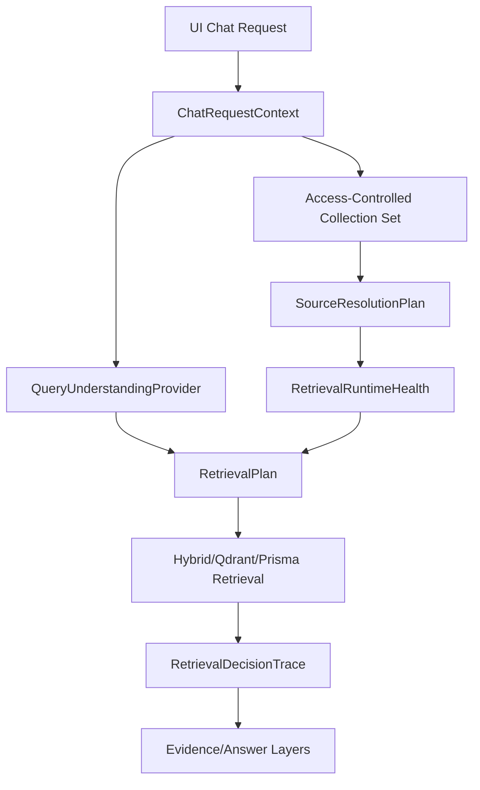

# R3MES Architecture Audit - Section 02

Date: 2026-05-15

Scope: source resolution, query understanding, retrieval entry path, UI/eval parity, runtime retrieval dependencies.

Non-scope: answer planning, composer, safety presentation, feedback-to-regression implementation. Those are downstream layers and should be reviewed after this section.

## Executive Summary

This section is the first major quality boundary after ingestion. The current system has a working RAG backbone, but the runtime behavior is not yet product-level for arbitrary enterprise data.

The main issue is not one single broken function. The risk comes from a chain:

1. UI and eval call the same backend endpoint, but with different source-selection conditions.
2. Backend auto-selects all private collections when the user has not selected a source.
3. The runtime retrieval engine defaults to Prisma lexical retrieval unless `R3MES_RETRIEVAL_ENGINE=hybrid`.
4. BGE-M3 embeddings and cross-encoder reranking can silently fall back outside production/strict envs.
5. Query understanding and routing are mostly deterministic heuristics with hardcoded domain rules.
6. Table/KAP/numeric retrieval support exists, but part of it is hardcoded into retrieval and extraction logic rather than represented as general document intelligence.

So eval can be green while UI quality is bad. The eval path can be cleaner than real UI traffic because it usually sends explicit `collectionIds`, always sends debug header, and may run under a different retrieval environment.

## Current Architecture Map

### 1. UI Chat Request

Observed files:

- `apps/dApp/components/chat-screen.tsx`
- `apps/dApp/lib/api/chat-stream.ts`

Flow:

1. Chat UI keeps `selectedCollectionIds` as state. It starts as `[]`.
2. If exactly one collection exists, the UI auto-selects it.
3. If multiple collections exist, the UI does not auto-select; it sends no `collectionIds`.
4. `includePublic` defaults to `false`.
5. The UI sends the chat body to `/v1/chat/completions` through `streamChatCompletions`.
6. The UI sets `stream: false` even though the function name says stream. The client then renders a typewriter-style response locally.
7. `collectionIds` is only included when the selected list is non-empty.
8. `includePublic` is included as a boolean.
9. `X-R3MES-Debug: 1` is sent only when local chat debug is enabled.

Evidence:

- `apps/dApp/components/chat-screen.tsx:688` initializes `selectedCollectionIds`.
- `apps/dApp/components/chat-screen.tsx:689` initializes `includePublic`.
- `apps/dApp/components/chat-screen.tsx:764` keeps existing valid selection or auto-selects only when there is exactly one collection.
- `apps/dApp/components/chat-screen.tsx:876` sends `messages`, `collectionIds`, `includePublic`, and adapter fields.
- `apps/dApp/lib/api/chat-stream.ts:156` sends `stream: false`.
- `apps/dApp/lib/api/chat-stream.ts:169` includes `collectionIds` only when present.
- `apps/dApp/lib/api/chat-stream.ts:170` includes `includePublic`.
- `apps/dApp/lib/api/chat-stream.ts:180` sends debug header only when enabled.

Deterministic/model/fallback classification:

- UI source selection: deterministic UI state.
- UI domain filtering: deterministic heuristic.
- Model use: none.
- Fallback: backend auto-private behavior when no source is selected.

### 2. Backend Chat Entry

Observed file:

- `apps/backend-api/src/routes/chatProxy.ts`

Flow:

1. Backend receives `/v1/chat/completions`.
2. `stream` is true only when request body explicitly sets `stream: true`; UI/eval use false.
3. Backend normalizes `collectionIds` and `includePublic`.
4. Backend extracts a retrieval query from user messages.
5. Follow-up queries can be expanded with previous user turns if they look contextual.
6. Query understanding is built before retrieval.
7. Accessible collections are resolved by wallet, requested collection IDs, and `includePublic`.
8. If no `collectionIds` and `includePublic=false`, all private collections for the wallet become accessible by default.
9. Conversational/source-discovery intents can skip retrieval.
10. Query planning is run through deterministic skill/router code.
11. Retrieval engine is chosen from environment.

Evidence:

- `apps/backend-api/src/routes/chatProxy.ts:121` defaults retrieval engine to `prisma`.
- `apps/backend-api/src/routes/chatProxy.ts:506` extracts and contextualizes retrieval query.
- `apps/backend-api/src/routes/chatProxy.ts:1506` reads `stream`.
- `apps/backend-api/src/routes/chatProxy.ts:1544` reads `includePublic` and `collectionIds`.
- `apps/backend-api/src/routes/chatProxy.ts:1560` builds query understanding.
- `apps/backend-api/src/routes/chatProxy.ts:1568` resolves accessible collections.
- `apps/backend-api/src/routes/chatProxy.ts:1576` traces auto-private source default.
- `apps/backend-api/src/routes/chatProxy.ts:1597` bypasses retrieval for conversational intent.
- `apps/backend-api/src/routes/chatProxy.ts:1643` runs the query planner skill.

Deterministic/model/fallback classification:

- Request normalization: deterministic.
- Follow-up query expansion: deterministic heuristic.
- Query understanding: deterministic heuristic.
- Query planner skill: deterministic local logic.
- Model use: not in this layer.
- Fallback: no selected source means all private collections are candidates.

### 3. Source Access and Source Resolution

Observed file:

- `apps/backend-api/src/lib/knowledgeAccess.ts`

Flow:

1. `resolveAccessibleKnowledgeCollections` returns collections owned by wallet or public collections when `includePublic=true`.
2. If `requestedCollectionIds` is present, it filters to those IDs.
3. If `requestedCollectionIds` is empty and `includePublic=false`, it returns all private collections owned by the wallet.
4. Suggestible collections are separately resolved and may include public collections.
5. Route candidates are scored using collection metadata, auto metadata profile, first documents, first chunks, profile embeddings, and lexical/profile matches.

Evidence:

- `apps/backend-api/src/lib/knowledgeAccess.ts:1499` resolves accessible collections.
- `apps/backend-api/src/lib/knowledgeAccess.ts:1520` resolves suggestible collections.
- `apps/backend-api/src/lib/knowledgeAccess.ts:1476` selects collection metadata, documents, and first chunks.
- `apps/backend-api/src/lib/knowledgeAccess.ts:82` reads `autoMetadata.profile`.
- `apps/backend-api/src/lib/knowledgeAccess.ts:575` builds adaptive query/profile terms.
- `apps/backend-api/src/lib/knowledgeAccess.ts:1253` ranks metadata route candidates.
- `apps/backend-api/src/lib/knowledgeAccess.ts:1357` builds route decision.

Deterministic/model/fallback classification:

- Source access: deterministic database query.
- Route scoring: deterministic heuristic plus deterministic profile embeddings.
- Model use: none in observed source resolution.
- Fallback: broad accessible collection set when UI sends no explicit source.

### 4. Query Understanding

Observed files:

- `apps/backend-api/src/lib/queryUnderstanding.ts`
- `apps/backend-api/src/lib/turkishQueryNormalizer.ts`
- `apps/backend-api/src/lib/conceptNormalizer.ts`
- `apps/backend-api/src/lib/queryRouter.ts`

Flow:

1. User query is normalized through Turkish text folding and concept normalization.
2. Query signals are extracted by token and regex rules.
3. Canonical concepts are inferred by hardcoded concept rules.
4. Conversation intent and answer task are detected deterministically.
5. Requested fields and output constraints are detected by deterministic rules.
6. Router rules infer domain/subtopic/risk/retrieval hints.

Evidence:

- `apps/backend-api/src/lib/queryUnderstanding.ts:269` builds query understanding output.
- `apps/backend-api/src/lib/turkishQueryNormalizer.ts:75` normalizes Turkish query text.
- `apps/backend-api/src/lib/conceptNormalizer.ts:164` defines hardcoded concept rules.
- `apps/backend-api/src/lib/queryRouter.ts:170` defines hardcoded route rules.

Deterministic/model/fallback classification:

- Query understanding: deterministic heuristic.
- Turkish NLP depth: string normalization and light suffix handling, not full morphological analysis.
- Model use: none.
- Fallback: generic token/concept handling when no domain rule matches.

### 5. Retrieval Engine Selection

Observed file:

- `apps/backend-api/src/routes/chatProxy.ts`

Flow:

1. Backend reads `R3MES_RETRIEVAL_ENGINE`.
2. Accepted runtime modes are `prisma`, `qdrant`, and `hybrid`.
3. If env is missing or invalid, mode defaults to `prisma`.
4. True hybrid retrieval is only used when engine is `hybrid` and true hybrid is enabled.
5. Qdrant-only and hybrid branches differ in diagnostics and fallback behavior.

Evidence:

- `apps/backend-api/src/routes/chatProxy.ts:121` defaults engine to `prisma`.
- `apps/backend-api/src/routes/chatProxy.ts:126` reads true hybrid flag.
- `apps/backend-api/src/routes/chatProxy.ts:1691` uses true hybrid only in hybrid mode.
- `apps/backend-api/src/routes/chatProxy.ts:1707` handles qdrant or hybrid qdrant branch.
- `apps/backend-api/src/routes/chatProxy.ts:1738` runs Prisma retrieval fallback/default.

Deterministic/model/fallback classification:

- Engine selection: deterministic env.
- Model use: none at selection point.
- Fallback: default Prisma; hybrid can fallback to Prisma when Qdrant fails.

### 6. Retrieval Modes

Observed files:

- `apps/backend-api/src/lib/hybridKnowledgeRetrieval.ts`
- `apps/backend-api/src/lib/knowledgeRetrieval.ts`
- `apps/backend-api/src/lib/qdrantRetrieval.ts`

Flow:

1. True hybrid retrieval gathers Qdrant candidates, Prisma lexical candidates, and critical evidence candidates.
2. It deduplicates, pre-ranks, aligns, reranks, diversifies, extracts evidence, and compiles evidence.
3. Legacy Prisma retrieval performs lexical search over ready chunks, with broad fallback if token results are thin.
4. Qdrant retrieval embeds query, searches vectors, route-filters, reranks, and extracts evidence.

Evidence:

- `apps/backend-api/src/lib/hybridKnowledgeRetrieval.ts:896` collects Qdrant candidates.
- `apps/backend-api/src/lib/hybridKnowledgeRetrieval.ts:927` collects Prisma candidates.
- `apps/backend-api/src/lib/hybridKnowledgeRetrieval.ts:987` collects critical evidence candidates.
- `apps/backend-api/src/lib/hybridKnowledgeRetrieval.ts:1431` starts the true hybrid retrieval flow.
- `apps/backend-api/src/lib/hybridKnowledgeRetrieval.ts:1804` compiles evidence and applies evidence gating.
- `apps/backend-api/src/lib/knowledgeRetrieval.ts:38` expands legacy query tokens with hardcoded medical terms.
- `apps/backend-api/src/lib/knowledgeRetrieval.ts:172` fetches broad fallback chunks when lexical results are thin.
- `apps/backend-api/src/lib/qdrantRetrieval.ts:122` runs Qdrant vector retrieval.

Deterministic/model/fallback classification:

- Prisma lexical retrieval: deterministic.
- Qdrant vector retrieval: model embedding if real embedding provider is active; deterministic fallback possible.
- Cross-encoder rerank: model if provider is active; deterministic fallback possible.
- Critical evidence candidate logic: deterministic, currently includes hardcoded KAP/finance/table rules.

### 7. Runtime AI Dependencies

Observed files:

- `apps/backend-api/src/lib/qdrantEmbedding.ts`
- `apps/backend-api/src/lib/modelRerank.ts`
- `apps/backend-api/src/lib/decisionConfig.ts`

Flow:

1. Embedding provider defaults to deterministic unless env selects `ai-engine` or `bge-m3`.
2. Real embedding provider is required only if strict env or production requires it.
3. Reranker defaults to model mode by config, but can fall back to deterministic if real provider is not required.
4. `decisionConfig` contains thresholds and domain/evidence hints.

Evidence:

- `apps/backend-api/src/lib/qdrantEmbedding.ts:40` decides whether real embeddings are required.
- `apps/backend-api/src/lib/qdrantEmbedding.ts:104` defaults provider to deterministic.
- `apps/backend-api/src/lib/modelRerank.ts:360` checks whether model reranker is enabled.
- `apps/backend-api/src/lib/modelRerank.ts:460` falls back to deterministic rerank.
- `apps/backend-api/src/lib/decisionConfig.ts:685` configures reranker mode.
- `apps/backend-api/src/lib/decisionConfig.ts:269` defines evidence planner hints.

Deterministic/model/fallback classification:

- BGE-M3: active only when configured.
- Reranker: active only when AI engine route works and provider conditions pass.
- Fallback: deterministic embeddings/rerank outside strict runtime.

### 8. Eval Chat Path

Observed file:

- `apps/backend-api/scripts/run-grounded-response-eval.mjs`

Flow:

1. Eval calls the same `/v1/chat/completions` endpoint.
2. Eval sends `stream: false`.
3. Eval sends `collectionIds` from the test case.
4. Eval sets `includePublic` true only if the test case explicitly asks for it.
5. Eval always sends debug header.

Evidence:

- `apps/backend-api/scripts/run-grounded-response-eval.mjs:1404` sends `collectionIds`, `includePublic`, and `stream:false`.
- `apps/backend-api/scripts/run-grounded-response-eval.mjs:1417` calls `/v1/chat/completions`.
- `apps/backend-api/scripts/run-grounded-response-eval.mjs:1421` always sends `x-r3mes-debug: 1`.

Conclusion:

UI and eval use the same backend endpoint, but they are not equivalent runtime tests. Source state, debug header, selected collection behavior, and env-driven retrieval mode can diverge.

## Gap Analysis

| Layer | Current state | Product-level expectation | Gap |
| --- | --- | --- | --- |
| UI request contract | Sends selected collections only if user selected them; otherwise backend auto-private applies. | Request should carry explicit source mode: selected, auto-private, all-accessible, source-discovery, or unknown. | Backend infers intent from absence of fields. |
| Source access | Wallet/public filtering works. | Access control and source resolution should be separate. | Access and relevance are coupled too late. |
| Source resolution | Metadata route scoring uses collection profile, first docs/chunks, deterministic scoring. | A `SourceResolutionPlan` should be produced before retrieval with confidence, candidate scopes, exclusions, and expected doc types. | Current route decision is partly post-retrieval and partly heuristic. |
| Query understanding | Turkish normalization, concept rules, answer task, requested fields. | Query intent should be data/domain adaptive and pluggable: heuristic baseline plus optional NLP/model/classifier. | Many concepts are hardcoded in code. |
| Retrieval engine | Defaults to Prisma. Hybrid only by env. | Product deployment should make retrieval mode explicit and observable per response. | UI quality can depend on hidden env. |
| Embeddings | Default deterministic; BGE-M3 only by env. | Real embedding health should be visible and fail-closed for production/eval. | Silent fallback can make eval/runtime misleading. |
| Reranker | Model mode exists; fallback deterministic. | Cross-encoder status should be surfaced and strict for product/eval. | Fallback can hide missing model dependency. |
| Table/numeric retrieval | KAP/finance/table critical evidence logic exists. | General table structure should be preserved from ingestion through retrieval. | Some table intelligence is regex/domain hardcoded. |
| Diagnostics | Debug has retrieval/evidence/source info when enabled. | UI/eval should collect comparable traces without requiring manual debug mode. | Eval sees more trace than normal UI traffic. |
| Eval reality | Same endpoint, often explicit source IDs. | Eval must include UI-reality scenarios: no source selected, multiple private collections, wrong selected source, debug off, default env. | Green eval can miss UI failures. |

## Findings

### F01 - UI and eval share endpoint but not runtime conditions

Symptoms:

- Eval green while UI answer quality is inconsistent.
- UI can use no selected source; eval usually sends explicit `collectionIds`.
- Eval always sends debug header; UI debug is conditional.

Evidence:

- UI request body: `apps/dApp/lib/api/chat-stream.ts:156`, `apps/dApp/lib/api/chat-stream.ts:169`, `apps/dApp/lib/api/chat-stream.ts:180`.
- UI collection state: `apps/dApp/components/chat-screen.tsx:688`, `apps/dApp/components/chat-screen.tsx:764`.
- Eval request body: `apps/backend-api/scripts/run-grounded-response-eval.mjs:1404`, `apps/backend-api/scripts/run-grounded-response-eval.mjs:1421`.

Why it matters:

The eval path can avoid the exact source ambiguity the UI has. That makes eval green an insufficient signal for product quality.

Fix:

Introduce a `ChatRequestContext` trace object in backend that records:

- `sourceMode`: `explicit_selected | ui_auto_single | backend_auto_private | include_public | source_discovery | none`
- `requestedCollectionIds`
- `effectiveCollectionIds`
- `includePublic`
- `debugEnabled`
- `retrievalEngine`
- `embeddingProvider`
- `rerankerMode`

Eval should assert on this context, not just final answer text.

Acceptance criteria:

- At least one eval case runs with multiple private collections and no selected source.
- Eval reports `sourceMode=backend_auto_private`.
- UI trace and eval trace are comparable.

Risk:

Medium. This touches observability and request contract but does not need to change answer generation.

### F02 - Backend auto-private default can retrieve from too broad a source set

Symptoms:

- User does not choose a source in UI.
- Multiple private collections exist.
- Backend searches all owned private collections.
- Retrieval may pull plausible but irrelevant chunks.

Evidence:

- `apps/backend-api/src/routes/chatProxy.ts:1568` resolves accessible collections.
- `apps/backend-api/src/routes/chatProxy.ts:1576` traces auto-private source default.
- `apps/backend-api/src/lib/knowledgeAccess.ts:1499` resolves owner/public collections.

Why it matters:

Enterprise users expect answers from the intended document set. A missing UI source selection should not silently become broad search unless the system can explain and validate the choice.

Fix:

Split access from resolution:

```ts
export type SourceResolutionMode =
  | "explicit"
  | "auto_single_private"
  | "auto_private_ranked"
  | "include_public"
  | "needs_user_scope"
  | "source_discovery";

export interface SourceResolutionPlan {
  mode: SourceResolutionMode;
  accessibleCollectionIds: string[];
  selectedCollectionIds: string[];
  rejectedCollectionIds: Array<{ id: string; reason: string; score?: number }>;
  confidence: number;
  warnings: string[];
}
```

For multiple private collections, retrieval should use ranked source resolution, not undifferentiated all-private retrieval.

Acceptance criteria:

- If multiple private collections exist and no source is selected, backend emits `auto_private_ranked`.
- Low-confidence source resolution returns a controlled source clarification/no-source response rather than broad noisy retrieval.

Risk:

Medium. Bad thresholds could over-clarify. Roll out behind a config flag.

### F03 - Retrieval engine defaults to Prisma lexical, not true hybrid

Symptoms:

- Project description says BGE-M3 + Qdrant + reranker + hybrid RAG.
- Runtime default in code is Prisma.
- UI quality can degrade if env is not set exactly.

Evidence:

- `apps/backend-api/src/routes/chatProxy.ts:121` defaults to `prisma`.
- `apps/backend-api/src/routes/chatProxy.ts:1691` true hybrid only runs in hybrid mode.
- `apps/backend-api/src/routes/chatProxy.ts:1738` Prisma path is default/fallback.

Why it matters:

The product architecture and actual runtime architecture can diverge. That makes quality debugging unreliable.

Fix:

Make retrieval runtime explicit in health, traces, and eval gates.

Recommended behavior:

- Development: allow Prisma fallback, but trace it loudly.
- Eval: require expected engine unless test explicitly declares fallback.
- Production pilot: fail startup or degrade visibly if configured engine is unavailable.

Acceptance criteria:

- Every chat trace includes `retrievalEngineRequested`, `retrievalEngineActual`, and `fallbackUsed`.
- Answer-quality eval fails when expected true hybrid is not active.

Risk:

Low to medium. Mostly config and observability; strict startup gates need careful deployment.

### F04 - BGE-M3 and reranker can silently fall back

Symptoms:

- Embedding provider defaults to deterministic.
- Reranker can fall back to deterministic unless strict/production requires real provider.
- Eval may pass with deterministic components that do not match product claims.

Evidence:

- `apps/backend-api/src/lib/qdrantEmbedding.ts:40` real embedding requirement.
- `apps/backend-api/src/lib/qdrantEmbedding.ts:104` deterministic default.
- `apps/backend-api/src/lib/modelRerank.ts:460` deterministic rerank fallback.
- `apps/backend-api/src/lib/decisionConfig.ts:685` reranker mode config.

Why it matters:

For arbitrary enterprise documents, retrieval quality depends on semantic retrieval and strong rerank. Silent fallback changes the system class.

Fix:

Add `RetrievalRuntimeHealth`:

```ts
export interface RetrievalRuntimeHealth {
  retrievalEngine: "prisma" | "qdrant" | "hybrid";
  embeddingProvider: "deterministic" | "ai-engine" | "bge-m3";
  embeddingFallbackUsed: boolean;
  rerankerMode: "model" | "deterministic" | "disabled";
  rerankerFallbackUsed: boolean;
  strictRuntime: boolean;
}
```

Acceptance criteria:

- Product/eval mode fails if expected BGE-M3 or cross-encoder is unavailable.
- UI debug panel and feedback metadata record actual provider/fallback status.

Risk:

Low. Main risk is exposing existing env misconfiguration.

### F05 - Query understanding is heuristic, not general NLP

Symptoms:

- Turkish normalization is string folding, token normalization, and light suffix stripping.
- Concept/routing rules are hardcoded in TypeScript.
- New domains require code changes.

Evidence:

- `apps/backend-api/src/lib/turkishQueryNormalizer.ts:75` normalizes by deterministic expansion.
- `apps/backend-api/src/lib/conceptNormalizer.ts:164` hardcodes concept rules.
- `apps/backend-api/src/lib/queryRouter.ts:170` hardcodes route rules.
- `apps/backend-api/src/lib/queryUnderstanding.ts:269` combines deterministic signals.

Why it matters:

The stated goal is a system that adapts to every enterprise data type. Hardcoded concept and route logic does not scale to arbitrary tenants or document types.

Fix:

Keep the heuristic layer as baseline, but introduce a provider boundary:

```ts
export interface QueryUnderstandingProvider {
  analyze(input: {
    query: string;
    tenantProfile?: TenantKnowledgeProfile;
    sourceProfiles?: SourceProfile[];
  }): Promise<QueryUnderstanding>;
}
```

Move domain lexicons into declarative domain packs:

```ts
export interface DomainLexiconPack {
  id: string;
  locale: "tr" | "en" | string;
  concepts: ConceptRule[];
  routeRules: RouteRule[];
  tableFieldAliases?: RequestedFieldAlias[];
}
```

Acceptance criteria:

- Existing behavior remains as `heuristic-tr-v1`.
- New domain rules can be loaded from config/profile without editing `conceptNormalizer.ts` or `queryRouter.ts`.

Risk:

Medium. Refactor must preserve existing KAP and medical/legal behavior while moving toward configuration.

### F06 - Source routing uses shallow collection samples

Symptoms:

- Metadata route candidates use collection auto metadata, first documents, and first chunks.
- Heterogeneous collections can be misrepresented.

Evidence:

- `apps/backend-api/src/lib/knowledgeAccess.ts:1476` selects first documents/chunks for source metadata.
- `apps/backend-api/src/lib/knowledgeAccess.ts:82` reads auto metadata profile.
- `apps/backend-api/src/lib/knowledgeAccess.ts:1253` ranks metadata route candidates.

Why it matters:

Enterprise collections often contain multiple departments, periods, document types, and templates. A collection-level profile can be too coarse.

Fix:

Add document-level and section-level routing summaries:

```ts
export interface SourceProfile {
  collectionId: string;
  documentProfiles: DocumentProfile[];
  aggregateProfile: KnowledgeMetadataProfile;
  freshness: { generatedAt: string; version: string };
}
```

Retrieval should resolve likely collections and likely document clusters before chunk retrieval.

Acceptance criteria:

- Route trace shows whether match came from collection profile, document profile, or chunk signal.
- Mixed collection eval verifies that unrelated documents in the same collection do not dominate.

Risk:

Medium. Needs ingestion metadata and query routing changes, but can be phased.

### F07 - Table/KAP/numeric retrieval intelligence is partly hardcoded

Symptoms:

- Critical evidence term groups include KAP/finance/table-specific terms.
- Requested field detection includes finance/KAP aliases.
- Table numeric extraction contains fixed regexes and row-noise assumptions.

Evidence:

- `apps/backend-api/src/lib/hybridKnowledgeRetrieval.ts:599` defines critical KAP/finance evidence groups.
- `apps/backend-api/src/lib/requestedFieldDetector.ts:37` defines finance table fields.
- `apps/backend-api/src/lib/tableNumericFactExtractor.ts:1` extracts KAP/table numeric facts from text.

Why it matters:

This improves KAP cases, but it is not a general solution for arbitrary PDF/DOCX/Excel/OCR enterprise tables.

Fix:

Move KAP logic behind a domain pack and introduce general table fact extraction:

```ts
export interface TableFieldCandidate {
  fieldId: string;
  label: string;
  aliases: string[];
  expectedValueType: "money" | "number" | "date" | "text" | "percentage";
  domainPackId?: string;
}
```

The generic extractor should use document table structure first, text regex second.

Acceptance criteria:

- KAP eval still passes.
- A non-KAP table eval passes without adding code-level aliases.

Risk:

Medium to high. Requires careful table provenance and document-understanding integration.

### F08 - Legacy Prisma fallback contains domain-specific expansion and broad chunk fallback

Symptoms:

- Default engine can use Prisma retrieval.
- Legacy token expansion includes hardcoded medical concepts.
- If lexical results are thin, it fetches broad chunks from accessible collections.

Evidence:

- `apps/backend-api/src/lib/knowledgeRetrieval.ts:38` expands query tokens with medical terms.
- `apps/backend-api/src/lib/knowledgeRetrieval.ts:172` fetches broad fallback chunks.
- `apps/backend-api/src/routes/chatProxy.ts:1738` can call this path by default.

Why it matters:

When the actual runtime is default Prisma, product behavior is controlled by a legacy retrieval path with broad fallback. That can produce irrelevant context and bad UI answers.

Fix:

Restrict broad fallback:

- Only allow broad fallback after source confidence is high.
- Add document/profile gating before broad chunk fetch.
- Trace `broadFallbackUsed`.
- Eval should include a "thin lexical match with multiple private collections" case.

Acceptance criteria:

- Broad fallback cannot pull chunks from low-confidence collections.
- Retrieval debug reports when broad fallback was used.

Risk:

Medium. Could reduce recall if thresholds are too strict.

### F09 - Retrieval and source selection are coupled too late

Symptoms:

- Source selection summary is built after retrieval.
- Suggestions and route decisions depend partly on retrieval results.
- The system lacks a first-class pre-retrieval plan.

Evidence:

- `apps/backend-api/src/routes/chatProxy.ts:1805` builds source selection summary after retrieval.
- `apps/backend-api/src/routes/chatProxy.ts:1653` resolves suggestible collections separately.
- `apps/backend-api/src/lib/knowledgeAccess.ts:1357` builds route decision using sources/suggestions.

Why it matters:

A product assistant should know why it searched a source before it answers. Post-hoc source summaries are useful, but they do not prevent bad retrieval.

Fix:

Create a `RetrievalPlan` after `SourceResolutionPlan` and before retrieval:

```ts
export interface RetrievalPlan {
  query: string;
  normalizedQuery: string;
  sourcePlan: SourceResolutionPlan;
  retrievalMode: "true_hybrid" | "qdrant" | "prisma";
  expectedEvidenceKinds: Array<"paragraph" | "table" | "numeric" | "procedure" | "definition">;
  requestedFields: string[];
  constraints: string[];
}
```

Acceptance criteria:

- Retrieval receives a plan, not scattered arguments.
- Trace records plan vs actual retrieval.

Risk:

Medium. Requires integration in `chatProxy.ts` and retrieval function signatures.

### F10 - Eval does not yet fully test UI reality

Symptoms:

- Same endpoint but different request state.
- Explicit collections reduce ambiguity.
- Debug is always enabled.
- Runtime engine/fallback status may not be enforced by all tests.

Evidence:

- `apps/backend-api/scripts/run-grounded-response-eval.mjs:1404` sends test case collection IDs.
- `apps/backend-api/scripts/run-grounded-response-eval.mjs:1421` always sends debug header.

Why it matters:

The failure class reported by users is UI answer quality, not isolated retrieval under ideal test conditions.

Fix:

Add a UI-reality eval profile:

```json
{
  "id": "ui_reality_no_selected_source_multiple_private",
  "messages": [{ "role": "user", "content": "Tablodaki net dönem karı nedir?" }],
  "collectionIds": [],
  "includePublic": false,
  "uiState": {
    "selectedCollectionIds": [],
    "availablePrivateCollections": ["kap-2024", "hr-policy"]
  },
  "expectTrace": {
    "sourceMode": "backend_auto_private",
    "retrievalEngineActual": "hybrid",
    "embeddingFallbackUsed": false,
    "rerankerFallbackUsed": false
  },
  "qualityBuckets": ["source_found_but_bad_answer", "table_field_mismatch"]
}
```

Acceptance criteria:

- Eval has separate suites for ideal backend, UI-reality, and fallback-runtime.
- UI-reality suite fails when source mode or runtime mode differs from expected.

Risk:

Low. This is evaluation coverage.

## Product-Level Target Architecture for This Section

The current RAG backbone should be preserved. The missing product layer is an explicit planning contract between UI request, source resolution, query understanding, and retrieval.

Recommended pipeline:



Required new/strengthened contracts:

```ts
export interface ChatRequestContext {
  requestId: string;
  sourceMode: "explicit_selected" | "backend_auto_private" | "include_public" | "source_discovery" | "none";
  requestedCollectionIds: string[];
  effectiveCollectionIds: string[];
  includePublic: boolean;
  debugEnabled: boolean;
}

export interface SourceResolutionPlan {
  mode: "explicit" | "auto_single_private" | "auto_private_ranked" | "include_public" | "needs_user_scope" | "source_discovery";
  selectedCollectionIds: string[];
  candidates: Array<{ collectionId: string; score: number; reasons: string[] }>;
  rejected: Array<{ collectionId: string; reason: string; score?: number }>;
  confidence: number;
  warnings: string[];
}

export interface RetrievalRuntimeHealth {
  retrievalEngineRequested: "prisma" | "qdrant" | "hybrid";
  retrievalEngineActual: "prisma" | "qdrant" | "hybrid";
  embeddingProvider: "deterministic" | "ai-engine" | "bge-m3";
  embeddingFallbackUsed: boolean;
  rerankerMode: "model" | "deterministic" | "disabled";
  rerankerFallbackUsed: boolean;
  strictRuntime: boolean;
}

export interface RetrievalPlan {
  query: string;
  normalizedQuery: string;
  sourcePlan: SourceResolutionPlan;
  runtime: RetrievalRuntimeHealth;
  expectedEvidenceKinds: Array<"paragraph" | "table" | "numeric" | "procedure" | "definition">;
  requestedFields: string[];
  outputConstraints: string[];
}
```

## Implementation Plan for This Section

### Phase 2.1 - UI Reality Trace and Eval Parity

Goal:

Make UI/eval/runtime differences visible and testable.

Files:

- `apps/backend-api/src/routes/chatProxy.ts`
- `apps/dApp/lib/api/chat-stream.ts`
- `apps/dApp/components/chat-screen.tsx`
- `apps/backend-api/scripts/run-grounded-response-eval.mjs`
- answer-quality eval fixtures

Work:

1. Add `ChatRequestContext` in backend trace.
2. Record explicit source mode and effective source set.
3. Add UI-reality eval cases:
   - no selected source with multiple private collections
   - selected wrong source
   - includePublic false with public relevant source
   - debug off simulation
4. Require trace assertions in answer-quality eval.

Acceptance criteria:

- Eval can fail because UI request conditions are not product-safe.
- Feedback metadata contains source mode and runtime dependency status.

Rollback:

- Keep trace additions behind debug/eval flag first.

### Phase 2.2 - SourceResolutionPlan

Goal:

Separate access control from relevance-based source resolution.

Files:

- `apps/backend-api/src/lib/knowledgeAccess.ts`
- `apps/backend-api/src/routes/chatProxy.ts`
- `apps/backend-api/src/lib/decisionConfig.ts`

Work:

1. Add `SourceResolutionPlan`.
2. Rank auto-private sources before retrieval.
3. Add low-confidence behavior:
   - ask for source scope if interactive mode allows it
   - otherwise no-source with candidate suggestions
4. Do not search all private collections blindly when confidence is low.

Acceptance criteria:

- Multiple-private collection query creates ranked source plan.
- Low-confidence source plan blocks broad retrieval.
- Existing explicit-source eval remains unchanged.

Rollback:

- Feature flag `R3MES_SOURCE_RESOLUTION_PLAN=0`.

### Phase 2.3 - Retrieval Runtime Health Gates

Goal:

Stop silent architecture drift between product claims and runtime.

Files:

- `apps/backend-api/src/lib/qdrantEmbedding.ts`
- `apps/backend-api/src/lib/modelRerank.ts`
- `apps/backend-api/src/routes/chatProxy.ts`
- `apps/backend-api/scripts/run-grounded-response-eval.mjs`

Work:

1. Add runtime health object to retrieval debug.
2. Add eval assertions for BGE-M3/Qdrant/reranker status.
3. In product/eval mode, fail if required real components are missing.

Acceptance criteria:

- Eval fails if true hybrid expected but Prisma ran.
- Eval fails if BGE-M3 expected but deterministic embedding used.
- Eval fails if model reranker expected but fallback was used.

Rollback:

- Strict gates only enabled in eval/product env.

### Phase 2.4 - Query Understanding Provider Boundary

Goal:

Make query understanding extensible without embedding every new domain into TypeScript code.

Files:

- `apps/backend-api/src/lib/queryUnderstanding.ts`
- `apps/backend-api/src/lib/conceptNormalizer.ts`
- `apps/backend-api/src/lib/queryRouter.ts`
- `apps/backend-api/src/lib/turkishQueryNormalizer.ts`
- new domain pack/config files

Work:

1. Keep current heuristic code as default provider.
2. Add provider interface.
3. Move hardcoded concept/route definitions toward declarative packs.
4. Add tenant/source-profile concepts as first-class inputs.

Acceptance criteria:

- Existing tests still pass under `heuristic-tr-v1`.
- A new domain concept can be added by config/pack, not by editing route code.

Rollback:

- Provider defaults to existing implementation.

### Phase 2.5 - De-hardcode KAP/Table Retrieval Logic

Goal:

Keep KAP quality gains while preventing KAP-specific code from becoming the general product intelligence layer.

Files:

- `apps/backend-api/src/lib/hybridKnowledgeRetrieval.ts`
- `apps/backend-api/src/lib/requestedFieldDetector.ts`
- `apps/backend-api/src/lib/tableNumericFactExtractor.ts`
- `apps/backend-api/src/lib/compiledEvidence.ts`
- ingestion metadata/table artifact files from Section 01

Work:

1. Move KAP/finance aliases into a domain pack.
2. Add generic table field candidates from document/table metadata.
3. Prefer structured table artifacts over raw text regex.
4. Keep regex extraction as fallback.

Acceptance criteria:

- KAP field eval still passes.
- Non-KAP table field eval passes with table metadata and no code-specific alias.

Rollback:

- Preserve old KAP extractor behind `kap-finance-v1` pack.

## Test and Eval Additions

### UI/eval parity cases

```json
{
  "id": "ui_no_selected_source_multiple_private",
  "messages": [{ "role": "user", "content": "Net dönem karı kaçtır?" }],
  "collectionIds": [],
  "includePublic": false,
  "expectTrace": {
    "sourceMode": "backend_auto_private",
    "broadFallbackUsed": false
  },
  "qualityBuckets": ["source_found_but_bad_answer", "table_field_mismatch"]
}
```

```json
{
  "id": "ui_selected_irrelevant_source",
  "messages": [{ "role": "user", "content": "Sermaye grubundaki pay tutarı nedir?" }],
  "collectionIds": ["hr-policy-collection"],
  "includePublic": false,
  "expectQuality": {
    "mustNotAnswerFromUnselectedSource": true,
    "mustSuggestRelevantSource": true
  },
  "qualityBuckets": ["over_aggressive_no_source", "source_found_but_bad_answer"]
}
```

### Runtime dependency cases

```json
{
  "id": "requires_true_hybrid_runtime",
  "messages": [{ "role": "user", "content": "Tablodaki toplam tutarı kaynakla ver." }],
  "collectionIds": ["mixed-enterprise-docs"],
  "expectTrace": {
    "retrievalEngineActual": "hybrid",
    "embeddingProvider": "bge-m3",
    "embeddingFallbackUsed": false,
    "rerankerFallbackUsed": false
  }
}
```

### Query understanding cases

```json
{
  "id": "new_domain_without_code_rule",
  "messages": [{ "role": "user", "content": "Bakım prosedüründeki maksimum duruş süresi nedir?" }],
  "collectionIds": ["maintenance-procedures"],
  "expectTrace": {
    "queryUnderstandingProvider": "heuristic-tr-v1",
    "sourceProfileConceptMatch": true
  },
  "qualityBuckets": ["ignored_user_constraint", "source_found_but_bad_answer"]
}
```

## What Not To Do In This Section

1. Do not solve this by increasing model size. The failure begins before generation.
2. Do not use LoRA for factual correctness.
3. Do not treat all-private auto-source as product intelligence.
4. Do not add more KAP regex directly into retrieval as the main path.
5. Do not accept green eval unless it reproduces UI source state and runtime dependencies.
6. Do not convert source resolution into an agent loop.
7. Do not remove the current RAG backbone; wrap it with explicit plans and traces.

## Final Verdict For Section 02

Current level:

The system has a functional RAG backend, but this layer is still prototype-to-pilot quality. It has strong components, but runtime behavior is too implicit for product reliability.

Primary bottleneck:

The main bottleneck is not Qwen2.5-3B. It is source/query/retrieval planning. The system does not yet have a first-class source resolution and retrieval plan contract, and real runtime dependencies can differ from the intended architecture.

Most important fix:

Add explicit `ChatRequestContext`, `SourceResolutionPlan`, `RetrievalRuntimeHealth`, and `RetrievalPlan` before changing composer behavior. Without these contracts, downstream evidence/composer improvements will keep receiving unstable context.

Expected effect:

For UI answer quality, this section should reduce irrelevant-source failures, eval/UI mismatch, and silent retrieval fallback errors. It will not fully solve table/numeric answer quality by itself; that requires the next layers: structured evidence, answer planning, and composer validation.

