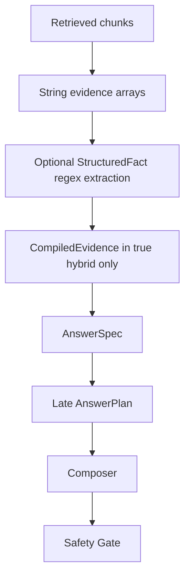
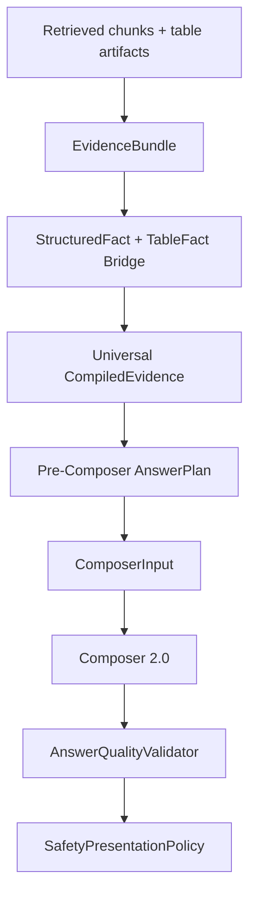

# R3MES Section 03 - Solution Research and Remediation Design

Date: 2026-05-16

Related audit: `docs/architecture-audits/section-03-evidence-answer-audit.md`

Scope: solutions for Section 03 findings: evidence extraction, compiled evidence, structured facts, AnswerPlan, composer, safety presentation, model fallback, and answer-quality eval.

Non-scope: source resolution and retrieval runtime planning. Those were implemented in Section 02.

## Research Basis

The solution design below uses repo observations plus these external technical references:

- [Docling official site](https://www.docling.ai/): Docling preserves document structure including tables, formulas, reading order, OCR, rows, columns, and multi-level headers.
- [Docling document model reference](https://docling-project.github.io/docling/reference/docling_document/): table cells, row/column bounding boxes, merged cells, row headers, column headers, and table data are explicit structures.
- [Docling paper](https://arxiv.org/abs/2501.17887): Docling uses specialized layout and table structure models for document conversion.
- [RAGAS metrics docs](https://docs.ragas.io/en/latest/concepts/metrics/available_metrics/): RAG eval should separately measure retrieval context, faithfulness, answer accuracy, and factual correctness.
- [RAGAS paper](https://arxiv.org/abs/2309.15217): RAG evaluation must consider context relevance, faithful use of context, and generation quality separately.
- [ARES paper](https://arxiv.org/abs/2311.09476): RAG evaluation should evaluate context relevance, answer faithfulness, and answer relevance; small human-annotated sets can calibrate automatic judges.
- [NIST AI RMF](https://www.nist.gov/itl/ai-risk-management-framework): trustworthy AI systems need valid/reliable behavior, safety, accountability, transparency, and evaluation practices.
- [Qwen2.5 technical report](https://arxiv.org/abs/2412.15115): Qwen2.5 improves instruction following and structural data analysis, but in R3MES it should remain a synthesis layer over clean evidence, not a fact source.

Research interpretation:

1. For tables, the source of truth should be row/column/cell artifacts, not flattened markdown/text.
2. RAG answer quality should be evaluated at multiple levels: context quality, evidence faithfulness, answer correctness, and presentation constraints.
3. Safety should be a deterministic validation and fail-safe layer, not the normal answer style.
4. A small model such as Qwen2.5-3B can be viable if the input is typed, small, source-grounded, and already planned.
5. The answer layer needs explicit contracts around evidence, planning, composer input, and validation.

## Target Architecture

Section 03 should evolve from:



to:



The current pipeline should not be replaced. Add the typed layer beside the old string arrays, then switch composer/eval to the typed layer gradually.

## Shared Contracts To Add

### EvidenceBundle

Recommended file:

- `apps/backend-api/src/lib/evidenceBundle.ts`

```ts
export type EvidenceItemKind =
  | "text_fact"
  | "table_fact"
  | "numeric_fact"
  | "procedure_step"
  | "source_limit"
  | "contradiction";

export interface EvidenceItem {
  id: string;
  kind: EvidenceItemKind;
  sourceId: string;
  documentId?: string;
  chunkId?: string;
  quote: string;
  normalizedClaim?: string;
  structuredFactId?: string;
  tableFactId?: string;
  confidence: "low" | "medium" | "high";
  provenance: {
    extractor: string;
    sourceSpan?: { start?: number; end?: number };
    page?: number;
    bbox?: [number, number, number, number];
  };
}

export interface EvidenceBundle {
  userQuery: string;
  items: EvidenceItem[];
  sourceIds: string[];
  requestedFieldIds: string[];
  diagnostics: {
    stringFactCount: number;
    structuredFactCount: number;
    tableFactCount: number;
    contradictionCount: number;
    sourceLimitCount: number;
  };
}
```

### TableFact Bridge

Recommended file:

- `apps/backend-api/src/lib/tableFactBridge.ts`

```ts
export interface TableFactToStructuredFactOptions {
  defaultSourceId: string;
  extractor: "docling" | "excel" | "ocr" | "regex_fallback";
}

export function structuredFactFromTableFact(
  fact: TableFact,
  opts: TableFactToStructuredFactOptions,
): StructuredFact;
```

### ComposerInput

Recommended file:

- `apps/backend-api/src/lib/composerInput.ts`

```ts
export interface ComposerInput {
  answerSpec: AnswerSpec;
  answerPlan: AnswerPlan;
  compiledEvidence: CompiledEvidence;
  evidenceBundle?: EvidenceBundle;
  constraints: {
    forbidCaution: boolean;
    noRawTableDump: boolean;
    maxWords?: number;
    sourceGroundedOnly: boolean;
  };
}
```

### AnswerQualityValidator

Recommended file:

- `apps/backend-api/src/lib/answerQualityValidator.ts`

```ts
export type AnswerQualityBucket =
  | "incomplete_answer"
  | "template_answer"
  | "unnecessary_warning"
  | "table_field_mismatch"
  | "raw_table_dump"
  | "ignored_user_constraint"
  | "source_found_but_bad_answer"
  | "over_aggressive_no_source"
  | "answer_too_long"
  | "wrong_output_format";

export interface AnswerQualityFinding {
  bucket: AnswerQualityBucket;
  severity: "warn" | "fail";
  message: string;
}
```

## R01 - Evidence Is Still Mostly String-First

### Problem

Repo evidence:

- `EvidenceExtractorOutput` is mostly string arrays in `apps/backend-api/src/lib/skillPipeline.ts:57`.
- `buildDeterministicEvidenceExtraction` creates direct/supporting/risk/missing evidence as strings in `apps/backend-api/src/lib/skillPipeline.ts:1226`.
- `CompiledEvidence` keeps `facts`, `risks`, `unknowns`, and optional `structuredFacts` in `apps/backend-api/src/lib/compiledEvidence.ts:8`.

Current failure mode:

The answer layer cannot reliably know whether a number belongs to a specific table row, column, period, source span, or requested field. This causes table-field mismatch, raw table dumps, and answer templates.

### Solution

Add `EvidenceBundle` beside the existing string arrays.

Implementation outline:

1. Keep `EvidenceExtractorOutput` backward compatible.
2. Add `evidenceBundle?: EvidenceBundle`.
3. In `buildDeterministicEvidenceExtraction`, every accepted string fact also creates an `EvidenceItem`.
4. Every structured fact creates a linked `EvidenceItem`.
5. `compileEvidence` accepts `EvidenceBundle` and carries it forward.
6. Debug exposes bundle diagnostics, not raw full evidence.

Files:

- `apps/backend-api/src/lib/evidenceBundle.ts`
- `apps/backend-api/src/lib/skillPipeline.ts`
- `apps/backend-api/src/lib/compiledEvidence.ts`
- `apps/backend-api/src/lib/hybridKnowledgeRetrieval.ts`

Acceptance criteria:

- Existing tests pass without reading `evidenceBundle`.
- `retrieval_debug.evidenceBundle.diagnostics` shows text/table/numeric counts.
- Answer-quality eval can assert `minEvidenceBundleItemCount`.

Rollback:

Feature flag:

```txt
R3MES_EVIDENCE_BUNDLE=0
```

Risk:

Low to medium. This is additive if old arrays remain.

## R02 - Generic TableFact Is Not Integrated

### Problem

Repo evidence:

- Generic `TableFact` exists in `apps/backend-api/src/lib/tableFact.ts`.
- Runtime extraction still uses string facts in `apps/backend-api/src/lib/tableNumericFactExtractor.ts:6`.
- `StructuredFact` has table metadata, but not full cell coordinate/bbox semantics in `apps/backend-api/src/lib/structuredFact.ts:5`.

Current failure mode:

The system reconstructs table meaning after flattening, which is exactly where table semantics are lost.

### Research Link

Docling's document model preserves table rows, columns, merged cells, headers, and bounding boxes. That is the correct input shape for enterprise table QA.

### Solution

Bridge table artifacts to structured facts before regex extraction.

Implementation outline:

1. Add `structuredFactFromTableFact`.
2. Add `tableFacts?: TableFact[]` to evidence extraction input or to a retrieval/evidence adapter.
3. Extraction order:
   - table artifact match
   - domain pack alias match
   - header/cell context match
   - regex fallback
4. Preserve provenance:
   - table ID
   - row/column index
   - header path
   - page
   - bbox
   - extractor
5. Existing regex extractor remains `regex_fallback`.

Files:

- `apps/backend-api/src/lib/tableFactBridge.ts`
- `apps/backend-api/src/lib/tableFact.ts`
- `apps/backend-api/src/lib/tableNumericFactExtractor.ts`
- `apps/backend-api/src/lib/structuredFact.ts`

Acceptance criteria:

- A non-KAP table case passes without adding aliases to TypeScript.
- KAP eval still passes.
- Structured fact includes row/column/page provenance when artifact exists.

Rollback:

Leave regex fallback as current behavior.

Risk:

Medium. Depends on ingestion artifact availability.

## R03 - CompiledEvidence Is Not Universal Across Retrieval Modes

### Problem

Repo evidence:

- `compileEvidence` is called in true hybrid retrieval at `apps/backend-api/src/lib/hybridKnowledgeRetrieval.ts:1810`.
- `chatProxy.ts` reads compiled evidence only when retrieval result has that property at `apps/backend-api/src/routes/chatProxy.ts:2064`.
- Qdrant and Prisma paths return evidence but not compiled evidence.

Current failure mode:

The answer layer behaves differently depending on retrieval engine. Eval can pass under true hybrid while fallback/runtime modes behave worse.

### Solution

Move compilation into a post-retrieval normalization adapter.

Implementation outline:

1. Add `normalizeRetrievedEvidence`.
2. Input: retrieval result, sources, grounding confidence.
3. Output always includes:
   - `evidence`
   - `compiledEvidence`
   - `compiledEvidenceStatus`
4. True hybrid can keep its internal compile, but the adapter should normalize shape.
5. Qdrant/prisma should compile their evidence through the same function.

Files:

- new `apps/backend-api/src/lib/retrievedEvidenceAdapter.ts`
- `apps/backend-api/src/routes/chatProxy.ts`
- `apps/backend-api/src/lib/compiledEvidence.ts`

Acceptance criteria:

- `retrieval_debug.compiledEvidence` exists whenever `retrieval_debug.evidence` exists.
- If compile is impossible, `retrieval_debug.compiledEvidenceStatus.reason` is explicit.
- Same answer-quality fixture can run across hybrid/qdrant/prisma with comparable debug fields.

Rollback:

Keep current true hybrid compiled evidence untouched; adapter can start as trace-only for qdrant/prisma.

Risk:

Medium.

## R04 - Structured Facts Do Not Count As Usable Grounding

### Problem

Repo evidence:

- `deriveConfidence` uses `factCount` from string facts in `apps/backend-api/src/lib/compiledEvidence.ts:79`.
- `hasCompiledUsableGrounding` checks only `usableFactCount > 0` in `apps/backend-api/src/lib/compiledEvidence.ts:189`.

Current failure mode:

A high-confidence table cell can be ignored as grounding if string facts are absent or pruned.

### Solution

Make grounding count typed facts.

Implementation outline:

1. Add `usableGroundingCount = facts.length + structuredFacts.length`.
2. Add diagnostics:
   - `usableTextFactCount`
   - `usableStructuredFactCount`
   - `usableGroundingCount`
3. Update `hasCompiledUsableGrounding`:

```ts
return Boolean(evidence && ((evidence.usableFactCount ?? 0) + (evidence.structuredFactCount ?? 0)) > 0);
```

4. Confidence rule:
   - high-confidence structured fact + source ID can satisfy medium grounding.
   - high confidence needs either multiple supporting items or explicit source/table provenance.

Files:

- `apps/backend-api/src/lib/compiledEvidence.ts`
- `apps/backend-api/src/lib/compiledEvidence.test.ts`

Acceptance criteria:

- Structured-only evidence can be usable.
- Contradictions still downgrade confidence.
- No-source behavior does not become permissive without source IDs.

Rollback:

Feature flag:

```txt
R3MES_STRUCTURED_FACT_GROUNDING=0
```

Risk:

Low to medium.

## R05 - AnswerPlan Is Built Too Late

### Problem

Repo evidence:

- `buildAnswerPlan` is called inside `applyRenderedAnswer` in `apps/backend-api/src/routes/chatProxy.ts:914`.
- It is not used to guide evidence extraction or answer-path selection.

Current failure mode:

The system discovers that fields are missing only after evidence is already extracted and answer rendering is underway.

### Solution

Add pre-composer answer planning.

Implementation outline:

1. After query understanding and retrieval plan, build `AnswerPlanRequest`.
2. Before composer selection, build `AnswerPlan` from `AnswerSpec`.
3. Store it in `retrieval_debug.answerPlan`.
4. Use it to decide:
   - deterministic structured field answer
   - model synthesis over typed facts
   - no-source/missing-field fallback
5. Keep the existing call inside `applyRenderedAnswer` temporarily as a consistency check.

Files:

- `apps/backend-api/src/routes/chatProxy.ts`
- `apps/backend-api/src/lib/answerPlan.ts`
- `apps/backend-api/src/lib/answerSpec.ts`

Acceptance criteria:

- `chat_trace.answerPlan.coverage` exists before `answer_path`.
- Field extraction with missing required fields records missing field IDs before composer.
- Eval can assert `expectAnswerPlan.coverage`.

Rollback:

Trace-only first. Composer can continue using existing late plan until parity is verified.

Risk:

Medium.

## R06 - Requested Field Detection Is Hardcoded Finance/KAP

### Problem

Repo evidence:

- `FINANCE_TABLE_FIELDS` lives in `apps/backend-api/src/lib/requestedFieldDetector.ts:37`.
- Row-number field logic is in `apps/backend-api/src/lib/tableNumericFactExtractor.ts`.
- `TableDomainPack` exists but is not integrated.

Current failure mode:

Adding a new domain means editing TypeScript. That conflicts with arbitrary enterprise data support.

### Solution

Move field aliases into domain packs and source/table profiles.

Implementation outline:

1. Add `RequestedFieldProvider`.
2. It reads:
   - `DomainLexiconPack`
   - `TableDomainPack`
   - source profile table headers
3. Current `FINANCE_TABLE_FIELDS` becomes `kap-finance-v1` pack.
4. `detectRequestedFields` accepts optional provider context.
5. Hardcoded finance fields remain fallback for compatibility.

Files:

- `apps/backend-api/src/lib/requestedFieldDetector.ts`
- `apps/backend-api/src/lib/domainLexiconPack.ts`
- `apps/backend-api/src/lib/tableDomainPack.ts`
- new `apps/backend-api/src/lib/requestedFieldProvider.ts`

Acceptance criteria:

- A new table field alias can be added through a pack/test fixture, not code.
- Existing KAP tests still pass with `kap-finance-v1`.

Rollback:

Default provider uses existing `FINANCE_TABLE_FIELDS`.

Risk:

Medium.

## R07 - Composer Still Contains Finance Table Mining

### Problem

Repo evidence:

- `composeFinanceTableFacts` parses labels/numbers from `spec.facts` in `apps/backend-api/src/lib/domainEvidenceComposer.ts:282`.
- Composer therefore still performs extraction.

Current failure mode:

Composer can choose values from raw text instead of preselected facts, causing field/value mismatches.

### Solution

Introduce Composer 2.0 that renders only selected facts.

Implementation outline:

1. Add `composePlannedAnswer(input: ComposerInput)`.
2. For `field_extraction`, render only `answerPlan.selectedFacts`.
3. If coverage is partial, use a controlled missing-field response.
4. Keep `composeFinanceTableFacts` behind a fallback flag:

```txt
R3MES_ENABLE_FINANCE_TABLE_STRING_FALLBACK=1
```

5. Once structured table eval is green, default the fallback off.

Files:

- `apps/backend-api/src/lib/domainEvidenceComposer.ts`
- new `apps/backend-api/src/lib/composerInput.ts`
- new `apps/backend-api/src/lib/plannedEvidenceComposer.ts`

Acceptance criteria:

- KAP cases pass without `composeFinanceTableFacts`.
- Composer never extracts new numbers from string facts during field extraction.
- Raw table dump is impossible when selected facts cover fields.

Rollback:

Re-enable finance table string fallback.

Risk:

Medium.

## R08 - Safety Can Become Presentation Policy

### Problem

Repo evidence:

- Low-grounding lead templates are in `apps/backend-api/src/lib/domainEvidenceComposer.ts:363`.
- Safety fallback renders through `composeAnswerSpec` in `apps/backend-api/src/lib/safetyGate.ts:175`.
- Domain fallback caution/action can enter the final answer through `answerSpec.ts`.

Current failure mode:

The system can sound templated or add caution text when the user asked for a field-only answer.

### Research Link

NIST AI RMF frames trustworthy AI as valid, reliable, safe, accountable, transparent, and able to fail safely. For R3MES, that means safety must preserve the no-source discipline and prevent unsafe claims, while not becoming normal answer content.

### Solution

Split safety validation from safety presentation.

Implementation outline:

1. Add `SafetyPresentationPolicy`.
2. Derive policy from `AnswerPlan.constraints`.
3. If `field_extraction && forbidCaution`, fallback can say missing source/field but must not add generic domain advice unless a blocking rail requires it.
4. Safety gate returns:
   - validation rails
   - presentation action
   - allowed fallback type
5. Composer applies final presentation policy.

Files:

- `apps/backend-api/src/lib/safetyGate.ts`
- `apps/backend-api/src/lib/domainEvidenceComposer.ts`
- new `apps/backend-api/src/lib/safetyPresentationPolicy.ts`

Acceptance criteria:

- Field-only queries do not include generic caution when sources are sufficient.
- Blocking safety rails still override unsafe answers.
- Safety result explains why fallback was applied.

Rollback:

Keep current fallback path and add policy only to debug first.

Risk:

Low to medium.

## R09 - Eval Does Not Enforce Plan/Structured Fact Coverage Enough

### Problem

Repo evidence:

- Fixtures include `qualityExpectations.requiredFields`.
- `detectAnswerQualityFindings` checks max words, answer terms, caution, raw table dump, and format, but not required fields in `apps/backend-api/scripts/run-grounded-response-eval.mjs:215`.

Current failure mode:

Eval may pass because a number appears, even if the field/value mapping is wrong.

### Research Link

RAGAS and ARES both separate retrieval/context and answer faithfulness/relevance. R3MES should additionally split answer-plan coverage from final answer text.

### Solution

Add answer-plan and structured fact assertions.

Implementation outline:

1. Add optional `expectAnswerPlan`:

```json
{
  "expectAnswerPlan": {
    "taskType": "field_extraction",
    "coverage": "complete",
    "missingFieldIds": []
  }
}
```

2. Add `qualityExpectations.requiredFieldValues`:

```json
{
  "requiredFieldValues": [
    { "fieldId": "net_donem_kari", "label": "Net Dönem Kârı", "value": "511.801.109" }
  ]
}
```

3. Add buckets:
   - `table_field_mismatch`
   - `source_found_but_bad_answer`
   - `ignored_user_constraint`
4. Include structured fact summaries in eval output.

Files:

- `apps/backend-api/scripts/run-grounded-response-eval.mjs`
- `infrastructure/evals/answer-quality/golden.jsonl`
- `infrastructure/evals/ui-reality/golden.example.jsonl`

Acceptance criteria:

- Eval fails if field is detected but `answer_plan.coverage` is partial when complete is required.
- Eval fails if answer contains value but not the requested field mapping.
- Eval fails if source exists and facts exist but final answer is incomplete.

Rollback:

Add new assertions only to new fixtures first.

Risk:

Low.

## R10 - Model Path Still Receives String Context

### Problem

Repo evidence:

- `injectRetrievedContextIntoMessages` injects `contextText` in `apps/backend-api/src/routes/chatProxy.ts:557`.
- The model path does not receive `AnswerPlan`, `StructuredFact`, or `CompiledEvidence` as typed objects.

Current failure mode:

When Qwen is used, it can still copy raw table text, miss requested fields, or add templated caution.

### Research Link

Qwen2.5 can follow instructions and handle structural data better than earlier models, but R3MES should not rely on model inference for factual extraction. The model input should be narrow and typed.

### Solution

Send typed composer context to the model path.

Implementation outline:

1. Add `buildModelComposerContext`.
2. Include:
   - answer plan summary
   - selected structured facts
   - compiled evidence facts
   - forbidden additions
   - output constraints
3. In field extraction, tell model:
   - only render selected facts
   - do not infer missing values
   - if coverage partial, say which field is missing
4. Keep deterministic composer as default.

Files:

- `apps/backend-api/src/routes/chatProxy.ts`
- `apps/backend-api/src/lib/composerInput.ts`
- new `apps/backend-api/src/lib/modelComposerContext.ts`

Acceptance criteria:

- Forced model composer mode passes KAP field extraction fixtures.
- Model path no longer raw-dumps table context.
- Model output is validated by `AnswerQualityValidator`.

Rollback:

Feature flag:

```txt
R3MES_TYPED_MODEL_COMPOSER_CONTEXT=0
```

Risk:

Medium. Model prompts can regress if too large; keep typed payload short.

## Consolidated Implementation Order

### Step 1 - Trace-Only EvidenceBundle

Implement `EvidenceBundle` and debug summaries without changing composer behavior.

### Step 2 - Structured Fact Grounding Fix

Let structured facts count as usable grounding in `CompiledEvidence`.

### Step 3 - Universal CompiledEvidence

Normalize qdrant/prisma/hybrid retrieval results into the same evidence contract.

### Step 4 - TableFact Bridge

Connect generic table artifacts to structured facts before regex fallback.

### Step 5 - Pre-Composer AnswerPlan

Build and trace AnswerPlan before answer-path selection.

### Step 6 - Composer 2.0

Render field extraction from selected facts only.

### Step 7 - Safety Presentation Policy

Keep deterministic safety, but preserve field-only and no-caution constraints.

### Step 8 - Eval Upgrade

Add `expectAnswerPlan`, `requiredFieldValues`, `table_field_mismatch`, and `source_found_but_bad_answer`.

### Step 9 - Typed Model Composer Context

Only after deterministic path is stable, give Qwen typed plan/evidence instead of raw context.

## Issue-to-Solution Matrix

| Root cause | Main fix | First safe mode | Risk |
| --- | --- | --- | --- |
| R01 string-first evidence | `EvidenceBundle` | trace-only | medium |
| R02 TableFact not integrated | `TableFact -> StructuredFact` bridge | fallback after regex | medium/high |
| R03 compiled evidence not universal | post-retrieval evidence adapter | debug-only for qdrant/prisma | medium |
| R04 structured facts ignored in grounding | count structured facts | unit test first | low/medium |
| R05 AnswerPlan late | pre-composer plan trace | trace-only | medium |
| R06 hardcoded requested fields | provider/domain packs | existing finance fallback | medium |
| R07 composer mines table strings | Composer 2.0 | fallback flag on | medium |
| R08 safety as presentation | safety presentation policy | debug-only then enforce | low/medium |
| R09 eval weak on plan/facts | answer-plan assertions | new fixtures only | low |
| R10 model sees raw context | typed model context | off by default | medium |

## Concrete Eval Additions

### AnswerPlan coverage

```json
{
  "id": "kap_net_profit_requires_complete_plan",
  "query": "SPK'ya göre net dönem kârı kaç? Sadece rakamı yaz.",
  "collectionIds": ["kap-pilot-real-disclosures"],
  "expectAnswerPlan": {
    "taskType": "field_extraction",
    "coverage": "complete",
    "missingFieldIds": []
  },
  "qualityExpectations": {
    "requiredFieldValues": [
      { "fieldId": "net_donem_kari", "value": "511.801.109" }
    ],
    "forbiddenBuckets": ["table_field_mismatch", "raw_table_dump", "unnecessary_warning"]
  }
}
```

### Non-KAP table field extraction

```json
{
  "id": "maintenance_table_max_downtime",
  "query": "Bakım raporunda maksimum duruş süresi nedir? Sadece değeri ve kaynağı ver.",
  "collectionIds": ["maintenance-report"],
  "expectAnswerPlan": {
    "taskType": "field_extraction",
    "coverage": "complete"
  },
  "qualityExpectations": {
    "requiredFieldValues": [
      { "fieldId": "max_downtime", "label": "Maksimum Duruş Süresi", "value": "42 dk" }
    ],
    "forbidCaution": true,
    "noRawTableDump": true
  }
}
```

### Source found but bad answer

```json
{
  "id": "source_found_but_answer_ignored_field",
  "query": "Tablodaki net dağıtılabilir dönem kârı kaç?",
  "collectionIds": ["kap-pilot-real-disclosures"],
  "minSources": 1,
  "minEvidenceFacts": 1,
  "qualityExpectations": {
    "requiredFieldValues": [
      { "fieldId": "net_dagitilabilir_donem_kari", "value": "579.151.463" }
    ],
    "forbiddenBuckets": ["source_found_but_bad_answer", "table_field_mismatch"]
  }
}
```

## Final Recommendation

The next implementation should not start with Composer 2.0 directly.

Do this order:

1. `EvidenceBundle`
2. structured-fact grounding fix
3. universal `CompiledEvidence`
4. table-artifact bridge
5. pre-composer `AnswerPlan`
6. Composer 2.0
7. safety presentation policy
8. eval upgrade
9. typed model context

This keeps the existing working deterministic answer stack while moving it toward product-grade typed evidence and field/value correctness.
