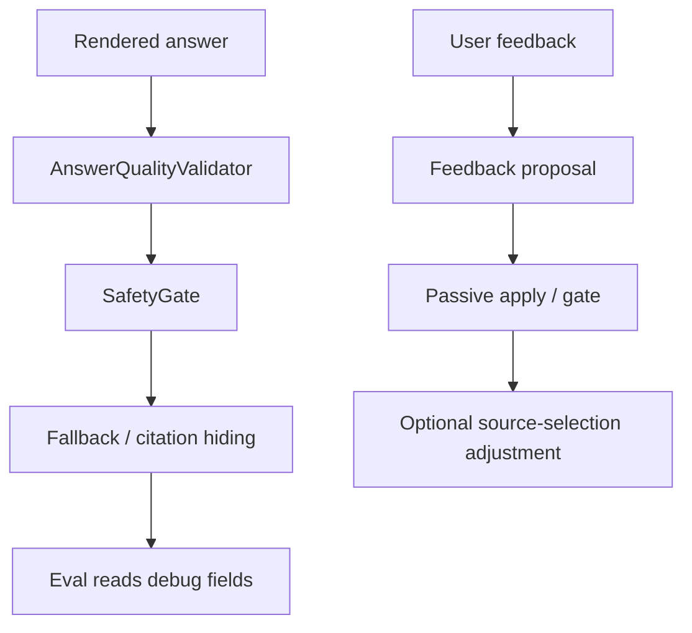
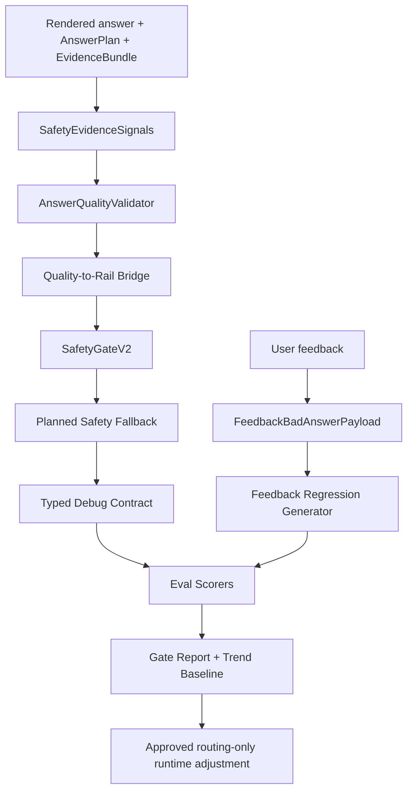

# R3MES Section 04 - Solution Research and Remediation Design

Date: 2026-05-16

Related audit: `docs/architecture-audits/section-04-safety-eval-feedback-audit.md`

Scope: solutions for Section 04 findings: safety gate, answer quality validation, eval runner, feedback regression, and feedback runtime loop.

Non-scope: retrieval ranking, ingestion/OCR, model replacement, UI redesign.

## Research Basis

The solution design below uses repo observations plus external architecture references. These references are used as design controls, not as required dependencies.

- [NVIDIA NeMo Guardrails guardrails process](https://docs.nvidia.com/nemo/guardrails/0.19.0/user-guides/guardrails-process.html): useful separation of input, retrieval, dialog, execution, and output rails. R3MES should keep its deterministic implementation, but adopt the layered rail thinking.
- [TruLens RAG triad](https://www.trulens.org/getting_started/core_concepts/rag_triad/): RAG quality should be separated into context relevance, groundedness, and answer relevance. This supports splitting retrieval pass from answer-quality pass.
- [RAGAS metrics documentation](https://docs.ragas.io/en/stable/concepts/metrics/): RAG evaluation should separately measure context precision, faithfulness, answer accuracy, and factual correctness. R3MES can keep deterministic evals while adopting this metric separation.
- [NIST AI Risk Management Framework](https://www.nist.gov/itl/ai-risk-management-framework): product-grade AI systems need valid/reliable behavior, safety, accountability, transparency, and continuous monitoring. This supports feedback-to-regression and trend gates.

Research interpretation:

1. Runtime safety should not be one final string check. It should receive typed signals from retrieval, evidence, answer planning, and answer quality.
2. A safety pass is not the same thing as a good answer. Product eval must score safety, grounding, and answer relevance separately.
3. Feedback should not directly mutate runtime behavior. It should first create a reproducible regression case, then pass a gate, then become an approved runtime adjustment if the failure type is routing-related.
4. Deterministic quality gates are the right default for R3MES. Optional LLM-as-judge can be offline only after typed deterministic contracts are stable.

## Target Section 04 Architecture

Current Section 04 flow:



Target flow:



Key product rule:

- Retrieval feedback may affect source selection after gate.
- Answer-quality feedback must become eval/composer/safety regression first.
- Safety fallback must not become the normal answer-style layer.

## Shared Contracts To Add

### SafetyEvidenceSignals

Recommended file:

- `apps/backend-api/src/lib/safetyEvidenceSignals.ts`

```ts
export interface SafetyEvidenceSignals {
  legacyUsableFactCount: number;
  usableEvidenceBundleItemCount: number;
  selectedStructuredFactCount: number;
  requestedFieldCount: number;
  coveredRequestedFieldCount: number;
  answerPlanCoverage: "complete" | "partial" | "none";
  sourceCount: number;
  retrievalWasUsed: boolean;
}

export function buildSafetyEvidenceSignals(input: {
  answerSpec?: AnswerSpec;
  answerPlan?: AnswerPlan;
  evidenceBundle?: EvidenceBundle;
  evidence?: EvidenceExtractorOutput;
  sources: ChatSourceCitation[];
  retrievalWasUsed: boolean;
}): SafetyEvidenceSignals;
```

Purpose:

- Stop safety from depending only on old string fact counts.
- Give safety a stable signal object instead of pulling from many debug shapes.

### SafetyInputV2

Recommended file:

- Extend `apps/backend-api/src/lib/safetyGate.ts`

```ts
export interface SafetyInputV2 extends SafetyInput {
  evidenceSignals?: SafetyEvidenceSignals;
  answerPlan?: AnswerPlan;
  answerQualityFindings?: AnswerQualityFinding[];
}
```

Purpose:

- Keep old `SafetyInput` backward compatible.
- Add typed Section 03 artifacts without a big rewrite.

### QualityRailMap

Recommended file:

- `apps/backend-api/src/lib/answerQualityRailMap.ts`

```ts
export type AnswerQualityRailId =
  | "ANSWER_QUALITY_INCOMPLETE"
  | "ANSWER_QUALITY_TEMPLATE"
  | "ANSWER_QUALITY_UNNECESSARY_WARNING"
  | "ANSWER_QUALITY_TABLE_FIELD_MISMATCH"
  | "ANSWER_QUALITY_RAW_TABLE_DUMP"
  | "ANSWER_QUALITY_IGNORED_CONSTRAINT"
  | "ANSWER_QUALITY_SOURCE_FOUND_BAD_ANSWER"
  | "ANSWER_QUALITY_TOO_LONG"
  | "ANSWER_QUALITY_WRONG_FORMAT";

export function safetyRailsFromAnswerQuality(
  findings: AnswerQualityFinding[],
): SafetyRailId[];
```

Purpose:

- Make runtime answer-quality failures visible in the same rail language as safety failures.

### SafetyRailPolicyConfig

Recommended file:

- `apps/backend-api/src/lib/safetyRailPolicy.ts`

```ts
export interface SafetyRailPolicyOverride {
  id: SafetyRailId;
  status?: SafetyRailStatus;
  enabled?: boolean;
  mode?: "runtime" | "eval_only" | "disabled";
}

export interface SafetyRailPolicyConfig {
  version: string;
  overrides: SafetyRailPolicyOverride[];
}
```

Purpose:

- Keep the static registry as schema/defaults.
- Allow controlled product tuning without editing rail definitions.

### PlannedSafetyFallback

Recommended file:

- `apps/backend-api/src/lib/safetyFallbackRenderer.ts`

```ts
export interface SafetyFallbackRenderInput {
  answerSpec: AnswerSpec;
  answerPlan?: AnswerPlan;
  evidenceBundle?: EvidenceBundle;
  sources: ChatSourceCitation[];
  fallbackMode: SafetyFallbackMode;
  qualityFindings?: AnswerQualityFinding[];
}

export function renderSafetyFallback(input: SafetyFallbackRenderInput): string;
```

Purpose:

- Move fallback text out of the safety decision engine.
- Reuse answer plan and presentation policy.

### FeedbackBadAnswerPayload

Recommended file:

- `apps/backend-api/src/lib/feedbackQualityPayload.ts`

```ts
export interface FeedbackBadAnswerPayload {
  qualityBucket: AnswerQualityFindingBucket;
  safeQuery?: string;
  expectedAnswerTerms?: string[];
  forbiddenAnswerTerms?: string[];
  requestedFields?: string[];
  expectedOutputFormat?: "short" | "bullets" | "table" | "freeform";
  maxLength?: number;
  badAnswerExcerptHash?: string;
}

export function normalizeFeedbackBadAnswerPayload(
  value: unknown,
): FeedbackBadAnswerPayload | null;
```

Purpose:

- Convert user-visible bad answers into exact regression expectations.
- Avoid storing raw private answer text.

### EvalDebugContract

Recommended file:

- `apps/backend-api/src/lib/evalDebugContract.ts`

```ts
export interface EvalDebugContract {
  version: "2026-05-section-04";
  safetyGate?: SafetyGateResult;
  answerQuality?: {
    findings: AnswerQualityFinding[];
    passed: boolean;
  };
  answerPlan?: AnswerPlan;
  evidenceSignals?: SafetyEvidenceSignals;
  evidenceBundleDiagnostics?: EvidenceBundleDiagnostics;
  sourceSelection?: unknown;
}
```

Purpose:

- Stop eval from depending on incidental debug response shape.
- Make debug-required eval cases fail explicitly when the contract is missing.

## Solution By Root Cause

## S04-RC01 - Safety gate is still string/fact-count first

### Problem

Repo observation:

- `apps/backend-api/src/lib/safetyGate.ts:208` derives usable evidence from `evidence?.usableFacts.length ?? answerSpec?.facts.length ?? 0`.
- `apps/backend-api/src/lib/safetyGate.ts:258` raises `NO_USABLE_FACTS` from that count.

This ignores newer typed artifacts such as `EvidenceBundle`, selected structured facts, and `AnswerPlan.coverage`.

### Solution

Add `SafetyEvidenceSignals` and use it as the preferred evidence signal source.

Implementation:

1. Create `safetyEvidenceSignals.ts`.
2. Build signals inside `chatProxy.ts` near `applyRenderedAnswer`.
3. Pass `evidenceSignals` into `evaluateSafetyGate`.
4. In `safetyGate.ts`, compute:
   - `usableFactCount = evidenceSignals?.usableEvidenceBundleItemCount || evidenceSignals?.selectedStructuredFactCount || legacyCount`
   - `requestedFieldCoverage = coveredRequestedFieldCount / requestedFieldCount`
5. Keep legacy behavior if `evidenceSignals` is absent.

Test cases:

- `NO_USABLE_FACTS` is not raised when `EvidenceBundle.items` has usable items.
- `NO_USABLE_FACTS` is raised when legacy facts and bundle items are both empty.
- Debug metrics include both legacy and typed counts.

Acceptance criteria:

- No existing safety tests regress.
- New tests prove structured evidence is safety-visible.

Risk:

- Medium. This changes safety decisions, but can be feature-flagged.

Rollback:

- Add env/config flag `R3MES_SAFETY_TYPED_SIGNALS=off`.

## S04-RC02 - Answer quality and safety are parallel systems

### Problem

Repo observation:

- Runtime quality validation runs at `apps/backend-api/src/routes/chatProxy.ts:958`.
- Safety gate runs at `apps/backend-api/src/routes/chatProxy.ts:1000`.
- `safetyGate.ts` does not consume `AnswerQualityFinding[]`.

This means answer-quality failures are not first-class policy failures.

### Solution

Introduce a quality-to-rail bridge.

Implementation:

1. Add quality rail IDs to `safetyRailRegistry.ts`.
2. Create `answerQualityRailMap.ts`.
3. Extend `SafetyInputV2` with `answerQualityFindings`.
4. In `evaluateSafetyGate`, map fail-level findings into rails.
5. Use default status:
   - `raw_table_dump`: rewrite
   - `table_field_mismatch`: rewrite
   - `incomplete_answer`: rewrite
   - `template_answer`: warn first, then rewrite after eval stabilization
   - `unnecessary_warning`: warn first, rewrite for field-extraction intents

Test cases:

- `raw_table_dump` finding produces `ANSWER_QUALITY_RAW_TABLE_DUMP`.
- `table_field_mismatch` finding produces `ANSWER_QUALITY_TABLE_FIELD_MISMATCH`.
- Warn-only findings do not block unless policy config promotes them.

Acceptance criteria:

- Debug has one policy explanation for quality failure.
- Eval can assert rail IDs for answer-quality failures.

Risk:

- High if all quality findings immediately rewrite. Start with policy statuses.

Rollback:

- Keep bridge enabled but default new rails to warn.

## S04-RC03 - Safety fallback bypasses planned composer policy

### Problem

Repo observation:

- `buildFallback(...)` in `apps/backend-api/src/lib/safetyGate.ts:138` renders fallback with `composeAnswerSpec(...)`.
- Normal planned rendering uses `composePlannedAnswer(...)` and `SafetyPresentationPolicy`.

Fallback can reintroduce generic caution/template text after the planned composer path already avoided it.

### Solution

Separate safety decision from fallback rendering.

Implementation:

1. Make `evaluateSafetyGate` return fallback intent, not final fallback text, behind a compatibility path.
2. Add `safetyFallbackRenderer.ts`.
3. In `chatProxy.ts`, when safety requires fallback, call `renderSafetyFallback(...)` with:
   - `AnswerSpec`
   - `AnswerPlan`
   - `EvidenceBundle`
   - sources
   - fallback mode
   - quality findings
4. For source-suggestion and privacy-safe fallbacks, keep deterministic hard limits.
5. For low-grounding fallbacks, use answer-plan output format.

Test cases:

- Field extraction fallback is under 160 chars when requested format is short.
- Fallback does not include caution/risk text unless domain policy requires it.
- Privacy fallback exposes no source IDs.

Acceptance criteria:

- No generic caution in table/numeric extraction fallback.
- Safety fallback and normal composer share presentation policy.

Risk:

- Medium. Fallback text behavior changes.

Rollback:

- Keep old `buildFallback` behind `R3MES_SAFETY_FALLBACK_RENDERER=legacy`.

## S04-RC04 - `ANSWER_TOO_THIN` is length-based

### Problem

Repo observation:

- `apps/backend-api/src/lib/safetyGate.ts:309` adds `ANSWER_TOO_THIN` for answers under 40 chars when retrieval was used, except finance field extraction.

This can punish correct concise answers.

### Solution

Make thin-answer logic answer-plan aware.

Implementation:

1. Add helper:

```ts
function shouldApplyThinAnswerRail(input: {
  answerText: string;
  answerPlan?: AnswerPlan;
  evidenceSignals?: SafetyEvidenceSignals;
  answerDomain: string;
  query: string;
  retrievalWasUsed: boolean;
}): boolean;
```

2. Do not apply thin rail when:
   - output format is `short`
   - requested fields are fully covered
   - source count is positive
   - usable evidence item count is positive
3. Keep thin rail for:
   - freeform answers
   - triage/risk answers
   - partial or no coverage
   - missing source support

Test cases:

- Single numeric answer with complete coverage passes.
- Empty or vague answer with sources fails.
- Triage answer under 40 chars still fails.

Acceptance criteria:

- Table/numeric evals no longer need domain-specific exceptions.

Risk:

- Medium. Could allow too-short answers if evidence signals are wrong.

Rollback:

- Feature flag thin-answer V2 logic.

## S04-RC05 - Static rail registry is not product-policy configurable

### Problem

Repo observation:

- `apps/backend-api/src/lib/safetyRailRegistry.ts:14` defines rail defaults statically.

Static defaults are good for determinism but too rigid for product tuning.

### Solution

Add `SafetyRailPolicyConfig` on top of static registry.

Implementation:

1. Keep `SAFETY_RAIL_DEFINITIONS` as canonical rail schema.
2. Add `resolveSafetyRailDefinition(id, policyConfig)`.
3. Load optional overrides from `decisionConfig.ts`.
4. Add debug output:
   - policy version
   - applied override IDs
5. Never allow unknown rail IDs in config.

Test cases:

- Unknown override ID fails config validation.
- Override can demote `ANSWER_TOO_THIN` to warn.
- Disabled rails are reported as disabled, not silently ignored.

Acceptance criteria:

- Product tuning does not require editing `safetyRailRegistry.ts`.
- Eval can run with a named policy version.

Risk:

- Medium. Misconfiguration can weaken safety.

Rollback:

- Default to static registry if no config exists.
- For high-risk rails, prevent demotion unless explicit `allowHighRiskDemotion=true`.

## S04-RC06 - BAD_ANSWER feedback creates weak regression cases

### Problem

Repo observation:

- `apps/backend-api/scripts/generate-feedback-regression-eval.mjs:241` creates BAD_ANSWER cases with source/fact requirements and forbidden `LOW_LANGUAGE_QUALITY`.
- It does not require exact quality bucket prevention by default.

This lets user-visible bad answers become green regressions.

### Solution

Add `FeedbackBadAnswerPayload` and generate strict quality expectations.

Implementation:

1. Add `feedbackQualityPayload.ts`.
2. In `feedback.ts`, sanitize and normalize:
   - `metadata.qualityBucket`
   - `metadata.expectedAnswerTerms`
   - `metadata.forbiddenAnswerTerms`
   - `metadata.requestedFields`
   - `metadata.expectedOutputFormat`
   - `metadata.maxLength`
3. In `generate-feedback-regression-eval.mjs`, for `BAD_ANSWER`:
   - include `qualityExpectations`
   - include `expectedAnswerQualityBucketsAbsent`
   - include expected output format if present
   - mark weak case if payload is missing
4. In `run-feedback-eval-gate.mjs`, fail approved BAD_ANSWER proposals with weak cases unless explicitly waived.

Test cases:

- BAD_ANSWER with `raw_table_dump` generates a case that fails on pipe-heavy answer.
- BAD_ANSWER with `unnecessary_warning` generates forbidden caution terms.
- BAD_ANSWER without payload is marked `weakFeedbackCase: true`.

Acceptance criteria:

- Source found but bad answer becomes reproducible as answer-quality failure.

Risk:

- High for existing feedback rows with weak metadata.

Rollback:

- Continue generating weak cases but do not allow weak cases to promote runtime changes.

## S04-RC07 - Eval answer-quality logic is duplicated

### Problem

Repo observation:

- Runtime validator is `apps/backend-api/src/lib/answerQualityValidator.ts:165`.
- Eval detector is duplicated in `apps/backend-api/scripts/run-grounded-response-eval.mjs:262`.

Runtime and CI can drift.

### Solution

Create a shared answer-quality contract consumed by runtime and eval.

Practical options:

1. Build TS before eval and import compiled JS from `dist`.
2. Move rule definitions into JSON and keep thin adapters in TS/MJS.
3. Keep duplicate detector short-term, but add a parity test.

Recommended path:

- Phase 1: parity test now.
- Phase 2: shared compiled module.

Implementation:

1. Add test fixture file:
   - `apps/backend-api/test-fixtures/answer-quality-cases.json`
2. Add runtime test that validates fixtures with TS validator.
3. Add script test that validates fixtures with eval detector.
4. Refactor eval detector into `scripts/eval-scorers/answer-quality.mjs`.
5. Later import the compiled runtime validator.

Test cases:

- Every bucket has one fail and one pass fixture.
- Runtime and eval produce the same bucket IDs.

Acceptance criteria:

- Adding a new quality bucket requires updating shared fixtures.

Risk:

- Low-medium. Mostly test and structure.

Rollback:

- Keep eval detector but enforce fixture parity.

## S04-RC08 - Eval success depends on debug shape

### Problem

Repo observation:

- Eval checks `safety_gate`, `answer_plan`, evidence, and retrieval debug fields.
- Runtime exposes these in `chatProxy.ts:1060` when debug data is present.

If UI and eval differ in debug header/response shape, eval can stop representing UI reality.

### Solution

Define `EvalDebugContract` and make eval fail explicitly when it is missing.

Implementation:

1. Add `evalDebugContract.ts`.
2. In `chatProxy.ts`, attach:
   - `debug_contract_version`
   - `safety_gate`
   - `answer_quality`
   - `answer_plan`
   - `evidenceSignals`
   - `evidenceBundleDiagnostics`
3. In eval cases, add:

```json
{
  "debugRequired": true,
  "expectDebugContractVersion": "2026-05-section-04"
}
```

4. In `run-grounded-response-eval.mjs`, fail with `debug_contract_missing` or `debug_contract_version_mismatch`.

Test cases:

- Debug-disabled response fails a debug-required eval case.
- Version mismatch fails clearly.
- UI path and eval path both expose same contract when debug is requested.

Acceptance criteria:

- Eval cannot silently score a partial response when internals are required.

Risk:

- Medium. Some existing eval cases may need explicit debug settings.

Rollback:

- Only require contract for new Section 04 cases at first.

## S04-RC09 - Feedback loop mostly targets routing, not answer intelligence

### Problem

Repo observation:

- `feedbackShadowRuntime.ts` can reorder candidate collections.
- It cannot repair answer composition, table-field mismatch, or unnecessary warning.

This can apply the wrong repair mechanism to the wrong failure.

### Solution

Split feedback into repair tracks.

Recommended categories:

```ts
export type FeedbackRepairTrack =
  | "routing"
  | "ingestion_evidence"
  | "answer_quality"
  | "safety_policy";
```

Mapping:

- `WRONG_SOURCE` -> routing
- `MISSING_SOURCE` -> routing or ingestion_evidence
- `BAD_ANSWER` with source present -> answer_quality
- `BAD_ANSWER` with no usable evidence -> ingestion_evidence
- `GOOD_SOURCE` / `GOOD_ANSWER` -> routing confidence or regression positive

Implementation:

1. Add repair-track classifier in `feedback.ts`.
2. Store repair track in proposal metadata.
3. Only routing proposals can create router adjustments.
4. Answer-quality proposals must create/require feedback regression cases.
5. Safety-policy proposals require explicit human approval and eval pass.

Test cases:

- BAD_ANSWER with correct source does not create routing adjustment.
- WRONG_SOURCE creates routing proposal.
- BAD_ANSWER with `raw_table_dump` creates answer-quality regression proposal.

Acceptance criteria:

- Feedback does not make source routing worse to compensate for composer bugs.

Risk:

- Medium-high. Existing proposal flows need careful compatibility.

Rollback:

- Keep old proposal actions but add repair track as metadata first.

## S04-RC10 - No stable quality trend/SLO layer

### Problem

Repo observation:

- Eval scripts write artifacts and summaries.
- There is no observed persistent trend baseline for answer-quality bucket deltas.

Product readiness needs movement over time, not only one green run.

### Solution

Add quality trend baselines and SLO gates.

Implementation:

1. Add artifact:
   - `artifacts/evals/quality-trends/latest-baseline.json`
2. Add summary fields:
   - `answerQualityFailureRate`
   - `rawTableDumpRate`
   - `tableFieldMismatchRate`
   - `unnecessaryWarningRate`
   - `overAggressiveNoSourceRate`
   - `sourceFoundBadAnswerRate`
3. Add `scripts/update-eval-baseline.mjs`.
4. In CI/gate mode:
   - fail if any critical bucket regresses above threshold
   - allow explicit baseline update only after review

Test cases:

- Current run worse than baseline blocks.
- Current run equal or better passes.
- Missing baseline warns locally but fails in production gate.

Acceptance criteria:

- Product quality can be tracked by bucket over time.

Risk:

- Low-medium. Artifact management can become noisy.

Rollback:

- Start trend gate as warn-only.

## Implementation Sequence

### Phase 4A - Typed safety signals

Goal:

- Make `EvidenceBundle` and `AnswerPlan` visible to safety.

Files:

- `apps/backend-api/src/lib/safetyEvidenceSignals.ts`
- `apps/backend-api/src/lib/safetyGate.ts`
- `apps/backend-api/src/routes/chatProxy.ts`

Acceptance:

- New tests for `NO_USABLE_FACTS` with evidence bundle.
- New debug metric `evidenceSignals`.

Rollback:

- Disable typed signal usage by config.

### Phase 4B - Quality rails

Goal:

- Unify answer-quality and safety policy language.

Files:

- `apps/backend-api/src/lib/answerQualityRailMap.ts`
- `apps/backend-api/src/lib/safetyRailRegistry.ts`
- `apps/backend-api/src/lib/safetyGate.ts`

Acceptance:

- `raw_table_dump`, `table_field_mismatch`, and `wrong_output_format` can be asserted as rails.

Rollback:

- New rails default to warn.

### Phase 4C - Planned fallback

Goal:

- Stop fallback from reintroducing boilerplate or unnecessary caution.

Files:

- `apps/backend-api/src/lib/safetyFallbackRenderer.ts`
- `apps/backend-api/src/lib/safetyGate.ts`
- `apps/backend-api/src/routes/chatProxy.ts`

Acceptance:

- Short table/numeric fallback stays concise and source-disciplined.

Rollback:

- Legacy fallback renderer flag.

### Phase 4D - Feedback quality payload

Goal:

- Make BAD_ANSWER feedback actionable.

Files:

- `apps/backend-api/src/lib/feedbackQualityPayload.ts`
- `apps/backend-api/src/routes/feedback.ts`
- `apps/backend-api/scripts/generate-feedback-regression-eval.mjs`
- `apps/backend-api/scripts/run-feedback-eval-gate.mjs`

Acceptance:

- BAD_ANSWER can generate strict answer-quality cases.
- Weak feedback cases are visible and cannot promote runtime changes.

Rollback:

- Continue weak case generation, block promotion.

### Phase 4E - Eval scorer split and debug contract

Goal:

- Make eval failures diagnosable and stable.

Files:

- `apps/backend-api/src/lib/evalDebugContract.ts`
- `apps/backend-api/scripts/eval-scorers/*.mjs`
- `apps/backend-api/scripts/run-grounded-response-eval.mjs`

Acceptance:

- Debug contract missing failure is explicit.
- Answer-quality scorer is isolated.

Rollback:

- Keep monolithic runner as compatibility path.

### Phase 4F - Trend gate

Goal:

- Turn eval from point-in-time pass/fail into product quality monitoring.

Files:

- `apps/backend-api/scripts/run-feedback-eval-gate.mjs`
- `apps/backend-api/scripts/update-eval-baseline.mjs`
- `artifacts/evals/quality-trends/*`

Acceptance:

- Trend report shows critical bucket deltas.
- Production gate can block regressions.

Rollback:

- Warn-only trend mode.

## Acceptance Matrix

| Issue | Minimum acceptance | Strong acceptance |
|---|---|---|
| RC01 typed safety signals | Bundle evidence prevents false `NO_USABLE_FACTS` | Safety metrics show legacy and typed evidence counts |
| RC02 quality rails | Blocking quality findings produce rails | Eval asserts quality rails directly |
| RC03 planned fallback | Fallback avoids unnecessary caution | All fallback modes use planned renderer |
| RC04 thin answer | Correct short numeric answer passes | No domain-specific extraction exception needed |
| RC05 policy config | Rail status override works | Policy version appears in debug/eval |
| RC06 BAD_ANSWER regression | Quality payload generates strict case | Weak BAD_ANSWER cases block promotion |
| RC07 shared quality logic | Runtime/eval parity fixtures pass | Eval imports shared validator |
| RC08 debug contract | Missing debug contract fails explicitly | UI/eval contract version is identical |
| RC09 repair tracks | BAD_ANSWER with correct source is not routing fix | Separate routing/answer/safety proposal queues |
| RC10 trend gate | Bucket rates are reported | Regression threshold blocks gate |

## Risks And Controls

| Risk | Control |
|---|---|
| New rails create too many rewrites | Start warn-only, promote after eval stabilization |
| Safety policy config weakens high-risk rails | Lock high-risk demotions behind explicit config and test |
| Feedback payload stores sensitive answer text | Store terms and hashes only; keep current metadata sanitization |
| Eval refactor breaks CI | Add scorer modules behind compatibility runner |
| Trend baselines create noisy failures | Start warn-only and require reviewed baseline update |
| Typed signals mask missing retrieval | Keep legacy source/evidence checks and expose both counts |

## What To Implement First

First implementation unit should be Phase 4A plus the minimum of Phase 4B.

Reason:

- Safety cannot make product-level decisions until it sees typed evidence and answer-plan coverage.
- Answer-quality findings cannot become gateable until they are mapped into safety rails.
- Feedback and trend work should wait until runtime decisions expose stable typed signals.

Recommended first PR/change set:

1. `safetyEvidenceSignals.ts`
2. `SafetyInputV2` additive fields
3. `chatProxy.ts` passes evidence signals and quality findings
4. `safetyGate.ts` uses evidence signals for `NO_USABLE_FACTS` and `ANSWER_TOO_THIN`
5. `answerQualityRailMap.ts` maps only critical buckets:
   - `raw_table_dump`
   - `table_field_mismatch`
   - `wrong_output_format`
6. Tests for false `NO_USABLE_FACTS`, short numeric answer, and raw table dump rail.

Do not start with feedback runtime mutation. It is downstream of stable runtime/eval semantics.

## Final Recommendation

Section 04 should be upgraded in small, testable layers:

1. Make safety read the same typed answer intelligence that composer uses.
2. Convert answer-quality failures into safety rails.
3. Route fallback through planned presentation logic.
4. Make BAD_ANSWER feedback generate strict answer-quality eval cases.
5. Split eval scoring and add a debug contract.
6. Add trend gates after the buckets are stable.

This keeps the existing RAG spine intact and fixes the actual product-level gap: green evals must no longer hide bad UI answers.
