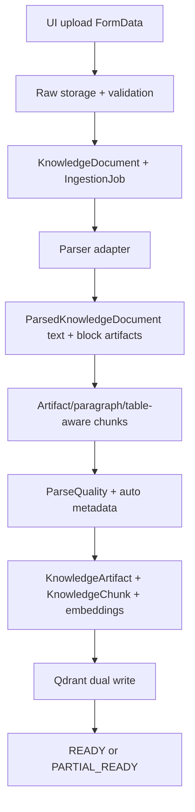
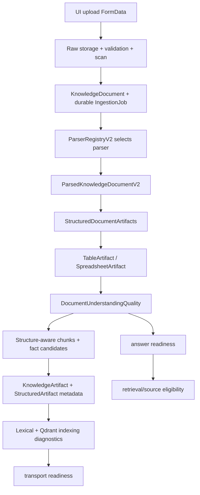

# R3MES Section 05 - Solution Research and Remediation Design

Date: 2026-05-16

Related audit: `docs/architecture-audits/section-05-ingestion-document-understanding-audit.md`

Scope: solutions for Section 05 findings: ingestion, parser registry, document understanding, table/spreadsheet semantics, parse quality, readiness gating, collection profile freshness, ingestion eval, embedding runtime diagnostics, and upload security.

Non-scope: retrieval ranking rewrite, answer composer rewrite, Qwen model replacement, blockchain/product narrative.

## Research Basis

This design uses repo observations plus external technical references. These are design controls, not mandatory dependencies.

- [OWASP File Upload Cheat Sheet](https://cheatsheetseries.owasp.org/cheatsheets/File_Upload_Cheat_Sheet.html): upload pipelines should keep files outside webroot, enforce permissions and size limits, and use AV/sandbox/CDR where applicable.
- [Docling official site](https://www.docling.ai/): Docling targets structured document conversion for PDF/DOCX/PPTX/HTML/XLSX/CSV and can detect OCR, reading order, tables, rows, columns, headers, cells, formulas, and bounding boxes.
- [Docling document model reference](https://docling-project.github.io/docling/reference/docling_document/): table cells have row/column offsets, row/column header flags, spans, text, and optional bounding boxes.
- [Docling document concepts](https://docling-project.github.io/docling/concepts/docling_document/): documents separate texts, tables, pictures, key-value items, body tree, furniture, and groups.
- [Apache Tika supported formats](https://tika.apache.org/2.9.0/formats.html): Tika/POI covers broad Office and OOXML text/metadata extraction, including Excel and CSV/TSV.
- [SheetJS CE API](https://docs.sheetjs.com/docs/api/) and [SheetJS parse options](https://docs.sheetjs.com/docs/api/parse-options/): spreadsheet parsing exposes workbook/sheet/cell/range utilities, with details around sparse/dense worksheets, self-reported ranges, stub cells, and VBA blobs.
- [ClamAV scanning docs](https://docs.clamav.net/manual/Usage/Scanning.html): `clamd` is a daemon for file scanning, `clamdscan` is a client, and signature DB setup is required.
- [BullMQ retry docs](https://docs.bullmq.io/guide/retrying-failing-jobs): retries require attempts/backoff and jobs can fail due processor exceptions or stalled jobs.

Research interpretation:

1. R3MES should keep its current async ingestion backbone. The missing layer is not "how to upload"; it is "how to preserve document structure so RAG can answer exact fields."
2. For tables, the source of truth should be a typed table artifact with row/column/cell provenance, not markdown table text.
3. Spreadsheet support should be first-class because Excel/CSV are not edge cases for enterprise knowledge assistants.
4. Parser fallback is acceptable for local dev, but product/pilot runtime must expose when parser, embedding, AV, or table extraction falls back.
5. Quality gates should distinguish transport readiness from answer readiness. A document can be stored and indexed while still not safe for strict field-level answers.
6. Evals must execute the real ingestion path for representative files. Text-only parse quality fixtures cannot prove parser/artifact/fact fidelity.

## Target Section 05 Architecture

Current effective flow:



Target flow:



Key rule:

- `readinessStatus` should continue to mean processing/indexing state.
- A new semantic layer should say whether the document can be used for strict grounded answers, table/numeric answers, and no-source discipline.

## Shared Contracts To Add

### ParserRegistryV2

Recommended files:

- Extend `apps/backend-api/src/lib/parserRegistry.ts`
- Adapt `apps/backend-api/src/lib/knowledgeText.ts`
- Expose richer fields through `apps/backend-api/src/routes/knowledge.ts`

```ts
export type ParserCapabilityKind = "built_in" | "external" | "service";
export type ParserHealth = "ready" | "degraded" | "unavailable";

export interface KnowledgeParserCapabilityV2 {
  id: string;
  version: number;
  kind: ParserCapabilityKind;
  sourceTypes: KnowledgeSourceType[];
  extensions: string[];
  mimeTypes: string[];
  priority: number;
  health: ParserHealth;
  supportsTables: boolean;
  supportsOcr: boolean;
  supportsSpreadsheets: boolean;
  outputSchemaVersion: number;
  reason?: string | null;
}
```

Purpose:

- Stop treating one external command as "document parser support."
- Allow Docling, Tika, spreadsheet parser, OCR parser, and current bridge to coexist.
- Make UI/parser status honest without leaking command paths.

### ParsedKnowledgeDocumentV2

Recommended file:

- Extend `apps/backend-api/src/lib/knowledgeText.ts`

```ts
export interface ParsedKnowledgeDocumentV2 extends ParsedKnowledgeDocument {
  schemaVersion: 2;
  pages?: Array<{
    pageNumber: number;
    width?: number;
    height?: number;
    text?: string;
  }>;
  structuredArtifacts?: StructuredDocumentArtifact[];
  parserRun: {
    id: string;
    version: number;
    profile?: "docling" | "tika" | "spreadsheet" | "ocr" | "external";
    durationMs?: number;
    fallbackUsed: boolean;
    outputSchemaVersion: number;
    warnings: string[];
  };
}
```

Purpose:

- Keep current `ParsedKnowledgeDocument` compatibility.
- Add typed structure beside existing text/artifacts.
- Preserve parser diagnostics for status/eval/debug.

### StructuredDocumentArtifact

Recommended file:

- New `apps/backend-api/src/lib/structuredDocumentArtifact.ts`
- Persist in `KnowledgeArtifact.metadata` first, then normalize later if needed.

```ts
export type StructuredDocumentArtifact =
  | StructuredTableArtifact
  | StructuredKeyValueArtifact
  | StructuredOcrSpanArtifact;

export interface StructuredTableArtifact {
  version: 1;
  kind: "table";
  tableId: string;
  title?: string | null;
  page?: number | null;
  sheetName?: string | null;
  headers: Array<{
    columnId: string;
    text: string;
    normalizedText: string;
    sourceCell?: string;
  }>;
  rows: Array<{
    rowId: string;
    label?: string;
    sourceRow?: number;
    cells: Array<{
      columnId: string;
      text: string;
      normalizedText: string;
      value?: string | number;
      valueType?: "string" | "number" | "date" | "boolean" | "empty";
      unit?: string;
      sourceCell?: string;
      confidence?: number;
    }>;
  }>;
  provenance: {
    parserId: string;
    parserVersion: number;
    artifactId?: string;
    bbox?: [number, number, number, number];
  };
}
```

Purpose:

- Give table/numeric RAG a stable input.
- Avoid hardcoding KAP row names.
- Let downstream StructuredFact extraction operate on row/column/value objects.

### DocumentUnderstandingQuality

Recommended file:

- New `apps/backend-api/src/lib/documentUnderstandingQuality.ts`
- Attach to `KnowledgeAutoMetadata.ingestionQuality` or a new sibling field.

```ts
export interface DocumentUnderstandingQuality {
  version: 1;
  parseQuality: "clean" | "usable" | "noisy";
  structureQuality: "strong" | "partial" | "weak";
  tableQuality: "none" | "text_only" | "structured";
  spreadsheetQuality: "none" | "structured" | "partial" | "failed";
  ocrQuality: "none" | "usable" | "weak";
  answerReadiness: "ready" | "partial" | "needs_review" | "failed";
  strictAnswerEligible: boolean;
  blockers: string[];
  warnings: string[];
  signals: {
    artifactCount: number;
    structuredArtifactCount: number;
    tableCount: number;
    structuredTableCount: number;
    tableCellCount: number;
    pageCount?: number;
    parserFallbackUsed: boolean;
  };
}
```

Purpose:

- Separate "uploaded/indexed" from "safe to answer exact questions."
- Prevent clean-looking but text-only tables from passing as structured evidence.

### IngestionEvalCase

Recommended files:

- New `infrastructure/evals/ingestion-quality/golden.jsonl`
- New `apps/backend-api/scripts/run-ingestion-quality-eval.mjs`

```ts
export interface IngestionEvalCase {
  id: string;
  bucket:
    | "spreadsheet_table"
    | "pdf_table_structure"
    | "docx_table_structure"
    | "ocr_noise"
    | "parser_failure"
    | "profile_staleness"
    | "embedding_runtime";
  input: {
    fixturePath: string;
    sourceType?: string;
  };
  expect: {
    readiness?: "READY" | "PARTIAL_READY" | "FAILED";
    answerReadiness?: "ready" | "partial" | "needs_review" | "failed";
    minStructuredTableCount?: number;
    requiredFields?: string[];
    forbiddenWarnings?: string[];
    requiredWarnings?: string[];
  };
}
```

Purpose:

- Test the real ingestion pipeline rather than scoring raw text.
- Make parser regressions visible before UI chat quality degrades.

## Solution Matrix By Root Cause

### S05-RC01 - Excel/XLSX/CSV intake is absent

Repo evidence:

- Source type enum is fixed to TEXT/MARKDOWN/JSON/PDF/DOCX/PPTX/HTML in `apps/backend-api/prisma/schema.prisma:46`.
- Upload validation allowlist lacks `.xls/.xlsx/.csv` in `apps/backend-api/src/lib/knowledgeFileValidation.ts:41`.
- `apps/backend-api/package.json` currently has no spreadsheet parser dependency; BullMQ/ioredis are present, spreadsheet libs are not.

Research:

- Docling currently advertises import support for XLSX and CSV plus document table/cell extraction.
- Apache Tika uses POI for Office/OOXML and includes CSV/TSV text parser coverage.
- SheetJS exposes workbook/sheet/cell/range utilities and parsing options for XLS/XLSX edge cases like self-reported ranges, stub cells, and macro blobs.

Solution:

1. Add source-kind support without forcing a broad Prisma migration first:
   - Keep current `KnowledgeSourceType` if migration risk is high.
   - Add `rawSourceKind`, `sourceExtension`, `sourceMime`, and `parserProfile` in metadata.
   - If enum migration is acceptable, add `CSV` and `SPREADSHEET`.
2. Add file validation for:
   - `.csv`: UTF-8 text-like plus delimiter sanity.
   - `.xlsx`: ZIP signature plus OOXML workbook path sanity (`xl/workbook.xml`).
   - `.xls`: OLE CFB signature if old Excel is required; otherwise defer old `.xls` behind an explicit unsupported message.
3. Add `spreadsheet-parser-v1` adapter:
   - Parse workbook sheets.
   - Emit one `StructuredTableArtifact` per detected table region.
   - Preserve sheet name, A1 cell address, row index, column index, raw text, typed value, and formula marker.
4. Treat formulas/macros as security/quality signals:
   - Formula cells can be stored as formula text plus cached value.
   - Macro-enabled files must become `needs_review` unless scanner/CDR policy allows them.

Files to touch:

- `apps/backend-api/src/lib/knowledgeFileValidation.ts`
- `apps/backend-api/src/lib/parserRegistry.ts`
- `apps/backend-api/src/lib/knowledgeText.ts`
- `apps/backend-api/src/lib/structuredDocumentArtifact.ts`
- `apps/backend-api/prisma/schema.prisma` only if adding enum/source fields
- `apps/dApp/components/studio/knowledge-upload-panel.tsx`
- `apps/dApp/lib/types/knowledge.ts`

Tests:

- `knowledgeFileValidation.test.ts`: csv/xlsx accepted, fake xlsx rejected.
- `knowledgeText.test.ts`: spreadsheet parser emits sheet/table/cells.
- `run-ingestion-quality-eval.mjs`: `spreadsheet_table` bucket.

Acceptance criteria:

- Uploading a simple `.xlsx` with two sheets produces at least two table artifacts.
- A cell value can be traced as `document -> artifact -> table -> row -> cell`.
- A question for one spreadsheet field can be answered without dumping the whole table.

Risk:

- High. This is product-critical for enterprise data.

Rollback:

- Keep spreadsheet parser behind `R3MES_ENABLE_SPREADSHEET_INGESTION=1`.
- UI accept list only exposes spreadsheet extensions when backend capability is healthy.

### S05-RC02 - External document parser is single-command and not parser-registry complete

Repo evidence:

- External parser is built from `R3MES_DOCUMENT_PARSER_COMMAND` in `apps/backend-api/src/lib/knowledgeText.ts:581`.
- Capability is marked available from env presence in `apps/backend-api/src/lib/knowledgeText.ts:702`.
- Current POC doc explicitly says the bridge is not production parser: `docs/operations/INGESTION_DOCUMENT_PARSER_POC.md`.

Research:

- Docling provides a document model and table structures; good candidate for layout/table-heavy PDF/DOCX/PPTX/HTML and scanned pages.
- Tika is broad-format text/metadata extraction; good candidate for fallback and coverage, not necessarily table-perfect extraction.

Solution:

1. Introduce ParserRegistryV2 but keep old adapter functions.
2. Model parser entries:
   - `plain-text-v1`
   - `markdown-v1`
   - `json-normalized-v1`
   - `docling-document-v1`
   - `tika-text-v1`
   - `spreadsheet-table-v1`
   - `external-document-parser-v1` as compatibility adapter
3. Add `healthCheck()` per parser:
   - Command configured.
   - Version command or smoke parse.
   - Output schema validation.
   - Last failure reason.
4. Parser selection should use:
   - extension + MIME + parser health + parser priority + table/OCR needs.
5. Store selected parser and fallback chain in parser diagnostics.

Files to touch:

- `apps/backend-api/src/lib/parserRegistry.ts`
- `apps/backend-api/src/lib/knowledgeText.ts`
- `apps/backend-api/src/routes/knowledge.ts`
- `apps/dApp/components/studio/knowledge-upload-panel.tsx`

Tests:

- Parser configured but unhealthy -> capability `degraded/unavailable`.
- Parser emits invalid JSON -> parse failure with `PARSER_SCHEMA_INVALID`.
- Docling parser unavailable and Tika available -> fallback is explicit.

Acceptance criteria:

- `/v1/knowledge/parsers` tells the UI which formats are actually usable and whether table/OCR support exists.
- Parser command presence alone does not equal "ready".
- Parser fallback appears in ingestion job diagnostics.

Risk:

- High for correctness; medium implementation risk if kept backward compatible.

Rollback:

- Default to existing `external-document-parser-v1`.
- V2 capability fields are additive.

### S05-RC03 - ParsedDocument is text-first; table semantics are not canonical

Repo evidence:

- `DocumentArtifact` stores `kind`, `text`, optional `page/title/items/metadata`, no typed table schema in `apps/backend-api/src/lib/knowledgeText.ts:38`.
- `KnowledgeArtifact` stores `kind/text/metadata` but no table cells in `apps/backend-api/prisma/schema.prisma:388`.

Research:

- Docling's table model has explicit table cell fields such as row/column offsets, header flags, spans, text, and bounding boxes.

Solution:

1. Keep current artifact storage.
2. Store structured table schema in `KnowledgeArtifact.metadata.structuredTable`.
3. Add `isStructuredTableArtifact(value)` validator.
4. Add `extractTableFactsFromStructuredArtifact()` for downstream.
5. Only add normalized Prisma models after schema stabilizes:
   - `KnowledgeTable`
   - `KnowledgeTableCell`
   - `KnowledgeStructuredFact`

Files to touch:

- `apps/backend-api/src/lib/structuredDocumentArtifact.ts`
- `apps/backend-api/src/lib/knowledgeArtifactPersistence.ts`
- `apps/backend-api/src/lib/tableFactBridge.ts`
- `apps/backend-api/src/lib/tableNumericFactExtractor.ts`

Tests:

- Persisted artifact metadata validates as `StructuredTableArtifact`.
- Table fact bridge reads artifact metadata, not raw chunk text.

Acceptance criteria:

- Same KAP table row produces a stable fact id across repeated ingestion.
- Extracted fact includes row label, column label, numeric value, page/sheet/cell provenance.

Risk:

- Critical for answer quality.

Rollback:

- If structured table extraction fails, preserve existing text artifact and mark `tableQuality: text_only`.

### S05-RC04 - Artifact inference is heuristic/string-based

Repo evidence:

- Artifact inference is regex/string based in `apps/backend-api/src/lib/knowledgeText.ts:429`.
- Footer/month/page/table rules are hardcoded heuristic fallback.

Solution:

1. Add artifact provenance:
   - `origin: "parser" | "heuristic" | "fallback"`
   - `confidence: "high" | "medium" | "low"`
2. Downgrade heuristic artifacts for strict table/numeric answers.
3. Do not remove heuristics; keep them for text/Markdown fallback.
4. Add an artifact quality scorer:
   - parser artifacts > heuristic artifacts
   - structured table > markdown table text > paragraph table-like text

Files to touch:

- `apps/backend-api/src/lib/knowledgeText.ts`
- `apps/backend-api/src/lib/knowledgeArtifactPersistence.ts`
- `apps/backend-api/src/lib/documentUnderstandingQuality.ts`

Tests:

- A Markdown table inferred by heuristic gets `origin=heuristic`, `tableQuality=text_only`.
- Parser-emitted structured table gets `origin=parser`, `tableQuality=structured`.

Acceptance criteria:

- Heuristic artifact never creates `strictAnswerEligible=true` for table/numeric unless structured facts are present.

Risk:

- High.

Rollback:

- Add metadata fields only; existing chunking behavior remains.

### S05-RC05 - Chunking preserves table text, not fact identity

Repo evidence:

- Markdown table splitting repeats header in `apps/backend-api/src/lib/knowledgeText.ts:859`.
- `chunkParsedKnowledgeDocument` returns chunk drafts, not facts, in `apps/backend-api/src/lib/knowledgeText.ts:1084`.

Solution:

1. Keep header-repeating table chunks for retrieval.
2. Add table fact candidates at ingestion:
   - one fact per meaningful cell or row/column value pair.
   - link each fact to `artifactId`, `rowId`, `columnId`, `sourceCell`, page/sheet.
3. Downstream retrieval can still retrieve table chunks, but answer planning should prefer facts when requested field is detected.
4. Avoid domain-specific row matching. Normalize labels generically with `normalizeConceptText`.

Files to touch:

- `apps/backend-api/src/lib/tableFactBridge.ts`
- `apps/backend-api/src/lib/tableNumericFactExtractor.ts`
- `apps/backend-api/src/lib/structuredDocumentArtifact.ts`
- Later Section 03 files: `compiledEvidence.ts`, `answerSpec.ts`, `domainEvidenceComposer.ts`

Tests:

- Same table chunk with repeated row labels must map to unique row/cell facts.
- Query for "Net dönem kârı" returns that row's value, not adjacent row.

Acceptance criteria:

- Raw table dump rate falls in answer-quality eval.
- `table_field_mismatch` bucket catches row/column swaps.

Risk:

- Critical.

Rollback:

- Facts can be generated but not used by composer until eval is green.

### S05-RC06 - Parse quality is text-level and does not validate structural fidelity

Repo evidence:

- `scoreKnowledgeParseQuality` uses text metrics in `apps/backend-api/src/lib/knowledgeParseQuality.ts:68`.
- Table warnings are regex-derived in `apps/backend-api/src/lib/knowledgeParseQuality.ts:108`.

Solution:

1. Keep `KnowledgeParseQuality` as low-level text health.
2. Add `DocumentUnderstandingQuality`.
3. Compute structural signals:
   - page count
   - artifact count by kind
   - structured table count
   - table cell count
   - parser fallback used
   - OCR warning/confidence
   - text-only table risk
4. Map to `answerReadiness`.

Files to touch:

- `apps/backend-api/src/lib/documentUnderstandingQuality.ts`
- `apps/backend-api/src/lib/knowledgeIngestionProcessor.ts`
- `apps/backend-api/src/lib/knowledgeAutoMetadata.ts`

Tests:

- Clean markdown table without structured cells: parse clean, structure partial, tableQuality text_only.
- Structured spreadsheet: parse clean/usable, tableQuality structured, answerReadiness ready.
- Noisy OCR: answerReadiness needs_review.

Acceptance criteria:

- A table-heavy text-only source no longer looks equivalent to a structured table source.

Risk:

- High.

Rollback:

- Do not change old parse score thresholds initially; add new field and report it.

### S05-RC07 - Quality signals do not strictly gate readiness

Repo evidence:

- Processor sets `qualityStatus: READY` after metadata/parse quality generation in `apps/backend-api/src/lib/knowledgeIngestionProcessor.ts:339`.
- Final `readinessStatus` follows vector index success/partial failure in `apps/backend-api/src/lib/knowledgeIngestionProcessor.ts:536`.
- Retrieval gating already checks ingestion quality in `apps/backend-api/src/lib/knowledgeAccess.ts:403` and `apps/backend-api/src/lib/hybridKnowledgeRetrieval.ts:822`.

Solution:

1. Do not overload `readinessStatus`.
2. Add `answerReadiness` in metadata:
   - `ready`
   - `partial`
   - `needs_review`
   - `failed`
3. Retrieval/source selection should require:
   - broad chat: `ready` or `partial`
   - strict no-source/table/numeric answers: `ready`
4. UI status board should show "indexed but needs review" separately.

Files to touch:

- `apps/backend-api/src/lib/documentUnderstandingQuality.ts`
- `apps/backend-api/src/lib/knowledgeAccess.ts`
- `apps/backend-api/src/lib/hybridKnowledgeRetrieval.ts`
- `apps/backend-api/src/routes/knowledge.ts`
- `apps/dApp/components/studio/knowledge-status-board.tsx`

Tests:

- Noisy OCR indexed in Prisma/Qdrant but excluded from strict route.
- User can still see/upload document status as processed.

Acceptance criteria:

- Bad parse does not silently become answer-quality debt.

Risk:

- High if gating too aggressive; phase with debug-only first.

Rollback:

- Feature flag `R3MES_ENABLE_ANSWER_READINESS_GATE=0`.

### S05-RC08 - Auto metadata can label "structured" without structural parsing

Repo evidence:

- `inferKnowledgeAutoMetadata` sets `structured` from knowledge card topic/tags in `apps/backend-api/src/lib/knowledgeAutoMetadata.ts:590`.
- `sourceQuality` is set from structured/route confidence at `apps/backend-api/src/lib/knowledgeAutoMetadata.ts:649`.

Solution:

Split the concept:

```ts
type ProfileSourceQuality = "structured_card" | "inferred" | "thin";
type DocumentStructureQuality = "strong" | "partial" | "weak";
```

1. Rename semantics internally:
   - Current `sourceQuality` remains for backward compatibility.
   - Add `profileSourceQuality`.
   - Add `documentStructureQuality` from `DocumentUnderstandingQuality`.
2. Retrieval strict route should not treat `sourceQuality=structured` as table/document structure.
3. UI should show profile confidence separately from parse/structure quality.

Files to touch:

- `apps/backend-api/src/lib/knowledgeAutoMetadata.ts`
- `apps/backend-api/src/lib/knowledgeAccess.ts`
- `apps/backend-api/src/lib/qdrantStore.ts`
- `apps/dApp/lib/types/knowledge.ts`

Tests:

- A note with `Topic/Tags` but no structured artifacts is `profileSourceQuality=structured_card`, `documentStructureQuality=weak/partial`.

Acceptance criteria:

- Domain/card structure no longer masquerades as table/document structure.

Risk:

- Medium.

Rollback:

- Add fields without removing `sourceQuality`.

### S05-RC09 - Collection profile merge can carry stale/wrong signals

Repo evidence:

- Processor merges existing collection metadata with new document metadata in `apps/backend-api/src/lib/knowledgeIngestionProcessor.ts:431`.

Solution:

1. Add `rebuildCollectionAutoMetadata(collectionId)`:
   - Read active documents in collection.
   - Merge only their current document metadata.
   - Ignore old collection-level metadata as an input source.
2. Use existing merge function after loading documents.
3. Add profile version/hash comparison to avoid unnecessary writes.
4. Run after ingestion and in backfill/refresh scripts.

Files to touch:

- `apps/backend-api/src/lib/knowledgeCollectionProfileRefresh.ts`
- `apps/backend-api/src/lib/knowledgeIngestionProcessor.ts`
- `apps/backend-api/scripts/knowledge-quality-refresh.mjs`

Tests:

- Upload finance table then HR procedure; delete or replace finance doc; collection profile no longer carries stale table concept.
- Rebuild is idempotent.

Acceptance criteria:

- Collection profile is a function of active documents, not historical merge residue.

Risk:

- Medium.

Rollback:

- Keep current incremental merge behind fallback path if rebuild fails.

### S05-RC10 - Ingestion eval does not run the real upload/parser/artifact path

Repo evidence:

- Parse-quality eval calls `chunkKnowledgeText(caseItem.text)` in `apps/backend-api/scripts/run-parse-quality-eval.mjs:70`.
- Golden fixtures are raw text JSONL in `infrastructure/evals/parse-quality/golden.jsonl`.

Solution:

Add three eval layers:

1. Parser contract eval:
   - Calls parser adapter with fixture buffers.
   - Validates `ParsedKnowledgeDocumentV2`.
2. Ingestion integration eval:
   - Runs raw storage validation, parser, chunking, artifact persistence using temp/mock DB or controlled DB.
   - Checks status, artifacts, chunks, quality.
3. Answer-impact eval:
   - Seeds ingested fixture.
   - Asks table/numeric questions.
   - Fails on raw table dump, field mismatch, overlong answer, no-source over-aggression.

Files to add/touch:

- `apps/backend-api/scripts/run-ingestion-quality-eval.mjs`
- `infrastructure/evals/ingestion-quality/golden.jsonl`
- `infrastructure/evals/ingestion-quality/fixtures/*`
- `apps/backend-api/package.json` script `eval:ingestion-quality`

Tests/eval buckets:

- `spreadsheet_table`
- `pdf_table_structure`
- `docx_table_structure`
- `ocr_noise_needs_review`
- `parser_failure_contract`
- `profile_staleness`
- `embedding_provider_mismatch`

Acceptance criteria:

- CI/product gate can fail if a parser no longer emits structured table artifacts.

Risk:

- Critical because eval trust is currently the weakest part of this section.

Rollback:

- Keep parse-quality eval; add ingestion eval as non-blocking report first.

### S05-RC11 - BGE-M3/Qdrant embedding fallback can hide runtime mismatch

Repo evidence:

- Fallback is possible in `apps/backend-api/src/lib/qdrantEmbedding.ts:126` and `apps/backend-api/src/lib/qdrantEmbedding.ts:150`.
- Tests already assert strict runtime failure when `R3MES_REQUIRE_REAL_EMBEDDINGS=1`.
- Runtime health warnings already include embedding fallback in `apps/backend-api/src/lib/retrievalRuntimeHealth.ts`.

Solution:

1. For product pilots, require:
   - `R3MES_EMBEDDING_PROVIDER=bge-m3`
   - `R3MES_REQUIRE_REAL_EMBEDDINGS=1`
   - matching `R3MES_QDRANT_VECTOR_SIZE`
2. Persist embedding diagnostics on ingestion/indexing:
   - requested provider
   - actual provider
   - fallbackUsed
   - dimension
   - model
3. Expose fallback in knowledge job/status and readiness baseline.
4. Add eval bucket `embedding_runtime`.

Files to touch:

- `apps/backend-api/src/lib/knowledgeIngestionProcessor.ts`
- `apps/backend-api/src/routes/knowledge.ts`
- `apps/backend-api/src/lib/retrievalRuntimeHealth.ts`
- `apps/backend-api/scripts/run-provider-readiness.mjs`

Tests:

- Dead BGE provider with require-real fails ingestion/indexing or provider readiness.
- Non-strict dev can fallback but job status says fallbackUsed.

Acceptance criteria:

- UI/eval cannot claim BGE-M3-backed retrieval when deterministic fallback was used.

Risk:

- Medium.

Rollback:

- Strict runtime only in pilot/prod env; dev remains fallback-friendly.

### S05-RC12 - Malware scan is a stub interface, not enterprise protection

Repo evidence:

- `scanKnowledgeUpload` only supports env override and EICAR detection in `apps/backend-api/src/lib/knowledgeFileValidation.ts:192`.
- Raw storage already has quarantine path support in `apps/backend-api/src/lib/knowledgeRawStorage.ts`.

Research:

- OWASP recommends AV/sandbox/CDR for applicable upload types.
- ClamAV provides `clamd` daemon and `clamdscan` client patterns, but requires signature database setup.

Solution:

1. Keep current scan interface; add provider adapters:
   - `local_stub`
   - `clamav_daemon`
   - `external_scan_command`
   - future commercial AV/CDR service
2. Add scan result shape:

```ts
export interface KnowledgeScanDiagnostics {
  provider: "local_stub" | "clamav_daemon" | "external_command" | "disabled";
  status: "CLEAN" | "QUARANTINED" | "FAILED";
  signature?: string;
  durationMs?: number;
  scannerVersion?: string;
}
```

3. Add policy:
   - Prod cannot use `local_stub` unless explicitly allowed.
   - PDF/DOCX/XLSX with macros or embedded files become `needs_review` unless CDR passes.
4. Keep files outside webroot and ensure least-privilege permissions.

Files to touch:

- `apps/backend-api/src/lib/knowledgeFileValidation.ts`
- `apps/backend-api/src/lib/knowledgeRawStorage.ts`
- `apps/backend-api/src/routes/knowledge.ts`
- Deployment docs/env docs.

Tests:

- EICAR quarantined.
- ClamAV unavailable in strict scan mode fails upload before parser.
- Stub scanner in production emits readiness warning or fails based on policy.

Acceptance criteria:

- No untrusted Office/PDF parser execution before scan policy passes.

Risk:

- High for deployment security; medium for answer quality.

Rollback:

- Keep stub mode for local dev only.

## Cross-Cutting Implementation Order

### Phase 05.1 - Add diagnostic contracts without behavior change

Goal:

- Add `DocumentUnderstandingQuality`, parser run diagnostics, and structured artifact validators.

Files:

- `apps/backend-api/src/lib/documentUnderstandingQuality.ts`
- `apps/backend-api/src/lib/structuredDocumentArtifact.ts`
- `apps/backend-api/src/lib/knowledgeIngestionProcessor.ts`
- `apps/backend-api/src/routes/knowledge.ts`

Acceptance:

- Existing tests pass.
- Existing upload behavior unchanged.
- Job/status response exposes new diagnostics when present.

Rollback:

- Remove additive metadata fields; old fields remain intact.

### Phase 05.2 - ParserRegistryV2 and parser contract eval

Goal:

- Make parser availability and schema validity explicit.

Files:

- `apps/backend-api/src/lib/parserRegistry.ts`
- `apps/backend-api/src/lib/knowledgeText.ts`
- `apps/backend-api/scripts/run-ingestion-quality-eval.mjs`

Acceptance:

- Invalid external parser output fails with `PARSER_SCHEMA_INVALID`.
- `/v1/knowledge/parsers` reports table/OCR/spreadsheet capability.

Rollback:

- Compatibility adapter keeps old external parser path.

### Phase 05.3 - StructuredTableArtifact in metadata

Goal:

- Preserve table row/column/cell semantics without immediate Prisma table migration.

Files:

- `apps/backend-api/src/lib/structuredDocumentArtifact.ts`
- `apps/backend-api/src/lib/knowledgeArtifactPersistence.ts`
- `apps/backend-api/src/lib/tableFactBridge.ts`

Acceptance:

- Parser-emitted structured tables persist in `KnowledgeArtifact.metadata`.
- Table facts can be extracted from metadata.

Rollback:

- If metadata validation fails, store text artifact and mark tableQuality text_only.

### Phase 05.4 - Spreadsheet parser POC

Goal:

- Add CSV/XLSX capability for controlled pilot.

Files:

- `apps/backend-api/src/lib/knowledgeFileValidation.ts`
- `apps/backend-api/src/lib/knowledgeText.ts`
- `apps/backend-api/src/lib/spreadsheetKnowledgeParser.ts`
- `apps/dApp/components/studio/knowledge-upload-panel.tsx`

Acceptance:

- `.csv` and `.xlsx` fixtures produce structured table artifacts.
- Sheet names and cell addresses are preserved.

Rollback:

- Feature flag hides spreadsheet extensions and rejects upload.

### Phase 05.5 - Answer readiness gate

Goal:

- Prevent semantically weak parses from being used for strict answers.

Files:

- `apps/backend-api/src/lib/knowledgeAccess.ts`
- `apps/backend-api/src/lib/hybridKnowledgeRetrieval.ts`
- `apps/backend-api/src/lib/qdrantStore.ts`
- `apps/dApp/components/studio/knowledge-status-board.tsx`

Acceptance:

- Noisy OCR and text-only tables are visible but not strict-answer eligible.

Rollback:

- Disable via `R3MES_ENABLE_ANSWER_READINESS_GATE=0`.

### Phase 05.6 - Security and durable queue hardening

Goal:

- Move from process-local background work and stub scan toward pilot-safe operations.

Files:

- `apps/backend-api/src/lib/knowledgeIngestionQueue.ts`
- `apps/backend-api/src/lib/knowledgeFileValidation.ts`
- Deployment docs.

Acceptance:

- BullMQ is used when Redis is configured; current inline/background remains local fallback.
- ClamAV/external scan provider can fail closed in pilot/prod.

Rollback:

- Use current `R3MES_KNOWLEDGE_INGESTION_MODE` fallback.

## Eval Redesign For Section 05

| Bucket | Fixture | Expected failure caught |
|---|---|---|
| `spreadsheet_table` | XLSX with two sheets, repeated labels, formulas, empty cells | Unsupported source, lost sheet/cell provenance |
| `csv_table` | CSV with Turkish decimal/comma formats | Wrong delimiter/value normalization |
| `pdf_table_structure` | PDF table with page number and row/column headers | Text-only extraction mistaken as structured table |
| `docx_table_structure` | DOCX table with merged headers | Lost row/column spans |
| `ocr_noise_needs_review` | OCR-like broken text/table | Noisy parse becoming strict answer-ready |
| `parser_failure_contract` | External parser exits 0 but emits invalid JSON | Capability/env treated as success |
| `profile_staleness` | Replace collection docs across domains | Stale profile retained |
| `embedding_provider_mismatch` | BGE requested but AI engine dead | Silent deterministic fallback |
| `scan_policy` | EICAR and macro-enabled office fixture | Parser runs before scan/quarantine |

Minimum eval assertions:

```json
{
  "id": "xlsx-income-table-basic",
  "bucket": "spreadsheet_table",
  "input": { "fixturePath": "fixtures/income-table.xlsx" },
  "expect": {
    "answerReadiness": "ready",
    "minStructuredTableCount": 1,
    "requiredFields": ["Net dönem kârı", "Dağıtılabilir dönem kârı"],
    "forbiddenWarnings": ["table_text_only", "parser_fallback_used"]
  }
}
```

```json
{
  "id": "ocr-fragmented-table-needs-review",
  "bucket": "ocr_noise_needs_review",
  "input": { "fixturePath": "fixtures/fragmented-ocr.txt" },
  "expect": {
    "answerReadiness": "needs_review",
    "requiredWarnings": ["ocr_risk_high"],
    "minStructuredTableCount": 0
  }
}
```

## Recommended Dependency Decisions

| Need | Recommendation | Reason |
|---|---|---|
| PDF/DOCX/PPTX/HTML structured parsing | Docling first for table/layout pilot; Tika fallback for broad text extraction | Docling is structure-oriented; Tika is broad coverage and stable text/metadata fallback. |
| XLSX/CSV parsing | Start with SheetJS or Docling XLSX/CSV bridge behind parser registry | Need cell/range/sheet fidelity; keep dependency isolated behind adapter. |
| AV scan | ClamAV daemon adapter first for local/private deployments; keep provider interface open | Low-friction starting point; not enough for all enterprise security alone. |
| Durable ingestion queue | Use existing BullMQ/ioredis dependency when Redis is configured | Package is already present; attempts/backoff align with ingestion retry needs. |
| Parser output storage | Store structured artifacts in JSON metadata first | Lower migration risk; can normalize Prisma tables after schema proves stable. |
| Readiness gate | Add answerReadiness alongside existing readinessStatus | Avoid breaking upload/index semantics while protecting chat quality. |

## What Not To Do

- Do not solve Excel/PDF table failures with KAP-specific row composers.
- Do not call text-only table parse "structured" because parse quality is clean.
- Do not expose spreadsheet upload before parser/eval can preserve sheet/cell provenance.
- Do not hide BGE/provider fallback in logs only; it must be visible in status/eval.
- Do not replace the current ingestion backbone. It is a usable base.
- Do not rely on Qwen or LoRA to infer missing table cells from flattened text.
- Do not make AV/CDR a prompt-level safety issue. It is an upload boundary issue.

## Final Recommendation

The next implementation should not start with a big parser migration. Start with additive contracts:

1. `DocumentUnderstandingQuality`
2. `StructuredTableArtifact`
3. Parser diagnostics/schema validation
4. Ingestion-quality eval runner

After those are visible, add spreadsheet parser support and answer-readiness gating. This order prevents hardcoded table fixes from being mistaken for product intelligence and gives the team a way to prove whether UI answer quality improves because source structure is actually preserved.
