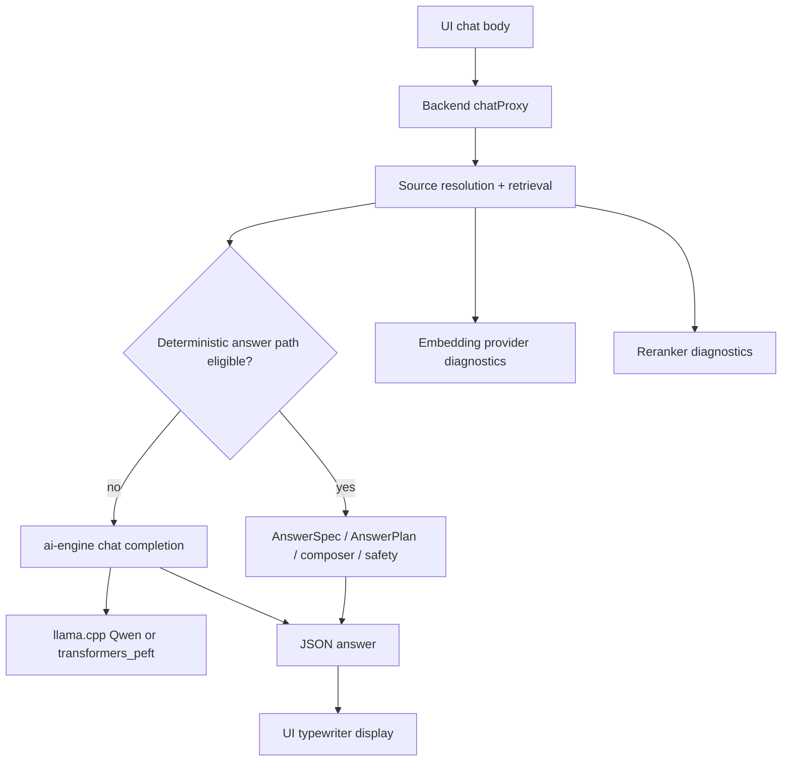
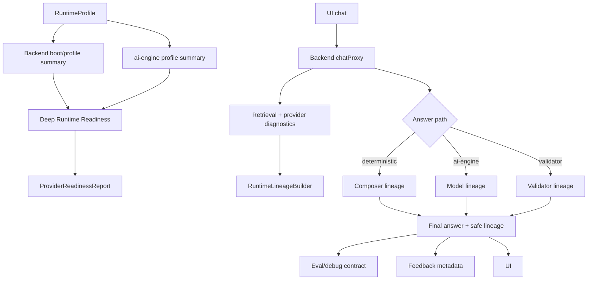

# R3MES Section 06 - Solution Research and Remediation Design

Date: 2026-05-17

Related audit: `docs/architecture-audits/section-06-ai-runtime-provider-readiness-audit.md`

Scope: solutions for Section 06 findings: AI runtime doctrine, provider readiness, Qwen/deterministic answer path visibility, BGE-M3 embedding fallback, cross-encoder reranker fallback, ai-engine health, Qdrant runtime availability, stream/non-stream contract, LoRA hot-swap throughput, feedback/eval runtime lineage.

Non-scope: retrieval algorithm rewrite, model replacement, LoRA knowledge training, UI redesign, blockchain/product narrative.

## Research Basis

This design uses repo observations plus external architecture references. External references are design controls, not mandatory dependencies.

- [Kubernetes probes documentation](https://kubernetes.io/docs/concepts/configuration/liveness-readiness-startup-probes/): separates liveness, readiness, and startup probes. R3MES should keep `/health` cheap, but add a separate deep RAG/runtime readiness gate.
- [OpenTelemetry semantic conventions](https://opentelemetry.io/docs/specs/semconv/): supports stable, low-cardinality observability attributes. R3MES answer/runtime lineage should use bounded enum fields, not raw prompts or source text.
- [Qdrant filtering and payload index docs](https://qdrant.tech/documentation/concepts/filtering/) and [Qdrant indexing docs](https://qdrant.tech/documentation/concepts/indexing/): payload filters/indexes are part of a production vector search design. R3MES already uses payload filters; readiness should verify both collection shape and provider payload quality.
- [BAAI/bge-m3 model card](https://huggingface.co/BAAI/bge-m3): BGE-M3 is designed for multilingual, multi-function retrieval. In R3MES, deterministic embedding must be treated as a local-dev fallback, not as equivalent semantic retrieval.
- [llama.cpp server docs](https://github.com/ggml-org/llama.cpp/tree/master/tools/server): llama-server is an OpenAI-compatible runtime surface. R3MES should keep llama.cpp as a runtime adapter, but expose runtime state and LoRA slot behavior through product diagnostics.

Research interpretation:

1. Runtime health is not one boolean. `/health` means process responds; `/ready` means dependencies needed for request handling are usable; deep RAG readiness means quality providers are real and not fallback.
2. A RAG answer must carry provider lineage. Without lineage, UI bad-answer feedback cannot distinguish bad retrieval, provider fallback, deterministic composer, safety fallback, or Qwen synthesis.
3. BGE-M3 and cross-encoder reranker are not optional quality details for pilot-grade KAP/table/numeric answers. They may be optional in local dev, but strict in eval/staging/pilot.
4. Qwen2.5-3B can remain viable if it is measured as a synthesis runtime, not treated as a hidden source of truth.
5. Stream support should be either a product contract or explicitly out of product path. A function named stream that sends `stream:false` creates operational ambiguity.
6. LoRA must stay behavior/persona-only. Its runtime cost and lock contention must not become a knowledge-correctness dependency.

## Target Section 06 Architecture

Current effective runtime flow:



Target product runtime flow:



Product rule:

- `RuntimeProfile` describes what should run.
- `RuntimeLineage` describes what actually ran for one answer.
- `ProviderReadinessReport` describes whether the environment is allowed to serve product traffic.

These three should not be mixed.

## Shared Contracts To Add

### RuntimeProfile

Recommended files:

- New shared type: `packages/shared-types/src/runtime.ts`
- Backend resolver: `apps/backend-api/src/lib/runtimeProfile.ts`
- ai-engine mirror: `apps/ai-engine/r3mes_ai_engine/runtime_profile.py`

```ts
export type RuntimeProfileName = "local-dev" | "eval" | "pilot-rag" | "production" | "peft-lab";
export type RuntimeStrictness = "dev_fallback_allowed" | "quality_fallback_blocked";

export interface RuntimeProfile {
  version: 1;
  name: RuntimeProfileName;
  strictness: RuntimeStrictness;
  chat: {
    runtime: "llama_cpp" | "transformers_peft";
    modelFamily: "qwen2_5_3b" | "unknown";
    modelId: string;
    synthesisOnly: boolean;
    allowDeterministicComposerBypass: boolean;
  };
  embedding: {
    requestedProvider: "ai-engine" | "bge-m3" | "deterministic";
    requiredRealProvider: boolean;
    expectedModelIncludes: string[];
    expectedDimension: number;
  };
  reranker: {
    requestedMode: "model" | "deterministic";
    requiredRealProvider: boolean;
    expectedProvider: "cross_encoder";
  };
  qdrant: {
    required: boolean;
    collectionName: string;
    vectorSize: number;
  };
  stream: {
    productMode: "non_stream_json" | "sse_stream";
  };
  lora: {
    role: "behavior_persona_only";
    optional: boolean;
    maxLockWaitMs?: number;
  };
}
```

Purpose:

- Stop spreading runtime truth across `.env`, backend code, ai-engine settings, README, and eval scripts.
- Make pilot profile explicit: real BGE-M3, real cross-encoder, Qwen synthesis-only, non-stream or stream product decision.

### RuntimeLineage

Recommended files:

- New backend type/builder: `apps/backend-api/src/lib/runtimeLineage.ts`
- Add field to `ChatTraceSnapshot`: `apps/backend-api/src/lib/chatTrace.ts`
- Add sanitized output to `evalDebugContract`: `apps/backend-api/src/lib/evalDebugContract.ts`
- Add feedback metadata extraction: `apps/dApp/components/chat-screen.tsx`

```ts
export type AnswerPathName =
  | "conversational_intent"
  | "no_source_fallback"
  | "rag_fast_path"
  | "contradiction_fast_path"
  | "low_confidence_evidence_fast_path"
  | "fast_grounded_composer"
  | "ai_engine"
  | "ai_engine_validated"
  | "ai_engine_parsed"
  | "ai_engine_draft_wrapped"
  | "ai_engine_empty_wrapped"
  | "ai_engine_raw_json";

export interface RuntimeLineage {
  version: 1;
  profileName?: RuntimeProfileName;
  answerPath: AnswerPathName;
  stream: boolean;
  qwen: {
    called: boolean;
    validatorCalled: boolean;
    callCount: number;
    runtime?: "llama_cpp" | "transformers_peft";
    model?: string;
  };
  composer: {
    deterministicUsed: boolean;
    plannedComposerUsed?: boolean;
    fallbackTemplateUsed?: boolean;
  };
  retrieval: {
    mode?: "true_hybrid" | "qdrant" | "prisma" | "legacy_hybrid";
    qdrantUsed: boolean;
    qdrantFallbackUsed?: boolean;
  };
  embedding: {
    requestedProvider?: string;
    actualProvider?: string;
    fallbackUsed: boolean;
    model?: string;
    dimension?: number;
  };
  reranker: {
    requestedMode?: string;
    actualMode?: string;
    provider?: string;
    fallbackUsed: boolean;
    fallbackReason?: string;
  };
  safety: {
    fallbackMode?: string;
    blockedReasonCount: number;
  };
}
```

Purpose:

- Make every bad answer diagnosable without exposing raw source text.
- Give feedback/eval a stable, PII-safe payload.
- Prevent "Qwen caused it" assumptions when deterministic composer answered.

### ProviderReadinessReport

Recommended files:

- Backend runtime readiness: `apps/backend-api/src/lib/providerReadiness.ts`
- Route: `apps/backend-api/src/routes/health.ts`
- Extend script output: `apps/backend-api/scripts/run-provider-readiness.mjs`

```ts
export type ReadinessStatus = "pass" | "degraded" | "fail";

export interface ProviderReadinessCheck {
  id:
    | "backend_db"
    | "backend_redis"
    | "ai_engine_runtime"
    | "llama_loaded"
    | "qdrant_health"
    | "qdrant_collection_shape"
    | "embedding_real_provider"
    | "embedding_semantic_smoke"
    | "reranker_real_provider"
    | "reranker_score_smoke";
  status: ReadinessStatus;
  latencyMs?: number;
  details?: Record<string, unknown>;
  requiredForProfile: boolean;
}

export interface ProviderReadinessReport {
  version: 1;
  generatedAt: string;
  profile: RuntimeProfile;
  status: ReadinessStatus;
  checks: ProviderReadinessCheck[];
  failures: string[];
  warnings: string[];
}
```

Purpose:

- Keep `/health` cheap.
- Add `GET /ready/rag-runtime` or `GET /ready?deep=rag-runtime`.
- Let CI, local runbook, and backend route use the same report structure.

### RuntimeFallbackPolicy

Recommended files:

- `apps/backend-api/src/lib/runtimeFallbackPolicy.ts`
- Use inside `qdrantEmbedding.ts`, `modelRerank.ts`, `chatProxy.ts`, `run-grounded-response-eval.mjs`.

```ts
export interface RuntimeFallbackPolicy {
  profileName: RuntimeProfileName;
  allowDeterministicEmbeddingFallback: boolean;
  allowLightweightRerankerFallback: boolean;
  allowBackendDeterministicRerankerFallback: boolean;
  allowQdrantFailSoft: boolean;
  allowDeterministicAnswerComposer: boolean;
  failChatWhenQualityProviderFallbackUsed: boolean;
}
```

Purpose:

- Replace scattered `NODE_ENV === "production"` and `R3MES_REQUIRE_REAL_*` checks with one policy resolver.
- Keep local dev usable while making eval/pilot strict.

## Root Cause Solutions

| Root cause | Product solution | Touch points | Acceptance criteria | Rollback |
|---|---|---|---|---|
| RC01 Backend `/ready` AI provider readiness'i kapsamıyor | Add deep readiness route/report; keep `/health` cheap and `/ready` DB/Redis-compatible | `routes/health.ts`, new `lib/providerReadiness.ts`, `scripts/run-provider-readiness.mjs` | ai-engine down makes deep readiness `fail`; DB/Redis `/ready` still works | Route behind `R3MES_ENABLE_DEEP_RUNTIME_READY=0` |
| RC02 Embedding fallback non-prod'da sessiz kalite sapması yaratabilir | Runtime profile makes real embedding mandatory for eval/pilot; fallback allowed only local-dev | `qdrantEmbedding.ts`, `runtimeFallbackPolicy.ts`, eval runner | `pilot-rag` with ai-engine embedding failure fails chat/eval; local-dev still falls back | Profile env back to `local-dev` |
| RC03 Reranker two-level fallback yanıltıcı | Require `provider=cross_encoder` and `fallback_used=false` for strict profiles | `modelRerank.ts`, `hf_reranker.py`, `run-grounded-response-eval.mjs` | Broken reranker local path fails provider-readiness and eval | `R3MES_RUNTIME_PROFILE=local-dev` |
| RC04 UI stream contract ambiguous | Choose product mode. Short term: rename/declare non-stream JSON; long term: SSE only after diagnostics are structured | `chat-stream.ts`, docs, tests; later ai-engine stream events | UI body snapshot expects `stream:false` in non-stream profile; no hidden stream claims | Keep current non-stream path |
| RC05 Qwen call path not metricized | Add `RuntimeLineage.qwen.callCount`, answer path, validator flag | `chatProxy.ts`, `runtimeLineage.ts`, `chatTrace.ts` | Every eval result has `answerPathName`, `qwen.called`, `validatorCalled` | Debug-only emission first |
| RC06 Provider readiness scripts not mandatory | Make provider-readiness a release gate and expose latest report | package scripts, CI/runbook, optional backend route reading artifact | CI or manual gate fails when BGE-M3/reranker fallback occurs | Keep script optional until CI adoption |
| RC07 Stream observability weak | Add stream first diagnostic event or trailer-like final event; do not enable product SSE before this | `proxy_service.py`, `chat-stream.ts`, ai-engine tests | Stream smoke sees runtime diagnostics without server log access | Keep product mode non-stream |
| RC08 LoRA global lock throughput risk | Keep LoRA optional; add lock wait budget and lineaged degradation | `proxy_service.py`, ai-engine README/runbook, backend lineage | Concurrent LoRA load test reports p95 lock wait; base-only RAG unaffected | Disable adapter use for pilot |
| RC09 llama_cpp vs transformers_peft doctrine mixed | RuntimeProfile selects official product profile; PEFT becomes `peft-lab` | `adapterRuntimeSelect.ts`, `settings.py`, docs | backend and ai-engine profile summaries agree | Continue `llama_cpp` default |
| RC10 Runtime fallback not in feedback | Add PII-safe `runtimeLineage` to feedback metadata and eval debug contract | `chat-screen.tsx`, `feedback.ts`, `evalDebugContract.ts` | BAD_ANSWER feedback stores answer path and provider fallback flags | Ignore unknown metadata fields |

## Detailed Remediation Plan

### Phase 1 - Contracts and lineage, no behavior change

Goal:

- Add runtime/profile/lineage types and expose them only in debug/eval/feedback metadata.
- Do not change provider fallback behavior yet.

Implementation:

1. Add `packages/shared-types/src/runtime.ts` with `RuntimeProfile`, `RuntimeLineage`, `ProviderReadinessReport`.
2. Add backend `runtimeProfile.ts` that resolves current env to a profile.
3. Add `runtimeLineage.ts` builder that converts existing `retrievalDebug`, `chatTrace`, reranker diagnostics, embedding diagnostics, and answer path into a safe summary.
4. Add `runtimeLineage` to `chat_trace` and `eval_debug_contract`.
5. Extend UI `buildFeedbackMetadata` to include:
   - `answerPathName`
   - `qwenCalled`
   - `validatorCalled`
   - `embeddingFallbackUsed`
   - `rerankerFallbackUsed`
   - `runtimeProfileName`

Tests:

- Unit test for `runtimeLineage.ts`: deterministic fast path -> `qwen.called=false`.
- Unit test for ai-engine path -> `qwen.called=true`.
- Feedback metadata test: debug data present -> safe runtime lineage copied without source text.
- Eval fixture: `expectRuntimeLineage.answerPath=rag_fast_path`.

Acceptance:

- Existing answer behavior unchanged.
- Every debug-enabled eval result includes runtime lineage.
- Feedback metadata can classify a bad answer as `provider_fallback_bad`, `composer_bad`, `qwen_bad`, or `safety_bad`.

### Phase 2 - Deep readiness gate

Goal:

- Add product-grade provider readiness without breaking cheap health checks.

Implementation:

1. Keep `GET /health` unchanged.
2. Keep existing `/ready` DB/Redis behavior.
3. Add `GET /ready/rag-runtime`:
   - DB check.
   - Redis check.
   - ai-engine `/health/runtime`.
   - Qdrant `/healthz`.
   - Qdrant collection vector size and payload index presence where feasible.
   - Optional warm embedding/reranker smoke with timeout.
4. Reuse `run-provider-readiness.mjs` logic where possible, but keep route lighter by default.
5. Add `R3MES_DEEP_READY_MODE=summary|warm`.

Tests:

- ai-engine down -> deep readiness fail.
- Qdrant vector size mismatch -> deep readiness fail.
- local-dev profile with deterministic embedding -> degraded or pass depending policy.
- pilot-rag profile with deterministic embedding -> fail.

Acceptance:

- Operators can get one JSON report that says whether this environment is allowed to serve RAG pilot traffic.
- `/ready` remains usable for process orchestration.

### Phase 3 - Strict provider fallback policy

Goal:

- Make fallback policy profile-driven.

Implementation:

1. Add `runtimeFallbackPolicy.ts`.
2. Replace direct strict checks in `qdrantEmbedding.ts`:
   - Today: `R3MES_REQUIRE_REAL_EMBEDDINGS === "1" || NODE_ENV === "production"`.
   - Target: `getRuntimeFallbackPolicy().allowDeterministicEmbeddingFallback`.
3. Replace direct strict checks in `modelRerank.ts`:
   - Today: `getDecisionConfig().reranker.requireRealProvider`.
   - Target: policy requires `cross_encoder` and no fallback for strict profile.
4. Add eval guard:
   - `R3MES_RUNTIME_PROFILE=pilot-rag` implies `embeddingFallbackUsed=false`, `rerankerFallbackUsed=false`.

Tests:

- `local-dev`: embedding endpoint down returns deterministic diagnostics.
- `pilot-rag`: embedding endpoint down throws.
- `pilot-rag`: ai-engine rerank returns `lightweight_fallback`, backend fails retrieval/eval.
- Eval golden can assert `expectRuntime.embeddingFallbackUsed=false`.

Acceptance:

- Eval green can no longer hide missing BGE-M3 or missing cross-encoder in strict profiles.

### Phase 4 - UI stream contract cleanup

Goal:

- Remove product ambiguity around stream/non-stream.

Short-term recommended path:

- Keep product chat as non-stream JSON because current UI already forces `stream:false`.
- Rename internal helper or comment contract:
  - `streamChatCompletions` can remain as generator for UI typewriter, but body contract should be named `non_stream_json`.
  - Add test that asserts body sends `stream:false` intentionally.

Long-term only after stream hardening:

1. ai-engine stream path emits a first diagnostic SSE event:
   - `event: r3mes_runtime`
   - `data: { requestId, adapterCache, lockWaitMs, runtime, model }`
2. Backend passes structured diagnostic event or records it in trace.
3. UI consumes source and runtime events separately from token events.

Tests:

- Non-stream UI request snapshot.
- Stream smoke with adapter_cid returns runtime diagnostic event before token stream.
- Stream upstream error has same triage shape as non-stream.

Acceptance:

- Product docs and code agree on stream mode.
- No eval/UI path split caused by accidental stream setting.

### Phase 5 - Feedback/eval runtime bridge

Goal:

- Bad-answer feedback becomes actionable by runtime cause.

Implementation:

1. Extend feedback metadata schema to include `runtimeLineage`.
2. In backend `feedback.ts`, sanitize and retain only enum/boolean/numeric fields.
3. Extend `generate-feedback-regression-eval.mjs`:
   - If `embeddingFallbackUsed=true`, generate provider fallback regression.
   - If `answerPath` deterministic and Qwen not called, target composer/evidence/safety.
   - If `qwen.called=true` and answer quality failed, target model synthesis prompt/composer wrapper.
4. Extend `run-grounded-response-eval.mjs` summary:
   - fallback ratios by provider.
   - answer path distribution.
   - Qwen call ratio.

Tests:

- BAD_ANSWER with deterministic answer path creates `composer_bad` bucket.
- BAD_ANSWER with reranker fallback creates `provider_fallback_bad`.
- Eval fails if strict runtime has fallback ratio > 0.

Acceptance:

- UI bad answer no longer becomes a vague regression; it names the likely layer.

### Phase 6 - LoRA runtime guardrails

Goal:

- Keep LoRA as optional behavior/persona and prevent it from harming core RAG quality.

Implementation:

1. Add ai-engine lock wait budget env:
   - `R3MES_LORA_MAX_LOCK_WAIT_MS`.
2. If exceeded:
   - local-dev: warn and continue.
   - pilot-rag: fail adapter request with retryable runtime error or strip adapter if product chooses RAG-only fallback.
3. Add runtime lineage fields:
   - `adapterRequested`
   - `adapterApplied`
   - `adapterDisabledReason`
   - `loraLockWaitMs`
4. Add runbook warning: pilot RAG does not require LoRA.

Tests:

- Concurrent adapter requests serialize and report lock wait.
- Base-only RAG request does not wait behind adapter download if no slot reset is required.
- Non-medical domain with medical behavior adapter records disabled reason.

Acceptance:

- LoRA latency or failure cannot be mistaken for knowledge answer quality.

### Phase 7 - Runtime doctrine cleanup

Goal:

- Remove ambiguity between `llama_cpp` product path and `transformers_peft` lab path.

Implementation:

1. Update docs:
   - `llama_cpp` + Qwen GGUF = default product path.
   - `transformers_peft` = lab/runtime experiment unless profile says otherwise.
2. Add startup log/profile endpoint in ai-engine:
   - `/health/runtime` includes `runtime_profile`.
3. Backend `getConfiguredChatRuntime()` reads profile first, env override second.
4. Adapter error messages reference profile:
   - "PEFT adapter requires peft-lab profile."

Tests:

- profile snapshot: backend and ai-engine agree for `pilot-rag`.
- PEFT adapter in `pilot-rag` returns explicit profile error.
- GGUF adapter in `pilot-rag` remains optional.

Acceptance:

- Operators do not need to infer product runtime from code comments.

## Eval Redesign For Section 06

Add runtime assertions to answer-quality and production RAG eval cases.

Example JSONL fields:

```json
{
  "name": "kap_cash_dividend_field_real_providers",
  "messages": [{"role": "user", "content": "KAP tablosunda A grubu nakit kar payı oranı nedir?"}],
  "collectionIds": ["kap-pilot"],
  "expectRuntime": {
    "embeddingFallbackUsed": false,
    "rerankerFallbackUsed": false,
    "embeddingProviderActual": "ai-engine",
    "rerankerModeActual": "model"
  },
  "expectRuntimeLineage": {
    "stream": false,
    "qwen.called": false,
    "composer.deterministicUsed": true
  },
  "forbidAnswerQualityBuckets": ["raw_table_dump", "table_field_mismatch"]
}
```

```json
{
  "name": "provider_fallback_must_fail_in_pilot_profile",
  "messages": [{"role": "user", "content": "Net dönem karı satırındaki tutarı kısa yaz."}],
  "collectionIds": ["kap-pilot"],
  "runtimeProfile": "pilot-rag",
  "expectFailure": "provider_fallback",
  "expectRuntime": {
    "embeddingFallbackUsed": false,
    "rerankerFallbackUsed": false
  }
}
```

Eval summary additions:

- `answerPathDistribution`
- `qwenCallRatio`
- `validatorCallRatio`
- `embeddingFallbackRatio`
- `rerankerFallbackRatio`
- `qdrantFallbackRatio`
- `providerStrictFailures`

Quality gate defaults:

- `pilot-rag`: fallback ratios must be 0.
- `local-dev`: fallback ratios may be non-zero but must be reported.
- `peft-lab`: answer-quality eval should not be used as product RAG gate.

## Implementation Roadmap

### Sprint 1 - Runtime lineage visibility

Goal:

- Add `RuntimeLineage` and expose it through debug/eval/feedback.

Files:

- `packages/shared-types/src/runtime.ts`
- `apps/backend-api/src/lib/runtimeLineage.ts`
- `apps/backend-api/src/lib/chatTrace.ts`
- `apps/backend-api/src/lib/evalDebugContract.ts`
- `apps/backend-api/src/routes/chatProxy.ts`
- `apps/dApp/components/chat-screen.tsx`

Acceptance:

- Every debug eval result has runtime lineage.
- BAD_ANSWER feedback stores safe lineage.
- No runtime behavior change.

Risk:

- Low. Mainly type plumbing.

Rollback:

- Do not read the new field in eval/feedback; old behavior remains.

### Sprint 2 - RuntimeProfile and fallback policy

Goal:

- Introduce product profiles and strict fallback policy.

Files:

- `apps/backend-api/src/lib/runtimeProfile.ts`
- `apps/backend-api/src/lib/runtimeFallbackPolicy.ts`
- `apps/backend-api/src/lib/qdrantEmbedding.ts`
- `apps/backend-api/src/lib/modelRerank.ts`
- `apps/backend-api/src/lib/decisionConfig.ts`
- `apps/ai-engine/r3mes_ai_engine/runtime_profile.py`

Acceptance:

- `local-dev` preserves fallback.
- `pilot-rag` fails on embedding/reranker fallback.
- Eval can assert runtime profile.

Risk:

- Medium. Strict profile can surface currently hidden local setup problems.

Rollback:

- Set `R3MES_RUNTIME_PROFILE=local-dev`.

### Sprint 3 - Deep readiness endpoint/report

Goal:

- One product readiness report for RAG runtime.

Files:

- `apps/backend-api/src/routes/health.ts`
- `apps/backend-api/src/lib/providerReadiness.ts`
- `apps/backend-api/scripts/run-provider-readiness.mjs`
- `apps/backend-api/package.json`

Acceptance:

- ai-engine down -> deep readiness fail.
- Qdrant mismatch -> deep readiness fail.
- real providers unavailable -> strict profile fail.

Risk:

- Medium. Warm checks can be slow.

Rollback:

- Keep route behind env and use script-only gate.

### Sprint 4 - Eval/runtime gate integration

Goal:

- Make answer-quality eval sensitive to provider reality.

Files:

- `apps/backend-api/scripts/run-grounded-response-eval.mjs`
- `infrastructure/evals/answer-quality/golden.jsonl`
- `infrastructure/evals/kap-pilot/golden.jsonl`
- `apps/backend-api/scripts/generate-feedback-regression-eval.mjs`

Acceptance:

- Eval fails if strict provider fallback occurs.
- Eval summary reports answer path and Qwen call ratio.
- KAP numeric cases assert no fallback.

Risk:

- Medium. Current green evals may turn red for valid reasons.

Rollback:

- Gate only new `pilot-rag` eval profile first.

### Sprint 5 - Stream contract decision

Goal:

- Make non-stream explicit or harden stream.

Recommended first move:

- Explicitly document/productize non-stream JSON for chat UI.
- Add body snapshot test.

Optional later move:

- Add SSE runtime diagnostic events.

Files:

- `apps/dApp/lib/api/chat-stream.ts`
- `apps/ai-engine/r3mes_ai_engine/proxy_service.py`
- `apps/ai-engine/tests/test_proxy_operational.py`
- backend chat route tests

Acceptance:

- UI/eval path is no longer ambiguous.
- If stream is enabled, runtime diagnostics are available without server logs.

Risk:

- Low for non-stream clarification; medium for full SSE hardening.

Rollback:

- Keep current `stream:false` behavior.

### Sprint 6 - LoRA throughput and doctrine cleanup

Goal:

- Keep LoRA optional, lineaged, and bounded.

Files:

- `apps/ai-engine/r3mes_ai_engine/proxy_service.py`
- `apps/backend-api/src/lib/chatAdapterResolve.ts`
- `apps/backend-api/src/lib/runtimeLineage.ts`
- `apps/ai-engine/README.md`
- `docs/ai_architecture.md`

Acceptance:

- Adapter lock wait is reported.
- Pilot profile can disable/strip adapter without hiding it.
- Product docs say LoRA is behavior/persona only.

Risk:

- Medium. Adapter marketplace expectations may need copy alignment.

Rollback:

- Keep current adapter resolution and only log lock wait.

## What Not To Do

- Do not solve Section 06 by switching to a bigger model. It would hide provider-lineage and readiness gaps.
- Do not use LoRA for factual correctness.
- Do not treat deterministic embedding as equivalent to BGE-M3 in pilot/eval.
- Do not treat `R3MES_RERANKER_MODE=model` as proof that cross-encoder ran.
- Do not put all runtime checks into `/health`; keep process health cheap.
- Do not expose raw retrieved context or source excerpts in feedback metadata.
- Do not enable product SSE until stream diagnostics and error parity are first-class.
- Do not let eval remain green without answer path and provider fallback assertions.

## Final Recommendation

Minimum viable fix sequence:

1. Add `RuntimeLineage` first. This immediately makes UI bad answers diagnosable.
2. Add `RuntimeProfile` and fallback policy next. This stops silent provider drift.
3. Add deep readiness. This gives deploy/pilot a single operational truth.
4. Wire lineage into feedback/eval. This converts bad-answer feedback into targeted regression.
5. Decide stream contract. Keep non-stream if product latency is acceptable; otherwise harden SSE before exposing it.

Expected impact:

- High impact on diagnosis and eval trust.
- Medium direct impact on answer quality until strict BGE-M3/reranker gates are enforced.
- High impact on pilot reliability because false-green environments become visible.

This plan keeps the current RAG backbone. It does not rewrite retrieval, composer, or ai-engine. It adds the missing product layer: runtime truth.
