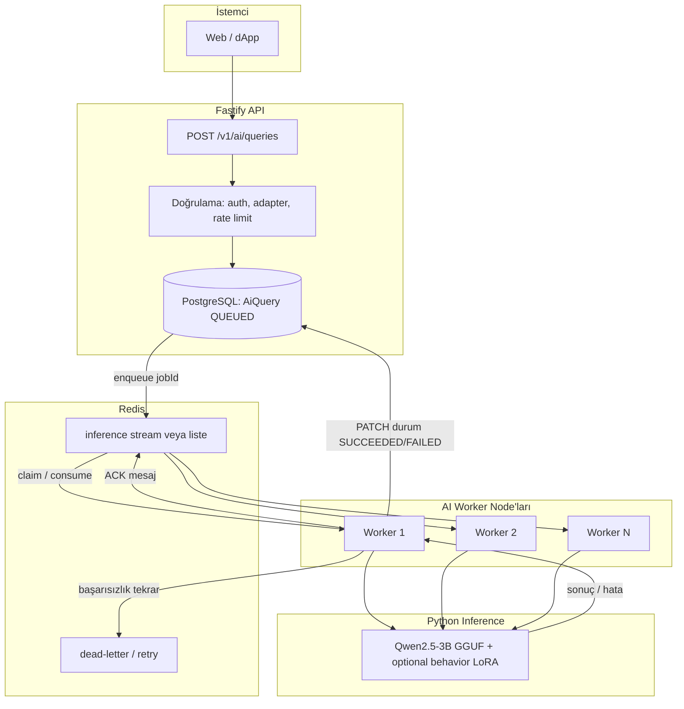
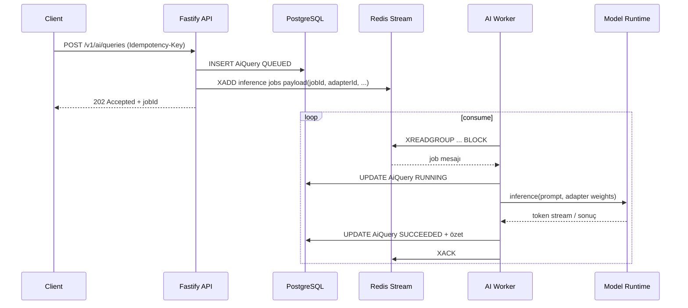

# R3MES Backend Mimarisi — Faz 0 Taslak

> **Güncel entegrasyon sözleşmesi (kanon):** yayında olan REST yüzeyi, adapter kimliği ve alan anlamları için önce **[api/INTEGRATION_CONTRACT.md](./api/INTEGRATION_CONTRACT.md)** dosyasına bakın. Bu bölüm tarihsel / hedef tasarım içerir; bazı yollar (ör. `/v1/ai/queries`) henüz kanon değildir.
>
> **Pivot notu:** Aktif MVP backend yolu `Qwen2.5-3B + RAG-first + optional behavior LoRA`dır. Aşağıdaki adapter/benchmark taslakları knowledge taşıma yolu değildir; knowledge doğruluğu RAG üzerinden gelir.

Bu belge, R3MES için **Fastify REST + GraphQL gateway**, **PostgreSQL (Prisma)** ve **Redis tabanlı iş kuyruğu** tasarımını tanımlar. Amaç: yüksek hacimli mikro-ödeme ve inference/log isteklerini sürdürülebilir şekilde karşılamak. **Uygulama kodu Faz 4 kapsamındadır;** burada yalnızca sözleşme ve şema taslağı yer alır.

---

## 1. Tasarım İlkeleri

| İlke | Uygulama |
|------|----------|
| İdempotensi | Mikro-ödeme ve inference istekleri `Idempotency-Key` veya sunucu üretimi `requestId` ile tekrarlanabilir; çift kesinti önlenir. |
| Yüksek yazma hacmi | Ham inference logları PostgreSQL’de özet + ayrı “append-only” veya partition’lı tablolar; detay için isteğe bağlı cold storage (Faz 4+). |
| Gerçek zamanlı iş | Ağır inference Python worker’da; API sadece kabul, kuyruk ve durum sorgusu sağlar. |
| Sui uyumu | Kullanıcı kimliği öncelikle cüzdan adresi; on-chain olaylar indexer ile DB’ye senkron (Faz 4). |

---

## 2. REST API — OpenAPI 3.1 Spesifikasyon Taslağı

**Önerilen dosya konumu (Faz 4):** `apps/backend-api/openapi/openapi.yaml`

Aşağıdaki yollar, R3MES_MASTER_PLAN ve ürün vizyonu ile uyumludur. Güvenlik şeması: `bearerAuth` (JWT veya imza doğrulamalı session), isteğe bağlı `apiKey` (iç servisler).

### 2.1 Bilgi ve Sağlık

| Metot | Yol | Açıklama |
|-------|-----|----------|
| GET | `/health` | Liveness: process ayakta mı? |
| GET | `/ready` | Readiness: PostgreSQL + Redis bağlantısı |
| GET | `/version` | Git SHA, semver |

### 2.2 Kimlik Doğrulama ve Oturum

| Metot | Yol | Açıklama |
|-------|-----|----------|
| POST | `/v1/auth/challenge` | Sunucu nonce döner (Sui imza akışı için). |
| POST | `/v1/auth/verify` | İmzayı doğrular, session/JWT üretir. |
| POST | `/v1/auth/refresh` | Token yenileme. |
| POST | `/v1/auth/logout` | Oturumu geçersiz kılar. |

### 2.3 Kullanıcı Profili

| Metot | Yol | Açıklama |
|-------|-----|----------|
| GET | `/v1/users/me` | Oturumdaki kullanıcı özeti. |
| PATCH | `/v1/users/me` | Görünen ad, tercihler (PII minimum). |
| GET | `/v1/users/{walletAddress}` | Public profil (varsa). |

### 2.4 LoRA Adaptörleri

| Metot | Yol | Açıklama |
|-------|-----|----------|
| GET | `/v1/adapters` | Sayfalı liste; filtre: `status`, `domain`, `minBenchmarkScore`. |
| GET | `/v1/adapters/{adapterId}` | Tekil metadata + on-chain/IPFS referansları. |
| POST | `/v1/adapters` | Yeni adaptör kaydı (metadata); dosya IPFS’e ayrı akışla (presigned veya worker). |
| PATCH | `/v1/adapters/{adapterId}` | Sadece sahip: açıklama, görünürlük (kurallara uygun). |

### 2.5 Yapay Zeka İşlemleri (Inference / Query)

| Metot | Yol | Açıklama |
|-------|-----|----------|
| POST | `/v1/ai/queries` | Inference isteği: `adapterId`, `prompt`, `parameters`, `idempotencyKey`. Yanıt: `202 Accepted` + `jobId` veya senkron mod (kapalı beta). |
| GET | `/v1/ai/queries/{queryId}` | İş durumu ve özet sonuç (tam metin stream bittiğinde). |
| GET | `/v1/ai/queries/{queryId}/stream` | SSE veya WebSocket upgrade bilgisi (Faz 4’te netleştirilir). |
| GET | `/v1/ai/queries` | Kullanıcının geçmiş sorguları (sayfalı). |

### 2.6 Mikro-Ödeme ve Kullanım Kayıtları (Log / Billing Özeti)

| Metot | Yol | Açıklama |
|-------|-----|----------|
| GET | `/v1/usage/summary` | Dönem bazlı özet (istek sayısı, tahmini maliyet birimi). |
| GET | `/v1/usage/events` | Sayfalı olay listesi (sunucu tarafı üretilen kayıtlar). |

*Not: Zincir üstü kesin bakiye ve transferler Sui üzerinden; bu uçlar off-chain özet ve denetim içindir.*

### 2.7 Zincir / İndeksleyici (Backend-Indexer entegrasyonu)

| Metot | Yol | Açıklama |
|-------|-----|----------|
| GET | `/v1/chain/adapters/{onChainId}` | İndekslenmiş adaptör durumu. |
| GET | `/v1/chain/stake/{wallet}` | İndekslenmiş stake özeti (read model). |

### 2.8 Webhook / İç Servis (İsteğe Bağlı)

| Metot | Yol | Açıklama |
|-------|-----|----------|
| POST | `/v1/internal/indexer/events` | Sadece iç ağ: toplu event işleme (HMAC veya mTLS). |

### 2.9 OpenAPI Meta

- **openapi:** `3.1.0`
- **info.title:** `R3MES API`
- **info.version:** `0.1.0` (Faz 0 taslağı)
- **servers:** `https://api.r3mes.example/v1` (placeholder)
- **tags:** `Health`, `Auth`, `Users`, `Adapters`, `AI`, `Usage`, `Chain`, `Internal`

Her path için Faz 4’te `requestBody` / `responses` (ör. `application/json`) ve ortak hata şeması (`Error`: `code`, `message`, `requestId`) tanımlanır.

---

## 3. GraphQL Şema Taslağı (SDL Özeti)

GraphQL, okuma ağırlıklı ekranlar (marketplace, dashboard) için önerilir; yazma ve kritik ödeme yolları REST ile tutarlı kalır.

**Önerilen endpoint (Faz 4):** `POST /graphql`

### 3.1 Sorgular (`Query`)

```graphql
type Query {
  health: HealthStatus!
  me: User
  user(walletAddress: String!): User
  adapter(id: ID!): Adapter
  adapters(
    first: Int
    after: String
    filter: AdapterFilter
    orderBy: AdapterOrderBy
  ): AdapterConnection!
  aiQuery(id: ID!): AiQuery
  myAiQueries(first: Int, after: String): AiQueryConnection!
  usageSummary(period: UsagePeriod!): UsageSummary!
}
```

### 3.2 Mutasyonlar (`Mutation`)

```graphql
type Mutation {
  # Kimlik: REST ile aynı güvenlik context'i (token)
  createAiQuery(input: CreateAiQueryInput!): CreateAiQueryPayload!
  # Adaptör oluşturma/güncelleme genelde REST'te kalabilir; tekrar export etmek isteğe bağlı
}
```

### 3.3 Örnek Tipler (özet)

```graphql
type User {
  id: ID!
  walletAddress: String!
  displayName: String
  createdAt: DateTime!
}

enum AdapterStatus {
  PENDING
  ACTIVE
  REJECTED
  SLASHED
}

type Adapter {
  id: ID!
  ownerWallet: String!
  name: String!
  status: AdapterStatus!
  ipfsCid: String
  benchmarkScore: Float
  domainTags: [String!]!
  createdAt: DateTime!
}

enum AiQueryStatus {
  QUEUED
  RUNNING
  SUCCEEDED
  FAILED
  CANCELLED
}

type AiQuery {
  id: ID!
  adapterId: ID!
  status: AiQueryStatus!
  createdAt: DateTime!
  completedAt: DateTime
  promptPreview: String
  errorCode: String
}

type CreateAiQueryPayload {
  query: AiQuery
  jobId: String
  clientRequestId: String
}
```

**Bağlantı (pagination):** Cursor tabanlı `AdapterConnection` / `AiQueryConnection` (`edges`, `pageInfo`) GraphQL best practice ile uyumludur.

---

## 4. PostgreSQL — `schema.prisma` Taslağı

**Amaç:** Kullanıcılar, LoRA adaptörleri ve AI sorgu/işlem kayıtları için ilişkisel model. Faz 4’te gerçek migrasyonlar üretilir.

```prisma
// prisma/schema.prisma — FAZ 0 TASLAK (R3MES)
// provider ve URL'ler Faz 1/4'te ortam değişkenlerinden gelir

generator client {
  provider = "prisma-client-js"
}

datasource db {
  provider = "postgresql"
  url      = env("DATABASE_URL")
}

/// Sui cüzdan adresi birincil kimlik köprüsü
model User {
  id             String   @id @default(cuid())
  walletAddress  String   @unique
  displayName    String?
  createdAt      DateTime @default(now())
  updatedAt      DateTime @updatedAt

  adapters       Adapter[]   @relation("OwnerAdapters")
  aiQueries      AiQuery[]
}

enum AdapterKind {
  LORA
  DORA
}

enum AdapterStatus {
  PENDING_REVIEW
  ACTIVE
  REJECTED
  SLASHED
  DEPRECATED
}

/// LoRA / DoRA adaptör metadata + indekslenmiş on-chain / IPFS referansları
model Adapter {
  id               String          @id @default(cuid())
  ownerId          String
  owner            User            @relation("OwnerAdapters", fields: [ownerId], references: [id], onDelete: Cascade)

  name             String
  description      String?
  kind             AdapterKind     @default(LORA)

  /// IPFS CID (weights veya manifest)
  weightsCid       String?
  manifestCid      String?

  /// Sui object id veya registry referansı (Faz 3/4 ile netleşir)
  onChainObjectId  String?         @unique

  status           AdapterStatus   @default(PENDING_REVIEW)
  benchmarkScore   Decimal?        @db.Decimal(10, 6)
  domainTags       String[]        @default([])

  createdAt        DateTime        @default(now())
  updatedAt        DateTime        @updatedAt

  aiQueries        AiQuery[]

  @@index([status, benchmarkScore])
  @@index([ownerId])
}

enum AiQueryStatus {
  QUEUED
  RUNNING
  SUCCEEDED
  FAILED
  CANCELLED
}

/// Tek bir inference / AI işlemi (yüksek hacim: partition veya arşiv stratejisi Faz 4+)
model AiQuery {
  id               String         @id @default(cuid())
  idempotencyKey   String?        @unique

  userId           String
  user             User           @relation(fields: [userId], references: [id], onDelete: Cascade)

  adapterId        String
  adapter          Adapter        @relation(fields: [adapterId], references: [id], onDelete: Restrict)

  status           AiQueryStatus  @default(QUEUED)

  /// Redis job / worker referansı
  queueJobId       String?

  promptHash       String?
  promptPreview    String?

  /// Mikro-ücret birimi (platform tanımına göre: nano coin vb.)
  billedAmountNano BigInt?        @default(0)

  resultSummary    String?        @db.Text
  errorCode        String?
  errorMessage     String?        @db.Text

  createdAt        DateTime       @default(now())
  startedAt        DateTime?
  completedAt      DateTime?

  @@index([userId, createdAt(sort: Desc)])
  @@index([adapterId, createdAt(sort: Desc)])
  @@index([status, createdAt])
}
```

**Genişletme notları (sonraki fazlar):**

- `UsageEvent` tablosu: ham olay akışı için append-only veya günlük partition.
- `IndexerCheckpoint`: Sui event işleme ofseti.
- `WorkerNode`: kayıtlı inference worker’lar için heartbeat (isteğe bağlı).

---

## 5. Redis Tabanlı AI Worker Görev Atama Süreci

### 5.1 Kuyruk Tasarımı (özet)

| Kavram | Açıklama |
|--------|----------|
| Liste / stream | `inference:pending` — LPUSH/BRPOP veya Redis Streams (`XADD` / `XREADGROUP`). |
| Tüketici grubu | `inference-workers` — her worker `XREADGROUP` ile mesaj alır; başarısızlıkta dead-letter stream. |
| İş kimliği | `jobId` = `aiQuery.id` veya ayrı UUID; DB ile eşleşir. |
| At-least-once | İşlem bitince `ACK`; timeout ile pending mesaj yeniden atanır. |

### 5.2 Akış Diyagramı (Mermaid)



### 5.3 Detaylı Sekans (isteğe bağlı diyagram)



### 5.4 Ölçek ve Dayanıklılık

- **Yatay ölçek:** Worker sayısı Redis tüketici grubu ile artar; API stateless kalır.
- **Sıcak nokta:** Tek `adapterId` için eşzamanlı yük — gelecekte adapter başına fair queue veya shard anahtarı düşünülebilir.
- **Mikro-ödeme:** İş `SUCCEEDED` olduktan sonra zincir veya iç ledger’a asenkron yazım (outbox pattern, Faz 4).

---

## 6. Bu Belgenin Kapsamı Dışındakiler (Faz 4+)

- Gerçek OpenAPI YAML ve GraphQL resolver implementasyonu
- Prisma migrate ve üretim index tuning
- Kesin Sui event şemaları (Blockchain Ajanı çıktısına bağlı)

---

## 7. Sürüm

| Belge | Sürüm | Tarih |
|-------|-------|-------|
| backend_architecture.md | 0.1.0 (Faz 0) | 2026-04-08 |
