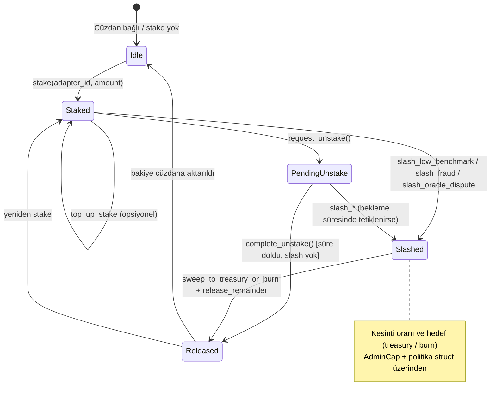

# R3MES Blockchain Mimarisi (Sui Move)

**Sürüm:** 0.1 (Faz 0 – tasarım)  
**Kapsam:** Modül/capability modeli, tokenomik kararı, eğitici stake/slash durum makinesi, IPFS CID’lerinin zincir üstü değişmez kaydı, teorik Move arayüzleri.  
**Dışlama:** Sui CLI kurulumu, derleme, testnet/localnet deploy yoktur.

> **Pivot notu:** Bu belge tarihsel/Faz 0 blockchain taslağıdır. Aktif MVP inference yolu Qwen2.5-3B + RAG-first’tür; LoRA yalnız behavior/style/persona katmanıdır. BitNet veya benchmark/slash ifadeleri aktif knowledge doğruluğu mekanizması olarak okunmamalıdır.

---

## 1. Amaç ve kapsam

Bu belge, R3MES’in Sui Move VM üzerindeki **fungible token (FT)**, **yetki (capability)**, **eğitici staking / slash** ve **LoRA / temel model IPFS hash** kayıtlarının nasıl modellenmesi gerektiğini tanımlar. Uygulama kodu yerine **sözleşme sınırları, nesne yaşam döngüsü ve pseudo-code** verilir.

---

## 2. R3MES Token (FT): modül ve capability mantığı

### 2.1 Modül ayrımı (önerilen paket yapısı)

| Modül | Sorumluluk |
|-------|------------|
| `r3mes::r3mes_coin` | Tek seferlik `R3MES` coin tipi tanımı; genesis’te sabit arz veya dağıtım sonrası `TreasuryCap` yakma/dondurma politikası. |
| `r3mes::staking_vault` | Eğitici stake pozisyonları, havuz durumu, slash / unstake kuralları. |
| `r3mes::reward_pool` | Inference ücretlerinden gelen havuz, dağıtım parametreleri (oranlar konfigürasyon nesnesinde). |
| `r3mes::adapter_registry` | Behavior LoRA / adapter kayıtları, isteğe bağlı kalite sonucu, IPFS CID immutable nesneleri. |
| `r3mes::model_registry` | Model-agnostic çekirdek GGUF kayıtları; aktif MVP varsayılanı Qwen2.5-3B, BitNet yalnız legacy/R&D referansıdır. |

Bu ayrım, **Orchestrator / R3MES planı**ndaki `AdaptorRegistry`, `StakingVault`, `RewardPool`, `R3MESCoin` hatlarıyla uyumludur.

### 2.2 Capability (yetki) türleri ve kullanımı

Sui Move’da yetki, genelde **tekil nesne** (`AdminCap`, `TreasuryCap`, `Publisher`) veya **witness + tek seferlik oluşturma** ile modellenir.

| Capability | Taşıyıcı nesne | Tipik yetki | Not |
|------------|----------------|-------------|-----|
| `TreasuryCap<R3MES>` | Yönetici veya kilitli çoklu-imza | İlk dağıtımda mint; politika uygunsa sonra **yakma** veya **dondurma** | Enflasyon kontrolü burada kilitle |
| `AdminCap` (staking / registry) | DAO veya multisig | Parametre güncelleme (eşik, slash oranı) | Upgrade değil, **konfigürasyon** |
| `OracleCap` veya `BenchmarkReporterCap` | Backend + imza doğrulama | Benchmark sonucu on-chain yazma | Kötü niyetli rapor riski; çoklu doğrulama veya zaman kilidi |
| `Publisher` | Deploy hesabı | Paket yükseltme yolu (isteğe bağlı) | Mainnet’te çoğunlukla multisig’e devredilir |

**İlke:** Üretimde kritik yetenekler **tek adrese** verilmez; **multisig** veya **zaman kilidi** ile sınırlandırılır.

### 2.3 Teorik arayüz: R3MES coin modülü

Aşağıdaki yapılar **arayüz tasarımıdır**; gerçek Move sözdizimi ve `sui::coin` entegrasyonu implementasyonda netleşir.

```move
// TEORİK ARAYÜZ — r3mes::r3mes_coin
module r3mes::r3mes_coin {
    /// Marker type; One-Time Witness ile modül başına tek oluşturulur.
    struct R3MES has drop {}

    /// TreasuryCap<R3MES> genesis'te oluşturulur.
    /// Politika: sabit arz için tüm mint sonrası cap yakılır veya
    /// object::freeze ile kullanım dışı bırakılır (tasarım kararı).

    /// entry fun initialize(otw: R3MES, ctx: &mut TxContext);
    /// public fun total_supply(...): u64;
    /// public fun burn_treasury_if_policy(treasury: TreasuryCap<R3MES>, ...);
}
```

**FT özeti:** `Coin<R3MES>` standart Sui `coin` modülü üzerinden; transfer, bölme ve birleştirme `sui::coin` API’si ile uyumludur.

---

## 3. Enflasyon kararı: R3MES enflasyonist mi?

### 3.1 Ürün vizyonu ile hizalama

[R3MES.md](../R3MES.md) açıkça belirtir: **“Enflasyon yok – coin mint edilmez; kullanıcıdan eğiticiye transfer”** ve akış **döngüseldir** (inference ücreti → havuz → eğitici ödülleri).

### 3.2 Mimari karar

| Soru | Karar |
|------|--------|
| Protokol sürekli yeni R3MES basıyor mu? | **Hayır.** Ana model **enflasyonist değildir**; ödüller mevcut likidite ve ücret akışından gelir. |
| Testnet / geliştirme musluğu (faucet)? | **Operasyonel** olabilir; bu, ekonomik modele “sürekli enflasyon” eklemez, test dağıtımıdır. |
| İleride DAO yeni mint onayı verir mi? | Olası bir **governance** değişikliğidir; Faz 0/MVP kapsamında varsayılan **sabit arz / mint kapalı** politikası geçerlidir. |

**Özet:** R3MES tokenomik tasarımı **enflasyonist değildir**; `TreasuryCap` ile mint **sınırlı bir genesis veya erken dağıtım** ile kapatılır ve sürekli emisyon planlanmaz.

---

## 4. Eğitici staking havuzu: “Stake kesintisi” (slash) kuralları — durum diyagramı

### 4.1 Durumlar ve tetikleyiciler (özet)

- **Staked:** Eğitici, adaptor yayınlamak için kilitlediği R3MES.
- **PendingUnstake:** İsteğe bağlı gecikme (slashing penceresi).
- **Slashed:** Kural ihlali (ör. benchmark altı, sahte rapor) sonrası kesinti uygulandı.
- **Released:** Normal unstake veya slash sonrası kalan bakiye serbest.

Aşağıdaki diyagram **eğitici stake havuzu** için soyut durum makinesidir; kesin yüzdeler parametre nesnesindedir.



### 4.2 Slash tetikleyicileri (tasarım seviyesi)

| Tetik | Koşul (off-chain + on-chain) | Zincir üstü sonuç |
|-------|------------------------------|-------------------|
| Düşük benchmark | Oracle/benchmark modülü eşik altı skor bildirir | Oransal slash veya adaptor reddi + stake kesintisi |
| Sahte / uyuşmayan IPFS içeriği | Registry’deki CID ile gerçek içerik hash uyuşmazlığı | Tam veya kısmi slash, adaptor devre dışı |
| Oracle itirazı | Çoklu imza / zaman kilidi ile anlaşmazlık çözülür | İdari veya otomatik kesinti (politikaya bağlı) |

---

## 5. Yapay zeka modeli yüklemesi: IPFS hash’lerinin değişmez (immutable / frozen) tutulması

### 5.1 Tasarım hedefi

- IPFS **CID** (ör. `Qm...` veya CIDv1) zincir üstünde **bir kez yazıldıktan sonra değiştirilemez** olmalı.
- “Değişmezlik” Move tarafında: **frozen object** veya **sadece oluşturma izni olan modül** ile sağlanır; alan güncellemesi API’si **yoktur**.

### 5.2 Nesne modeli

1. **`ModelManifest`** (veya `AdapterManifest`): `struct` içinde `ipfs_cid: vector<u8>` veya `String`, `content_hash: vector<u8>` (opsiyonel çift doğrulama), `version`, `created_at`, `creator`.
2. Oluşturma: `register_manifest(...)` tek transaction’da çağrılır; başarıdan sonra **`object::freeze(manifest)`** ile nesne dondurulur.
3. Sonuç: Hiçbir entry fonksiyonu CID’yi değiştiremez; yeni sürüm için **yeni object ID** ile yeni kayıt.

### 5.3 Pseudo-code (Move tarzı)

```move
// PSEUDO-CODE — immutable IPFS kaydı
module r3mes::adapter_registry {
    struct AdapterManifest has key {
        id: UID,
        adapter_id: u64,
        ipfs_cid: vector<u8>,      // UTF-8 CID string bytes
        content_blake2b: vector<u8>, // opsiyonel: içerik bağlayıcı hash
        benchmark_score_bps: u64,   // rapor sonrası AYRI nesnede de tutulabilir
        creator: address,
        created_at_ms: u64,
    }

    /// Tek seferlik kayıt; CID sonrası değiştirilemez.
    public entry fun register_adapter_manifest(
        registry: &mut Registry,
        ipfs_cid: vector<u8>,
        content_blake2b: vector<u8>,
        ctx: &mut TxContext,
    ) {
        let mut manifest = AdapterManifest {
            id: object::new(ctx),
            adapter_id: registry.next_id,
            ipfs_cid,
            content_blake2b,
            benchmark_score_bps: 0,
            creator: tx_context::sender(ctx),
            created_at_ms: tx_context::epoch_timestamp_ms(ctx), // veya uygun zaman API
        };
        registry.next_id = registry.next_id + 1;
        // Nesneyi paylaşımlı veya owned olarak ekle, sonra:
        transfer::public_freeze_object(manifest); // veya freeze + share politikası
        // NOT: Gerçek API'de freeze + shared object kuralları Sui sürümüne göre seçilir.
    }

    // ÖNEMLİ: update_cid YOK — yeni versiyon = yeni manifest nesnesi + parent pointer (isteğe bağlı)
}
```

**Sui notu:** `public_freeze_object` veya eşdeğeri, nesneyi **mutasyona kapalı** kılar. Benchmark skoru ayrı bir **`AdapterScoreRecord`** nesnesinde tutulursa, ana CID manifest’i yine değişmez kalır.

### 5.4 Onay zinciri (basit sıra)

1. Eğitici IPFS’e yükler → CID üretir.  
2. `register_adapter_manifest` çağrılır → nesne **freeze**.  
3. Benchmark tamamlanır → ayrı transaction ile skor / durum güncellenir (**manifest’e dokunmadan**).  
4. Slash gerekirse → staking modülü + registry **durum bayrakları** üzerinden.

---

## 6. Onay, yetki ve zincir üstü veri yapıları — özet tablo

| Varlık | Sui nesne türü | Yetki | Değiştirilebilirlik |
|--------|----------------|-------|---------------------|
| R3MES arz parametresi | `TreasuryCap` veya yakılmış | Başlangıçta admin | Mint kapalıysa sabit |
| Stake pozisyonu | `StakeReceipt` veya `StakedPosition` | Sahip | Unstake / slash ile geçiş |
| IPFS manifest | `AdapterManifest` | — | **Freeze sonrası değişmez** |
| Benchmark skoru | `ScoreUpdate` / event + struct | Oracle capability | Manifest’ten ayrı |
| Ödül havuzu | `RewardPool` (shared) | Admin + algoritma | Kurallar struct’ta |

---

## 7. Event’ler (indexer / backend için teorik)

- `ManifestRegistered { object_id, adapter_id, cid, creator }`
- `StakeDeposited { trainer, amount, adapter_id }`
- `SlashApplied { trainer, reason_code, amount }`
- `UnstakeCompleted { trainer, amount }`

Backend (AGENT-BE) bu event imzalarını Faz 1+ için sabitler.

---

## 8. Sonraki uygulama adımları (kod dışı)

1. `TreasuryCap` yakımı / dondurma politikası için ADR.  
2. Oracle imza şeması (ed25519 / zk?) için güvenlik (AGENT-SEC) incelemesi.  
3. Move modül dosya ağacı ve `Move.toml` isimleri monorepo oluşturulunca kilitlenir.

---

## Referanslar (proje içi)

- [R3MES.md](../R3MES.md) — token akışı, enflasyon yok, stake/slash özeti  
- [R3MES_MASTER_PLAN.md](../R3MES_MASTER_PLAN.md) — fazlar ve paket düzeni  
- [ONCHAIN_READ_MODEL_AND_EVENTS.md](./blockchain/ONCHAIN_READ_MODEL_AND_EVENTS.md) — `onChainAdapterId` / nesne ID / CID, olay→Prisma eşlemesi, indexer kapsamı  
- [ADR-002-stake-claim-source-of-truth.md](./adr/ADR-002-stake-claim-source-of-truth.md) — stake/claim kaynak gerçeği ve “claim” resmi tanımı (**Kabul**)
- [MVP_BLOCKCHAIN_ACCEPTANCE.md](./blockchain/MVP_BLOCKCHAIN_ACCEPTANCE.md) — Faz 7 MVP zincir kabulü (yeterlilik; yeni Move kapsamı yok)
