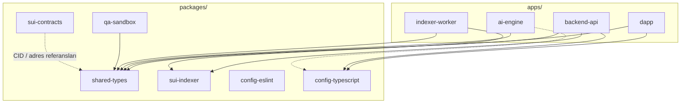
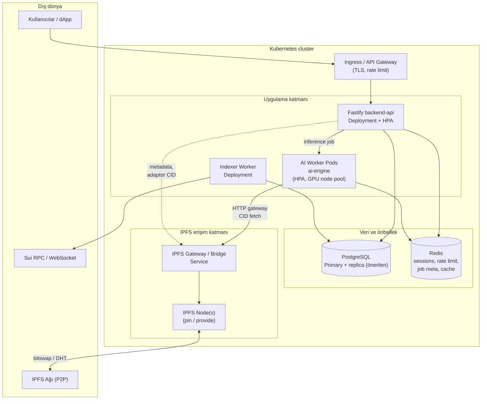
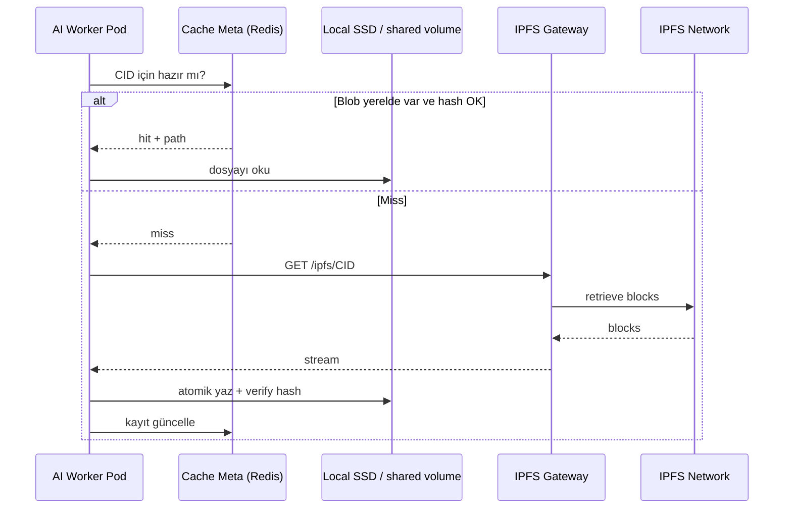

# R3MES Altyapı ve Kubernetes Mimarisi — Faz 0 Tasarım Belgesi

> **Durum:** Bu belge erken faz altyapı tasarımıdır. Aktif MVP’de ana inference yönü `Qwen2.5-3B + RAG-first` tir. BitNet/QVAC bu belgede geçtiği yerlerde tarihî veya alternatif runtime notu olarak okunmalıdır.

Bu belge, **r3mes-monorepo** kök yapısını (Turborepo veya Nx tabanlı monorepo hedefi), paylaşımlı paketler ile uygulamalar arası bağlantıları, Kubernetes üzerinde **IPFS Gateway**, **AI Worker**, **Fastify Backend** ve **PostgreSQL** topolojisini ve **model ağırlıkları** için IPFS gecikmesini azaltacak **önbellekleme (caching)** stratejisini tanımlar.

**Kapsam:** Yalnızca mimari ve operasyonel tasarım; Faz 1’de gerçek repo iskeleti, Terraform veya komut çalıştırma bu belgenin dışındadır.

---

## 1. Tasarım Hedefleri

| Hedef | Açıklama |
|--------|-----------|
| İzolasyon | Her ajanın sorumluluk alanı net sınırlarda; paylaşılan kod `packages/` altında versiyonlanır. |
| Ölçeklenebilirlik | API, inference ve indeksleme işleri bağımsız ölçeklenir; state PostgreSQL ve Redis ile merkezileştirilir. |
| Güvenlik | İç servis trafiği ağ politikaları ve gizli kimlik bilgileri ile korunur; IPFS erişimi kontrollü gateway üzerinden. |
| Gecikme kontrolü | Aktif GGUF çekirdek, knowledge artefact’ları ve sık kullanılan behavior LoRA’lar IPFS’ten tekrar tekrar çekilerek ağı tıkamaz; katmanlı önbellek zorunludur. |

---

## 2. Monorepo Kök Yapısı (`r3mes-monorepo/`)

Monorepo, **tek depoda** birden fazla uygulama (`apps/`) ve paylaşımlı kütüphane (`packages/`) barındırır. **Turborepo** veya **Nx** seçimi Faz 1’de netleştirilebilir; her iki araç da aşağıdaki dizin sözleşmesiyle uyumludur.

Önerilen kök düzeni:

```text
r3mes-monorepo/
├── apps/
│   ├── dapp/                 # Next.js 14 — kullanıcı arayüzü, Sui dApp Kit
│   ├── backend-api/          # Fastify — REST, GraphQL gateway, auth, iş kuralları
│   ├── ai-engine/            # FastAPI — Qwen GGUF inference proxy; retrieval backend tarafında, optional behavior LoRA
│   └── indexer-worker/       # (İsteğe bağlı ayrı süreç) Sui event tüketimi — yoğunluk için backend’den ayrılabilir
├── packages/
│   ├── shared-types/         # Zod şemaları, ortak TypeScript tipleri, API sözleşmeleri
│   ├── sui-contracts/        # Move kaynakları, build çıktıları için konvansiyon
│   ├── sui-indexer/          # Event şemaları, indeksleyici paylaşılan modüller
│   ├── qa-sandbox/           # Benchmark / QA pipeline tanımları ve yardımcıları
│   ├── config-eslint/        # Ortak ESLint flat config (isteğe bağlı)
│   ├── config-typescript/    # tsconfig.json extend setleri
│   └── ui-kit/               # (İsteğe bağlı) FE + iç araçlar için ortak bileşenler
├── infrastructure/          # Dockerfile’lar, Helm chart’lar, K8s manifest taslakları (Faz 1+)
├── docs/                     # ADR, mimari belgeler (bu dosya dahil)
├── turbo.json                # Turborepo pipeline tanımları (Faz 1)
├── nx.json / project.json    # Nx kullanılırsa (Faz 1)
├── pnpm-workspace.yaml       # pnpm workspace (Faz 1)
└── package.json              # Kök script’ler: lint, build, test (Faz 1)
```

**Not:** `R3MES_MASTER_PLAN.md` içindeki `security/` kökü, güvenlik test artefact’ları için ayrı tutulabilir; monorepo içinde `packages/` veya `tools/security/` altına taşınması Faz 1 kararıdır.

---

## 3. Uygulamalar (`apps/`) — Rol ve Sınırlar

| Uygulama | Teknoloji | Birincil sorumluluk | Tipik dış bağımlılık |
|----------|-----------|---------------------|----------------------|
| `dapp` | Next.js | Cüzdan, marketplace, chat UI | `backend-api` (HTTP/SSE), Sui RPC |
| `backend-api` | Fastify | Auth, REST/GraphQL, kuyruk koordinasyonu, iş mantığı | PostgreSQL, Redis, iç servis olarak `ai-engine` |
| `ai-engine` | FastAPI | Model yükleme, inference, LoRA montajı | IPFS gateway (okuma), opsiyonel Redis, `shared-types` ile uyumlu payload |
| `indexer-worker` | Node veya ayrı süreç | Sui WebSocket / RPC dinleme, DB yazımı | PostgreSQL, Sui ağı |

**Bağlantı özeti:**

- **dapp → backend-api:** Kamuya açık API; kimlik ve oturum sözleşmesi `shared-types` ile sabitlenir.
- **backend-api → ai-engine:** İç ağ (Kubernetes Service); inference isteği taşınır; ağır iş `ai-engine`’dedir (backend_architecture ile uyumlu).
- **backend-api ↔ PostgreSQL:** İlişkisel durum, kullanıcı özeti, indekslenmiş zincir görünümü.
- **indexer-worker → PostgreSQL:** On-chain olayların projeksiyonu; `backend-api` ile aynı şema veya ayrı okuma modeli (CQRS tarzı ayrım Faz 4’te netleştirilebilir).

---

## 4. Paylaşımlı Paketler (`packages/`) — Bağımlılık Grafiği (Mantıksal)

Monorepoda **uygulamalar doğrudan birbirini npm bağımlılığı olarak içermez**; ortak kod `packages/` üzerinden yayınlanır (workspace protocol: `workspace:*`).



**Açıklamalar:**

- **shared-types:** API istek/yanıt ve Zod şemaları; Frontend–Backend–AI arasında tek doğruluk kaynağı.
- **sui-indexer:** Event tipleri, mapper’lar; `indexer-worker` ve `backend-api` içinde yeniden kullanım.
- **sui-contracts:** Move kaynakları; TypeScript tarafında üretilen tipler veya el ile senkronize adres listesi `shared-types` ile bağlanır.
- **qa-sandbox:** Benchmark ve izole test ortamı tanımları; CI ve yerel çalıştırma için.

---

## 5. Turborepo / Nx — Görev ve Önbellek (Tasarım)

| Konu | Turborepo | Nx (alternatif) |
|------|-----------|------------------|
| Görev grafiği | `turbo.json` `pipeline` | `project.json` / `nx.json` hedefleri |
| Önbellek | Remote cache (isteğe bağlı CI) | Nx Cloud veya local cache |
| Etkilenen projeler | Değişen paketlere göre `build`/`test` | Aynı mantık, `affected` komutları |

**Öneri:** `build` sırası tipik olarak: `shared-types` → uygulamalar; `sui-contracts` build’i Move toolchain ile ayrı hedefde çalıştırılır.

---

## 6. Kubernetes Topolojisi — Genel Mimari

Aşağıdaki diyagram, ingress’ten veri katmanına kadar ana bileşenleri ve trafik yönlerini gösterir. **IPFS**, küme içinde gateway pod’ları ile temsil edilir; **AI Worker** ve **Fastify Backend** ayrı deployment setleridir; **PostgreSQL** operatör veya yönetilen servis olarak düşünülebilir.



### 6.1 Bileşen notları

| Bileşen | Rol |
|---------|-----|
| **Ingress** | TLS sonlandırma, WAF/rate limit entegrasyonu, tek dış yüz. |
| **Fastify backend-api** | Senkron API, GraphQL, auth; inference için kuyruk veya doğrudan iç çağrı tasarımı. |
| **AI Worker Pods** | GPU veya CPU node pool; model belleği yüksek; ölçekleme inference kuyruğu derinliğine göre. |
| **Indexer Worker** | Sui olaylarını tüketir; PostgreSQL’e yazar; API ile çakışmayı önlemek için ayrı deployment önerilir. |
| **PostgreSQL** | İlişkisel gerçek; yedekleme ve PITR operasyon politikası Faz 1+ ile tanımlanır. |
| **Redis** | Oturum, rate limit, kısa ömürlü inference meta; aşağıdaki model önbelleği ile birlikte düşünülür. |
| **IPFS Gateway** | Küme içi HTTP ile CID çözümü; dış IPFS ağına tek kontrollü çıkış noktası. |
| **IPFS Node(s)** | Pin, provide; kritik CID’ler için replikasyon politikası. |

### 6.2 Ağ segmentasyonu (tasarım ilkesi)

- **Namespace** ayrımı: `r3mes-api`, `r3mes-ai`, `r3mes-data`, `r3mes-ipfs` gibi; NetworkPolicy ile yalnızca gerekli pod’lar PostgreSQL ve Redis’e erişir.
- **Gizli bilgiler:** Veritabanı URL’si, Redis, API anahtarları Secret; AI pod’larına sadece okuma gereken IPFS gateway URL’si.

---

## 7. Model Ağırlıkları ve IPFS Gecikmesi — Önbellekleme Analizi

### 7.1 Problem

Qwen GGUF, behavior LoRA artefact’ları ve diğer büyük model dosyaları **içerik adresli (CID)** olarak IPFS’te tutulabilir. Çoklu kiracı (tenant) veya çoklu pod aynı anda gateway üzerinden aynı dosyaları çekerse:

- Gateway ve IPFS düğümü üzerinde **tekrarlayan bitswap** yükü oluşur.
- Soğuk önbellek senaryosunda **ilk yükleme gecikmesi** inference SLA’sını tehdit eder.
- Ağ katmanı, depolama ile rekabet ederek **tıkanıklık** yaratabilir.

### 7.2 Hedef

- **Sıcak yol:** Inference pod’unun yerel disk veya hızlı katmanda modeli **bir kez** veya **CID başına paylaşımlı** bulundurması.
- **Soğuk yol:** İlk çekim kontrollü (ön ısıtma job’ı), kullanıcı trafiğine bağlı ani patlama yaratmaması.

### 7.3 Önerilen katmanlı strateji

| Katman | Mekanizma | Fayda | Not |
|--------|-----------|-------|-----|
| **1 — Pod / node local cache** | `emptyDir` + SSD veya hostPath (güvenlik/policy ile); aynı node üzerinde çoklu pod için **DaemonSet** “model prefetch” veya paylaşımlı volume | Tekrarlayan IPFS indirmeyi aynı host’ta keser | GPU node’larda disk boyutu planlanmalı |
| **2 — Küme içi object cache** | MinIO / S3 uyumlu depo veya **Redis** büyük obje için uygun değil; **ayrı** dosya önbelleği (ör. NGINX `proxy_cache`, Varnish, veya özel “CID → blob” servisi) gateway önünde | Gateway’e giden tekrarlayan istekleri azaltır | CID doğrulama (hash kontrolü) zorunlu |
| **3 — Redis (meta)** | CID → yerel yol, son doğrulama zamanı, boyut, **hazır** bayrağı | AI worker’ların “dosya hazır mı?” sorgusu hızlı | Büyük blob Redis’te tutulmaz; sadece meta |
| **4 — Ön ısıtma (pre-warm)** | Yeni Qwen GGUF veya popüler behavior LoRA CID’leri için **CronJob** veya release pipeline’ında IPFS’ten çekip önbelleğe yazma | Pik öncesi gecikmeyi düşürür | Versiyon değişiminde tetiklenir |
| **5 — İçerik doğrulama** | İndirilen blob’un hash’i (on-chain veya manifest ile) **eşleşmezse** kullanılmaz | Güvenlik ve veri bütünlüğü | Zorunlu kontrol noktası |
| **6 — Eşzamanlılık sınırı** | IPFS gateway’e **eşzamanlı bağlantı kotası** veya kuyruk | Ağ patlamasını yumuşatır | Fairness için tenant başına limit düşünülebilir |

### 7.4 Çoklu dev (multi-tenant) bağlamında ek notlar

- **Aynı CID** farklı tenant inference isteklerinde paylaşılır: önbellek **içerik adreslidir**; tenant izolasyonu uygulama ve auth katmanında kalır, dosya tekrarı önlenir.
- **Farklı LoRA CID’leri** için LRU veya kullanım sıklığına göre **eviction** politikası; GPU belleği ve disk kotası birlikte yönetilir.
- **Rolling deployment** sırasında yeni pod’ların soğuk başlaması: **blue/green** veya önce önbelleği dolduran **init container** ile SLA korunur.

### 7.5 Özet akış (mantıksal)



---

## 8. İzleme ve Operasyon (Faz 1+ ile uyumlu)

- **Metrikler:** Gateway istek süresi, IPFS bitswap hataları, AI pod **model load time**, PostgreSQL bağlantı havuzu, Redis bellek.
- **Uyarılar:** Önbellek miss oranı ani artış, disk doluluk, gateway 5xx.

---

## 9. Bu Belgenin Sınırları

- Terraform, Helm chart dosyaları veya gerçek K8s manifestleri **bu fazda üretilmemiştir**; yalnızca topoloji ve sorumluluklar tanımlanmıştır.
- Monorepo araç seçimi (Turborepo vs Nx) ve tam `package.json` iskeleti **Faz 1** kapsamındadır.

---

## 10. İlgili Belgeler

- `R3MES_MASTER_PLAN.md` — Fazlar ve kök klasör özeti
- `docs/backend_architecture.md` — Fastify, PostgreSQL, Redis, API taslağı

---

*Belge sürümü: Faz 0 — Altyapı Ajanı. Tarih: 2026.*
